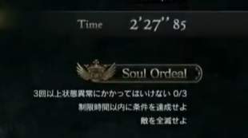

# Trial Objectives

## PCAP Data

### 英霊の試練 - Trial of the Heroic Spirit (139)

| English                                                   | Japanese                             | Unk0 | Unk1 | Unk2 | Unk3 |
|:----------------------------------------------------------|:-------------------------------------|:----:|:----:|:----:|:----:|
| Item must not be used more than once 0/1                  | アイテムを1回以上使用してはならない 0/1 | 7    | 2    | 1    | 1    |
| Cannot die more than once 0/1                             | 1回以上死亡してはならない 0/1          | 4    | 2    | 1    | 1    |
| Eliminate the enemy                                       | 敵を全滅せよ                          | 8    | 1    | 1    | 1    |

### 英霊の試練 - Trial of the Heroic Spirit (138)

| English                                                   | Japanese                            | Unk0 | Unk1 | Unk2 | Unk3 |
|:----------------------------------------------------------|:------------------------------------|:----:|:----:|:----:|:----:|
| Cannot be affected by abnormal status more than 0/3 times | 回以上状態異常にかかってはいけない 0/3 | 5    | 2    | 3    | 0    |
| Do not die more than 0/1 times                            | 回以上死亡してはならない 0/1          | 4    | 2    | 1    | 1    |
| Eliminate the enemy                                       | 敵を全滅せよ                         | 8    | 1    | 1    | 1    |

### 英霊の試練 - Trial of the Heroic Spirit (135)

| English                                                     | Japanese                             | Unk0 | Unk1 | Unk2 | Unk3 |
|:------------------------------------------------------------|:-------------------------------------|:----:|:----:|:----:|:----:|
| Cannot be affected by abnormal status more than 3 times 0/3 | 3回以上状態異常にかかってはいけない 0/3 | 5    | 2    | 3    | 0    |
| Complete the conditions within the time limit               | 制限時間以内に条件を達成せよ           | 10   | 2     | 150  | 1    |
| Eliminate the enemy                                         | 敵を全滅せよ                          | 8    | 1    | 1    | 1    |

### 英霊の試練 - Trial of the Heroic Spirit (136)

| English                                                     | Japanese                             | Unk0 | Unk1 | Unk2 | Unk3 |
|:------------------------------------------------------------|:-------------------------------------|:----:|:----:|:----:|:----:|
| Item may not be used more than once 0/1                     | アイテムを1回以上使用してはならない 0/1 | 7    | 2    | 1    | 1    |
| Complete the conditions within the time limit               | 制限時間以内に条件を達成せよ           | 10   | 2    | 150  | 1    |
| Defeat 20 or more enemies 0/20"                             | 敵を20体以上討伐せよ 0/20             | 1    | 1    | 20   | 0    |

### 英霊の試練 - Trial of the Heroic Spirit (132)

| English                                                     | Japanese                             | Unk0 | Unk1 | Unk2 | Unk3 |
|:------------------------------------------------------------|:-------------------------------------|:----:|:----:|:----:|:----:|
| Cannot die more than once                                   | 1回以上死亡してはならない 0/1          | 4    | 2    | 1    | 1    |
| Item may not be used more than once 0/1                     | アイテムを1回以上使用してはならない 0/1 | 7    | 2    | 1    | 1    |
| Eliminate the enemy                                         | 敵を全滅せよ                          | 8    | 1    | 1    | 1    |

### 英霊の試練 - Trial of the Heroic Spirit (137)

| English                                                     | Japanese                             | Unk0 | Unk1 | Unk2 | Unk3 |
|:------------------------------------------------------------|:-------------------------------------|:----:|:----:|:----:|:----:|
| Item may not be used more than once 0/1                     | アイテムを1回以上使用してはならない 0/1 | 7    | 2    | 1    | 1    |
| Complete the conditions within the time limit               | 制限時間以内に条件を達成せよ           | 10   | 2    | 300  | 1    |
| Eliminate the enemy                                         | 敵を全滅せよ                          | 8    | 1    | 1    | 1    |

### 英霊の試練 - Trial of the Heroic Spirit (145)

| English                                                     | Japanese                             | Unk0 | Unk1 | Unk2 | Unk3 |
|:------------------------------------------------------------|:-------------------------------------|:----:|:----:|:----:|:----:|
| Cannot be effected by abnormal status more than 3 times 0/3 | 3回以上状態異常にかかってはいけない 0/3 | 5    | 2    | 3    | 0    |
| Cannot die more than once 0/1                               | "1回以上死亡してはならない 0/1"        | 4    | 2    | 1    | 1    |
| Eliminate the enemy                                         | 敵を全滅せよ                          | 8    | 1    | 1    | 1    |

### 英霊の試練 - Trial of the Heroic Spirit (143)

| English                                                     | Japanese                             | Unk0 | Unk1 | Unk2 | Unk3 |
|:------------------------------------------------------------|:-------------------------------------|:----:|:----:|:----:|:----:|
| Item may not be used more than once 0/1                     | アイテムを1回以上使用してはならない 0/1 | 7    | 2    | 1    | 1    |
| Complete the conditions within the time limit               | 制限時間以内に条件を達成せよ           | 10   | 2    | 180  | 1    |
| Eliminate the enemy                                         | 敵を全滅せよ                          | 8    | 1    | 1    | 1    |

### 英霊の試練 - Trial of the Heroic Spirit (139)
| English                                                     | Japanese                             | Unk0 | Unk1 | Unk2 | Unk3 |
|:------------------------------------------------------------|:-------------------------------------|:----:|:----:|:----:|:----:|
| Item may not be used more than once 0/1                     | アイテムを1回以上使用してはならない 0/1 | 7    | 2    | 1    | 1    |
| Cannot die more than once 0/1                               | 1回以上死亡してはならない 0/1          | 4    | 2    | 1    | 1    |
| Eliminate the enemy                                         | 敵を全滅せよ                          | 8    | 1    | 1    | 1    |

### 英霊の試練 - Trial of the Heroic Spirit (138)
| English                                                     | Japanese                             | Unk0 | Unk1 | Unk2 | Unk3 |
|:------------------------------------------------------------|:-------------------------------------|:----:|:----:|:----:|:----:|
| Cannot be effected by abnormal status more than 3 times 0/3 | 3回以上状態異常にかかってはいけない 0/3 | 5    | 2    | 3    | 0    |
| Cannot die more than once 0/1                               | 1回以上死亡してはならない 0/1          | 4    | 2    | 1    | 1    |
| Eliminate the enemy                                         | 敵を全滅せよ                          | 8    | 1    | 1    | 1    |

### 英霊の試練 - Trial of the Heroic Spirit (144)
| English                                                     | Japanese                             | Unk0 | Unk1 | Unk2 | Unk3 |
|:------------------------------------------------------------|:-------------------------------------|:----:|:----:|:----:|:----:|
| Item may not be used more than once 0/1                     | アイテムを1回以上使用してはならない 0/1 | 7    | 2    | 1    | 1    |
| Cannot die more than once 0/1                               | 1回以上死亡してはならない 0/1          | 4    | 2    | 1    | 1    |
| Eliminate the enemy                                         | 敵を全滅せよ                          | 8    | 1    | 1    | 1    |

### 英霊の試練 - Trial of the Heroic Spirit (142)
| English                                                     | Japanese                             | Unk0 | Unk1 | Unk2 | Unk3 |
|:------------------------------------------------------------|:-------------------------------------|:----:|:----:|:----:|:----:|
| Item may not be used more than once 0/1                     | アイテムを1回以上使用してはならない 0/1 | 7    | 2    | 1    | 1    |
| Complete the conditions within the time limit               | 制限時間以内に条件を達成せよ           | 10   | 2    | 210  | 1    |
| Eliminate the enemy                                         | 敵を全滅せよ                          | 8    | 1    | 1    | 1    |

### 英霊の試練 - Trial of the Heroic Spirit (141)
| English                                                     | Japanese                             | Unk0 | Unk1 | Unk2 | Unk3 |
|:------------------------------------------------------------|:-------------------------------------|:----:|:----:|:----:|:----:|
| Item may not be used more than once 0/1                     | アイテムを1回以上使用してはならない 0/1 | 7    | 2    | 1    | 1    |
| Complete the conditions within the time limit               | 制限時間以内に条件を達成せよ           | 10   | 2    | 210  | 1    |
| Eliminate the enemy                                         | 敵を全滅せよ                          | 8    | 1    | 1    | 1    |

### 英霊の試練 - Trial of the Heroic Spirit (146)
| English                                                     | Japanese                             | Unk0 | Unk1 | Unk2 | Unk3 |
|:------------------------------------------------------------|:-------------------------------------|:----:|:----:|:----:|:----:|
| Cannot be effected by abnormal status more than 3 times 0/3 | 3回以上状態異常にかかってはいけない 0/3 | 5    | 2    | 3    | 0    |
| Cannot die more than once 0/1                               | 1回以上死亡してはならない 0/1          | 4    | 2    | 1    | 1    |
| Eliminate the enemy                                         | 敵を全滅せよ                          | 8    | 1    | 1    | 1    |

### 英霊の試練 - Trial of the Heroic Spirit (140)
| English                                                     | Japanese                             | Unk0 | Unk1 | Unk2 | Unk3 |
|:------------------------------------------------------------|:-------------------------------------|:----:|:----:|:----:|:----:|
| Cannot be effected by abnormal status more than 3 times 0/3 | 3回以上状態異常にかかってはいけない 0/3 | 5    | 2    | 3    | 0    |
| Cannot die more than once 0/1                               | 1回以上死亡してはならない 0/1          | 4    | 2    | 1    | 1    |
| Eliminate the enemy                                         | 敵を全滅せよ                          | 8    | 1    | 1    | 1    |