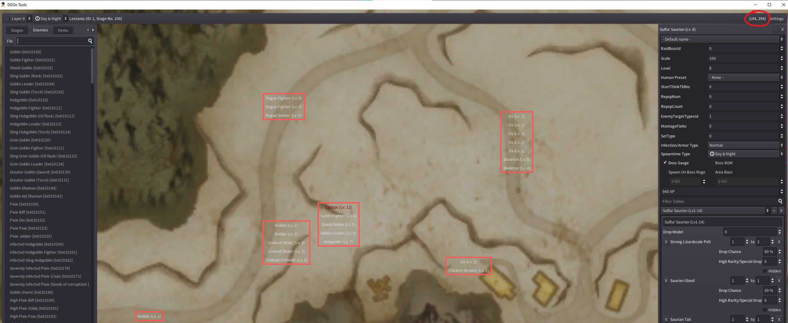
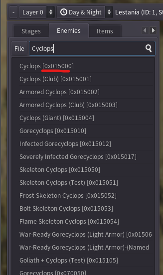
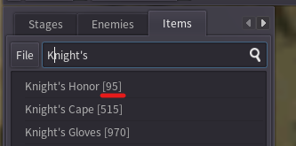

# Generic Quest State Machine

The generic quest state machine is a first attempt and providing a way for simple quests such as world quests or personal quests without needing "too much" technical knowledge.

The generic implementation is intended to handle the following types of quests
- Find and kill a world boss
- Find and kill multiple groups of enemies
- Talk to an NPC to receive directions for some task. Complete this task and return.
  - Both key item deliveries and item deliveries are implemented.

## High Level overview of how a quest works

The quest system in DDon seems to be fairly complicated. A quest can define multiple processes and each process can have what is known as a sequence and block number. It is suspected that a process is akin to a thread in the quest state machine. Each process block has 2 lists of quest commands which are known as check commands and result commands.

The "result commands" are commands which actually do something (display the progress banner, teleport a player, start a custscene, etc.) The list of result commands are executed instantly when the block is fetched by the client.  The "check commands" are commands which wait for some condition to be satisfied. The quest process will only progress to the next block when all the check commands in the current block for the process are satisfied. The server can also send "work commands" which are async to the normal quest progress mechanism. The content of these commands looks similar to check commands.

Researching the packet capture for the main quest "Hope's Bitter End", the following patterns were observed.

- A quest can spawn multiple processes
- As each processes moves to the next state the block number is incrementd by 1
- When a process is completed, the block number is incremented by 1 and the sequence number is set to 1.

## Details about the generic quest implementation

To simplify the enabling of simple quests, the generic quest state machine executes everything within a single process. The state machine assumes the following steps


Each quest has some starting condition, either being ordered from an NPC or being discovered by chance out in the field. A number of intermediate steps are required by the quest. These steps can be, killing enemies, running to marked enemies, discovering enemies, delivering items to an NPC or talking to an NPC. Finally when all intermediate steps are completed, the quest is marked as complete and rewards are distributed.


## What works in the current implementation

- Currently only world quests are activated.
- A small amount of world quests around the starting areas in Lestania has been added.
  - [The Knights' Bitter Enemy (q20005010)](http://ddon.wikidot.com/wq:theknightsbitterenemy)
  - [Confrontation With Scouts (q20005001)](http://ddon.wikidot.com/wq:confrontationwithscouts)
  - [Ambush in the Well's Depths (q20005002)](http://ddon.wikidot.com/wq:ambushinthewellsdepths)
  - [Sky-Concealing Wings (q20005000)](http://ddon.wikidot.com/wq:skyconcealingwings)
  - [Dweller In The Darkness (q20005003)](http://ddon.wikidot.com/wq:dwellerinthedarkness)
  - [Dispatch A Clamor of Harpies (q20015005)](http://ddon.wikidot.com/wq:dispatchaclamorofharpies)
  - [Boats Buddy (q20010001)](http://ddon.wikidot.com/wq:boatsbuddy)
  - [Beach Bandits (q20010000)](http://ddon.wikidot.com/wq:beachbandits)
  - Knight and Arisen (q20000015)
  - Request For Medicine (q20000009)
  - The Woes of A Merchant (q20000001)
  - Crackdown on Store Vandals (q20000007)
- Quest rewards can be claimed from the reward box after completing a quest.
  - 
- New quests can be defined by updating the file `world_quests.json` in `Arrowgene.Ddon.Shared/files/assets`.

> [!WARNING]
> The quest system generally doesn't work well in parties with multiple players. The world quests will reward all players in the party, but only the party leader will get quest banners as the quest progresses and completes.

> [!WARNING]
> The reward box is not currently saved into the database. Claim all rewards before exiting the game.

> [!WARNING]
> In the quests `Boat's Buddy` and `Beach Bandits`, the nodes which appear to be used for the quest don't behave properly. You may need to reset the instance by going to WDT to get the group to spawn with quest monsters.

> [!WARNING]
> In the quest `Confrontation With Scouts`, if you kill monsters in a group which is used in the quest before starting the quest, those monsters will not respawn until you reset the instance in WDT.

> [!NOTE]
> If a quest completes in a safe area, the party leader needs to exit the area and reenter to restart the quest.

> [!NOTE]
> The server currently treats every completion of the quest as the first time.

> [!NOTE]
> The dialouge from NPCs for the quest is probably incorrect but I can't read the messages they say to correct them :)

## Overview of the generic quest JSON format

The JSON for the state machine is split into 3 major parts.
- Generic details about the quest.
- Rewards that can be earned by completing the quest.
- Steps required for the quest to execute.

```json
{
    "type": string,
    "comment": string,
    "quest_id": int,
    "base_level": int,
    "minimum_item_rank": int,
    "discoverable": bool,
    "rewards": [],
    "blocks": []
}
```

A proper definition of the format should be defined but for now we will use an example to show how one can create a new quest.

## How to add new quests

There currently does not exist any tools to aid in adding new world quests. I suggest to install the following tools.

- [ripgrep](https://github.com/BurntSushi/ripgrep)
- [git](https://git-scm.com/download/win)
- [arctool](http://redirect.viglink.com/?key=71fe2139a887ad501313cd8cce3053c5&subId=5490376&u=https%3A//www.fluffyquack.com/tools/ARCtool.rar)

After installing `git`, clone the following repositories locally
- [DDON-translation](https://github.com/Sapphiratelaemara/DDON-translation)
- [DDon-tools](https://github.com/alborrajo/DDOn-Tools)
- [ddon-data](https://github.com/ddon-research/ddon-data)

Build `DDon-tools` from source to get the latest build.

Use a wiki like [http://ddon.wikidot.com/](http://ddon.wikidot.com) to find the name of the quest in japanese.

### Example: Implementing "The Knights' Bitter Enemy"

Go to [http://ddon.wikidot.com/](http://ddon.wikidot.com/wq:theknightsbitterenemy) and copy the Japanese name of the quest `騎士団の仇敵`. Using `ripgrep`, search for this text in the DDON-translation repository you cloned and look for a match which looks like `DDON-Translation-TOML\ui\00_message\quest_info\q20005010_00.toml`

```plaintext
$ rg 騎士団の仇敵
// lot's of text prints out ...
DDON-Translation-CSV\ui\00_message\quest_info\q20005010_00.csv
2:q20005010_00_289,騎士団の仇敵,The Knights' Bitter Enemy
```

The first part of this file name `q20005010` (really `20005010`) this is the quest ID used by the client to display information about the quest. I would also suggest to lookup the quest in [youtube](https://www.youtube.com/watch?v=eXns7McFY1E) using the japanese name to see how the quest should work.

Using the wiki, we can learn the following details:

- The quest is located at (x 193, Y 294)
- The recommended level is 12
- The exp and currency rewards from the quest
    - 590 XP
    - 390 G
    - 70 R
    - 80 AP (not implemented)
- The selectable rewards of the quest (1 of the following three items)
  - 1x [Knight's Honour](http://ddon.wikidot.com/weapons:knightshonour)
  - 3x [Lumber Knife](http://ddon.wikidot.com/consumables:lumberknife)
  - 1x [Cathedral Fire](http://ddon.wikidot.com/weapons:cathedralfire)

Let's open up DDon-tools and find the information we require. After opening the tool, select the Lestania map and click on the enemies tab. Then start to move around the mouse until we are at the location (X:193, Y:294). We can tell the position in DDon-tools by looking in the upper right corner.



Once you have found the region, zoom in and we can see a bunch of nodes close to the area (red square boxes). This next part takes a bit of guess work. For this particular quest, the node with the cyclops in it is what we are interested in. Record the StageId values `(1, 0, 26, 0)` in the upper right corner after hovering over the node.


Next let's search for the Cyclops enemy ID. The enemies tab has a search input box you can use. Type in the name `cyclops` and record the hex number `0x015000` next to the name in the list.



Next select the item tab. Similar to enemies, we can search item ID's quickly.



After doing this for all three items, you should find

- Knight's Honor (95)
- Lumber Knife (58)
- Cathedral Fire (10047)

In this particular quest, this is all the information we need. Let's use it to construct the quest JSON object parsed by the server.

### Populating the common information

New quests will be added to the array under the `quests` key. Each quest has the following pattern.
```json
{
    "type": string,
    "comment": string,
    "quest_id": int,
    "base_level": int,
    "minimum_item_rank": int,
    "discoverable": bool,
    "rewards": [],
    "blocks": []
}
```

First fill in the common items using the values we collected from the wiki. Currently only `"World"` quest type will be used the server. The `discoverable` field controls if the quest shows up on the map before accepting it. In this quest we will set it to `false`.
```json
{
    "type": "World",
    "comment": "q20005010_TheKnightsBitterEnemy",
    "quest_id": 20005010,
    "base_level": 12,
    "minimum_item_rank": 0,
    "discoverable": false,
    "rewards": [],
    "blocks": []
}
```

### Adding Rewards

Next we can define the rewards. The rewards have a variable format depending on the `type` field.

```json
{
    "type": string
}
```

- If the type is `wallet`, then it will contain the fields `wallet_type` and `amount`.
- If the type is `exp`, then it will contain the field `amount`.
- If the type is `select` it will describe a reward where 1 item can be selected.
- If the type is `random` it will describe a reward where 1 random item will be selected.
- If the type is `fixed` it will always reward the fixed item.

Putting this all together, we will get a reward list which looks like
```json
{
    "type": "wallet",
    "wallet_type": "Gold",
    "amount": 390
},
{
    "type": "wallet",
    "wallet_type": "RiftPoints",
    "amount": 70
},
{
    "type": "exp",
    "amount": 590
},
{
    "type": "select",
    "loot_pool": [
        {
            "item_id": 95,
            "num": 1
        },
        {
            "item_id": 58,
            "num": 3
        },
        {
            "item_id": 10047,
            "num": 1
        }
    ]
}
```

This should be added into the `rewards` array in the parent object.

### Defining the quest blocks

Finally, we need to add members to the `block` array. This describes all the steps required to start and complete the quest. As mentioned earlier in the document, there are 3 different types of `block` elements. There are blocks which are generally used to start a quest. Either `DiscoverEnemy` or `NpcOrder`. Then some variable amount of intermediate steps `DiscoverEnemy`, `KillGroup`, `TalkToNpc`, `SeekOutMarkedEnemy` or `DeliverItems`. Finally there is the end block type which is implicitly added by the generic quest state machine and doesn't need to be provided in the quest json.

This quest is simple in that it only has 2 major steps.
- We discover the enemy
- We kill the enemy

We need to define a rule which tells the quest state machine where we want to discover the enemy. Recall the stage ID value `(1, 0, 26, 0)` we recorded from DDon-tools. We would create the first block as a `DiscoverEnemy` block. This block takes information about the location of the enemy and the node on the map they are associated with.

```json
{
    "type": "DiscoverEnemy",
    "stage_id": {
        "id": 1,
        "group_no": 26
    }
}
```

Next we define a rule that we want to spawn some enemies and wait for them to be dead. First thing we need to do is when we move from the first state `DiscoverEnemy` to the next state `KillGroup` is that we need to "announce" that we have accepted this quest. We do this by setting the `announce_type` key to `Accept`. We will use the values we collected about the monster from DDon-tools. Again, just like the previous rule, we need to tell the quest state machine where to find this group of enemies.

```json
{
    "type": "KillGroup",
    "stage_id": {
        "id": 1,
        "group_no": 26
    },
    "announce_type": "Accept",
    "group": []
}
```

In the group members, we then populate the information about the required monsters.
```json
{
    "type": "KillGroup",
    "stage_id": {
        "id": 1,
        "group_no": 26
    },
    "announce_type": "Accept",
    "group": [
         {
            "enemy_id": "0x015000",
            "level": 12,
            "exp": 1860,
            "is_boss": true
        }
    ]
}
```

It is possible to define the other attributes of the enemy seen in DDon-tools, but they are considered optional by the parser. If not provided, sane defaults will be selected.

> [!NOTE]
> The `enemy_id` is a hexstring that way we can see the information about the enemy easier (json doesn't allow hex literals). Presenting the number in hexadecimal allows easy visualization of certain attributes of the enemy encoded in it's ID.

Finally, your file should look like below. Save the file, reload the server and try out your quest.

```json
{
    "state_machine": "GenericStateMachine",
    "comment": [
        "Handles quests which are simple enough where a single process is enough",
        "to handle all conditions in the quest. Typcial kill x, y, z and other",
        "types of fetch quests should use this state machine."
    ],
    "quests": [
        {
            "type": "World",
            "comment": "q20005010_TheKnightsBitterEnemy",
            "quest_id": 20005010,
            "base_level": 12,
            "minimum_item_rank": 0,
            "discoverable": false,
            "rewards": [
                {
                    "type": "wallet",
                    "wallet_type": "Gold",
                    "amount": 390
                },
                {
                    "type": "wallet",
                    "wallet_type": "RiftPoints",
                    "amount": 70
                },
                {
                    "type": "exp",
                    "amount": 590
                },
                {
                    "type": "select",
                    "loot_pool": [
                        {
                            "item_id": 95,
                            "num": 1
                        },
                        {
                            "item_id": 58,
                            "num": 3
                        },
                        {
                            "item_id": 10047,
                            "num": 1
                        }
                    ]
                }
            ],
            "blocks": [
                {
                    "type": "DiscoverEnemy",
                    "stage_id": {
                        "id": 1,
                        "group_id": 26
                    }
                },
                {
                    "type": "KillGroup",
                    "stage_id": {
                        "id": 1,
                        "group_id": 26
                    },
                    "announce_type": "Accept",
                    "group": [
                        {
                            "enemy_id": "0x015000",
                            "level": 12,
                            "exp": 1860,
                            "is_boss": true
                        }
                    ]
                }
            ]
        }
    ]
}
```

## Block Types

The generic state machine offers a bunch of pseudo blocks which implement common behavior used in many simple quests. For quests which require more control, the `Raw` block can be used to directly provide commands to the client quest state machine.

### NpcTalkAndOrder

Used when starting a quest by talking to an NPC.

### DiscoveryEnemy

Used when the quest starting point is when an enemy is encountered.

### SeekOutEnemiesAtMarkedLocation

Used when the quest requires you to find a group of enemies.

### End

This quest block is automatically inserted at the end of every list of blocks. This will generate the commands to complete/clear the quest. Do not add this block to the list of blocks in the JSON since it is implicitly added.

### KillGroup

Used to indicate enemies which need to be killed for a quest.

### CollectItem

Used to collect items from shiny points used in a quest.

### DeliverItems

Used to deliver items for a quest.

### TalkToNpc

Used to talk with NPCs.

### IsStageNo

Checks to see if the player is within a certain stage before progressing.

### Raw

The `Raw` block is a block type which accepts the raw commands understood by the game defined in the [Quest Commands](#quest-commands) section.

```json
{
    "type": "Raw",
    "check_commands": [],
    "result_commands": []
}
```

The check and result commands have a very similar format so they share the same JSON format. They all have a mandatory `type` argument and then accept up to 4 optional parameters. If a parameter is not provided it is assumed to be `0`.

```json
{
    "type": string,
    "Param1": int,
    "Param2": int,
    "Param3": int,
    "Param4": int
}
```

#### Example Raw Block

```json
{
    "type": "Raw",
    "check_commands": [
        {"type": "EventEnd", "Param1": 101, "Param2": 0}
    ],
    "result_commands": [
        {"type": "QstLayoutFlagOn", "Param1": 284},
        {"type": "QstLayoutFlagOn", "Param1": 937},
        {"type": "EventExec", "Param1": 101, "Param2": 0, "Param3": 101, "Param4": 0}
    ]
}
```

## Quest Commands

The quest commands are the commands used by the quest state machine in the client. As far as we can tell, the result commands are always executed first. Then the check commands are what control the progress of the state machine to request the next block for the process.


There are certain acronyms used in the command names

| Acronym | Meaning |
|:-------:|:-------:|
| Em      | Enemy   |
| Eq      | Equal   |
| OM      | Object Manager (doors, levers, glowing points) |
| Pl      | Player  |
| Prt     | Party   |
| Qst     | Quest   |
| Sce     | Scenario Bounding box? |

> [!NOTE]
> Some of the commands have misspellings in their names. I left them as originally sourced to help with searching/reverse engineering.

### Check Commands

```c
/**
 * @brief
 * @param stageNo
 * @param npcId
 */
TalkNpc(StageNo stageNo, NpcId npcId, int param03 = 0, int param04 = 0);

/**
 * @brief
 * @param stageNo
 * @param groupNo
 * @param setNo
 */
DieEnemy(StageNo stageNo, int groupNo, int setNo, int param04 = 0);

/**
 * @brief
 * @param stageNo
 * @param sceNo
 */
SceHitIn(StageNo stageNo, int sceNo, int param03 = 0, int param04 = 0);

/**
 * @brief
 * @param itemId
 * @param itemNum
 */
HaveItem(int itemId, int itemNum, int param03 = 0, int param04 = 0);

/**
 * @brief
 * @param itemId
 * @param itemNum
 * @param npcId
 * @param msgNo
 */
DeliverItem(int itemId, int itemNum, NpcId npcId = NpcId.None, int msgNo = 0);

/**
 * @brief
 * @param enemyId
 * @param enemyLv
 * @param enemyNum
 */
EmDieLight(int enemyId, int enemyLv, int enemyNum, int param04 = 0);

/**
 * @brief
 * @param questId
 * @param flagNo
 */
QstFlagOn(int questId, int flagNo, int param03 = 0, int param04 = 0);

/**
 * @brief
 * @param questId
 * @param flagNo
 */
QstFlagOff(int questId, int flagNo, int param03 = 0, int param04 = 0);

/**
 * @brief
 * @param flagNo
 */
MyQstFlagOn(int flagNo, int param02 = 0, int param03 = 0, int param04 = 0);

/**
 * @brief
 * @param flagNo
 */
MyQstFlagOff(int flagNo, int param02 = 0, int param03 = 0, int param04 = 0);

/**
 * @brief
 */
Padding00(int param01 = 0, int param02 = 0, int param03 = 0, int param04 = 0);

/**
 * @brief
 */
Padding01(int param01 = 0, int param02 = 0, int param03 = 0, int param04 = 0);

/**
 * @brief
 */
Padding02(int param01 = 0, int param02 = 0, int param03 = 0, int param04 = 0);

/**
 * @brief
 * @param stageNo
 */
StageNo(StageNo stageNo, int param02 = 0, int param03 = 0, int param04 = 0);

/**
 * @brief
 * @param stageNo
 * @param eventNo
 */
EventEnd(StageNo stageNo, int eventNo, int param03 = 0, int param04 = 0);

/**
 * @brief Creates a glowing point where a party gathers to start some event.
 * Use the integer values of x, y, z from the /info commands to get the coordinates.
 * There is an equivalent CheckCommand which you can use to check if the party is here.
 * @param stageNo
 * @param x
 * @param y
 * @param z
 */
Prt(StageNo stageNo, int x, int y, int z);

/**
 * @brief
 * @param minCount
 * @param maxCount
 */
Clearcount(int minCount, int maxCount, int param03 = 0, int param04 = 0);

/**
 * @brief
 * @param flagNo
 */
SceFlagOn(int flagNo, int param02 = 0, int param03 = 0, int param04 = 0);

/**
 * @brief
 * @param flagNo
 */
SceFlagOff(int flagNo, int param02 = 0, int param03 = 0, int param04 = 0);

/**
 * @brief
 * @param stageNo
 * @param npcId
 */
TouchActToNpc(StageNo stageNo, NpcId npcId, int param03 = 0, int param04 = 0);

/**
 * @brief
 * @param npcId
 */
OrderDecide(NpcId npcId, int param02 = 0, int param03 = 0, int param04 = 0);

/**
 * @brief
 */
IsEndCycle(int param01 = 0, int param02 = 0, int param03 = 0, int param04 = 0);

/**
 * @brief
 */
IsInterruptCycle(int param01 = 0, int param02 = 0, int param03 = 0, int param04 = 0);

/**
 * @brief
 */
IsFailedCycle(int param01 = 0, int param02 = 0, int param03 = 0, int param04 = 0);

/**
 * @brief
 */
IsEndResult(int param01 = 0, int param02 = 0, int param03 = 0, int param04 = 0);

/**
 * @brief Used to order a quest from an NPC with multiple talking options.
 * @param stageNo
 * @param npcId
 * @param noOrderGroupSerial
 */
NpcTalkAndOrderUi(StageNo stageNo, NpcId npcId, int noOrderGroupSerial, int param04 = 0);

/**
 * @brief Used to order a quest from an NPC with no additional talking options.
 * @param stageNo
 * @param npcId
 * @param noOrderGroupSerial
 */
NpcTouchAndOrderUi(StageNo stageNo, NpcId npcId, int noOrderGroupSerial, int param04 = 0);

/**
 * @brief
 * @param stageNo
 */
StageNoNotEq(StageNo stageNo, int param02 = 0, int param03 = 0, int param04 = 0);

/**
 * @brief
 * @param warLevel
 */
Warlevel(int warLevel, int param02 = 0, int param03 = 0, int param04 = 0);

/**
 * @brief
 * @param stageNo
 * @param npcId
 */
TalkNpcWithoutMarker(StageNo stageNo, NpcId npcId, int param03 = 0, int param04 = 0);

/**
 * @brief
 * @param gold
 * @param type
 */
HaveMoney(int gold, int type, int param03 = 0, int param04 = 0);

/**
 * @brief
 * @param clearNum
 * @param areaId
 */
SetQuestClearNum(int clearNum, int areaId, int param03 = 0, int param04 = 0);

/**
 * @brief
 */
MakeCraft(int param01 = 0, int param02 = 0, int param03 = 0, int param04 = 0);

/**
 * @brief
 */
PlayEmotion(int param01 = 0, int param02 = 0, int param03 = 0, int param04 = 0);

/**
 * @brief
 * @param timerNo
 */
IsEndTimer(int timerNo, int param02 = 0, int param03 = 0, int param04 = 0);

/**
 * @brief
 * @param stageNo
 * @param groupNo
 * @param setNo
 */
IsEnemyFound(StageNo stageNo, int groupNo, int setNo, int param04 = 0);

/**
 * @brief
 * @param randomNo
 * @param value
 */
RandomEq(int randomNo, int value, int param03 = 0, int param04 = 0);

/**
 * @brief
 * @param randomNo
 * @param value
 */
RandomNotEq(int randomNo, int value, int param03 = 0, int param04 = 0);

/**
 * @brief
 * @param randomNo
 * @param value
 */
RandomLess(int randomNo, int value, int param03 = 0, int param04 = 0);

/**
 * @brief
 * @param randomNo
 * @param value
 */
RandomNotGreater(int randomNo, int value, int param03 = 0, int param04 = 0);

/**
 * @brief
 * @param randomNo
 * @param value
 */
RandomGreater(int randomNo, int value, int param03 = 0, int param04 = 0);

/**
 * @brief
 * @param randomNo
 * @param value
 */
RandomNotLess(int randomNo, int value, int param03 = 0, int param04 = 0);

/**
 * @brief
 * @param div
 * @param value
 */
Clearcount02(int div, int value, int param03 = 0, int param04 = 0);

/**
 * @brief
 * @param minTime
 * @param maxTime
 */
IngameTimeRangeEq(int minTime, int maxTime, int param03 = 0, int param04 = 0);

/**
 * @brief
 * @param minTime
 * @param maxTime
 */
IngameTimeRangeNotEq(int minTime, int maxTime, int param03 = 0, int param04 = 0);

/**
 * @brief
 * @param hpRate
 * @param type
 */
PlHp(int hpRate, int type, int param03 = 0, int param04 = 0);

/**
 * @brief
 * @param stageNo
 * @param groupNo
 * @param setNo
 * @param hpRate
 */
EmHpNotLess(StageNo stageNo, int groupNo, int setNo, int hpRate);

/**
 * @brief
 * @param stageNo
 * @param groupNo
 * @param setNo
 * @param hpRate
 */
EmHpLess(StageNo stageNo, int groupNo, int setNo, int hpRate);

/**
 * @brief
 * @param weatherId
 */
WeatherEq(int weatherId, int param02 = 0, int param03 = 0, int param04 = 0);

/**
 * @brief
 * @param weatherId
 */
WeatherNotEq(int weatherId, int param02 = 0, int param03 = 0, int param04 = 0);

/**
 * @brief
 * @param jobId
 */
PlJobEq(int jobId, int param02 = 0, int param03 = 0, int param04 = 0);

/**
 * @brief
 * @param jobId
 */
PlJobNotEq(int jobId, int param02 = 0, int param03 = 0, int param04 = 0);

/**
 * @brief
 * @param sex
 */
PlSexEq(int sex, int param02 = 0, int param03 = 0, int param04 = 0);

/**
 * @brief
 * @param sex
 */
PlSexNotEq(int sex, int param02 = 0, int param03 = 0, int param04 = 0);

/**
 * @brief
 * @param stageNo
 * @param sceNo
 */
SceHitOut(StageNo stageNo, int sceNo, int param03 = 0, int param04 = 0);

/**
 * @brief
 */
WaitOrder(int param01 = 0, int param02 = 0, int param03 = 0, int param04 = 0);

/**
 * @brief
 * @param stageNo
 * @param groupNo
 * @param setNo
 */
OmSetTouch(StageNo stageNo, int groupNo, int setNo, int param04 = 0);

/**
 * @brief
 * @param stageNo
 * @param groupNo
 * @param setNo
 */
OmReleaseTouch(StageNo stageNo, int groupNo, int setNo, int param04 = 0);

/**
 * @brief
 * @param checkType
 * @param level
 */
JobLevelNotLess(int checkType, int level, int param03 = 0, int param04 = 0);

/**
 * @brief
 * @param checkType
 * @param level
 */
JobLevelLess(int checkType, int level, int param03 = 0, int param04 = 0);

/**
 * @brief
 * @param flagNo
 */
MyQstFlagOnFromFsm(int flagNo, int param02 = 0, int param03 = 0, int param04 = 0);

/**
 * @brief
 * @param stageNo
 * @param sceNo
 */
SceHitInWithoutMarker(StageNo stageNo, int sceNo, int param03 = 0, int param04 = 0);

/**
 * @brief
 * @param stageNo
 * @param sceNo
 */
SceHitOutWithoutMarker(StageNo stageNo, int sceNo, int param03 = 0, int param04 = 0);

/**
 * @brief
 * @param idx
 * @param num
 */
KeyItemPoint(int idx, int num, int param03 = 0, int param04 = 0);

/**
 * @brief
 * @param timerNo
 */
IsNotEndTimer(int timerNo, int param02 = 0, int param03 = 0, int param04 = 0);

/**
 * @brief
 * @param questId
 */
IsMainQuestClear(int questId, int param02 = 0, int param03 = 0, int param04 = 0);

/**
 * @brief
 */
DogmaOrb(int param01 = 0, int param02 = 0, int param03 = 0, int param04 = 0);

/**
 * @brief
 * @param stageNo
 * @param groupNo
 * @param setNo
 */
IsEnemyFoundForOrder(StageNo stageNo, int groupNo, int setNo, int param04 = 0);

/**
 * @brief
 * @param flagNo
 */
IsTutorialFlagOn(int flagNo, int param02 = 0, int param03 = 0, int param04 = 0);

/**
 * @brief
 * @param stageNo
 * @param groupNo
 * @param setNo
 */
QuestOmSetTouch(StageNo stageNo, int groupNo, int setNo, int param04 = 0);

/**
 * @brief
 * @param stageNo
 * @param groupNo
 * @param setNo
 */
QuestOmReleaseTouch(StageNo stageNo, int groupNo, int setNo, int param04 = 0);

/**
 * @brief
 * @param stageNo
 * @param groupNo
 * @param setNo
 * @param questId
 */
NewTalkNpc(StageNo stageNo, int groupNo, int setNo, int questId);

/**
 * @brief
 * @param stageNo
 * @param groupNo
 * @param setNo
 * @param questId
 */
NewTalkNpcWithoutMarker(StageNo stageNo, int groupNo, int setNo, int questId);

/**
 * @brief
 * @param questId
 */
IsTutorialQuestClear(int questId, int param02 = 0, int param03 = 0, int param04 = 0);

/**
 * @brief
 * @param questId
 */
IsMainQuestOrder(int questId, int param02 = 0, int param03 = 0, int param04 = 0);

/**
 * @brief
 * @param questId
 */
IsTutorialQuestOrder(int questId, int param02 = 0, int param03 = 0, int param04 = 0);

/**
 * @brief
 * @param stageNo
 * @param groupNo
 * @param setNo
 */
IsTouchPawnDungeonOm(StageNo stageNo, int groupNo, int setNo, int param04 = 0);

/**
 * @brief
 * @param stageNo
 * @param groupNo
 * @param setNo
 * @param questId
 */
IsOpenDoorOmQuestSet(StageNo stageNo, int groupNo, int setNo, int questId);

/**
 * @brief
 * @param stageNo
 * @param enemyId
 * @param enemyNum
 */
EmDieForRandomDungeon(StageNo stageNo, int enemyId, int enemyNum, int param04 = 0);

/**
 * @brief
 * @param stageNo
 * @param groupNo
 * @param setNo
 * @param hpRate
 */
NpcHpNotLess(StageNo stageNo, int groupNo, int setNo, int hpRate);

/**
 * @brief
 * @param stageNo
 * @param groupNo
 * @param setNo
 * @param hpRate
 */
NpcHpLess(StageNo stageNo, int groupNo, int setNo, int hpRate);

/**
 * @brief
 * @param stageNo
 * @param groupNo
 * @param setNo
 */
IsEnemyFoundWithoutMarker(StageNo stageNo, int groupNo, int setNo, int param04 = 0);

/**
 * @brief
 */
IsEventBoardAccepted(int param01 = 0, int param02 = 0, int param03 = 0, int param04 = 0);

/**
 * @brief
 * @param flagNo
 * @param questId
 */
WorldManageQuestFlagOn(int flagNo, int questId, int param03 = 0, int param04 = 0);

/**
 * @brief
 * @param flagNo
 * @param questId
 */
WorldManageQuestFlagOff(int flagNo, int questId, int param03 = 0, int param04 = 0);

/**
 * @brief
 */
TouchEventBoard(int param01 = 0, int param02 = 0, int param03 = 0, int param04 = 0);

/**
 * @brief
 */
OpenEntryRaidBoss(int param01 = 0, int param02 = 0, int param03 = 0, int param04 = 0);

/**
 * @brief
 */
OepnEntryFortDefense(int param01 = 0, int param02 = 0, int param03 = 0, int param04 = 0);

/**
 * @brief
 */
DiePlayer(int param01 = 0, int param02 = 0, int param03 = 0, int param04 = 0);

/**
 * @brief
 * @param partyMemberNum
 */
PartyNumNotLessWtihoutPawn(int partyMemberNum, int param02 = 0, int param03 = 0, int param04 = 0);

/**
 * @brief
 * @param partyMemberNum
 */
PartyNumNotLessWithPawn(int partyMemberNum, int param02 = 0, int param03 = 0, int param04 = 0);

/**
 * @brief
 */
LostMainPawn(int param01 = 0, int param02 = 0, int param03 = 0, int param04 = 0);

/**
 * @brief
 */
SpTalkNpc(int param01 = 0, int param02 = 0, int param03 = 0, int param04 = 0);

/**
 * @brief
 */
OepnJobMaster(int param01 = 0, int param02 = 0, int param03 = 0, int param04 = 0);

/**
 * @brief
 */
TouchRimStone(int param01 = 0, int param02 = 0, int param03 = 0, int param04 = 0);

/**
 * @brief
 */
GetAchievement(int param01 = 0, int param02 = 0, int param03 = 0, int param04 = 0);

/**
 * @brief
 */
DummyNotProgress(int param01 = 0, int param02 = 0, int param03 = 0, int param04 = 0);

/**
 * @brief
 */
DieRaidBoss(int param01 = 0, int param02 = 0, int param03 = 0, int param04 = 0);

/**
 * @brief
 */
CycleTimerZero(int param01 = 0, int param02 = 0, int param03 = 0, int param04 = 0);

/**
 * @brief
 * @param timeSec
 */
CycleTimer(int timeSec, int param02 = 0, int param03 = 0, int param04 = 0);

/**
 * @brief
 * @param stageNo
 * @param groupNo
 * @param setNo
 * @param questId
 */
QuestNpcTalkAndOrderUi(StageNo stageNo, int groupNo, int setNo, int questId);

/**
 * @brief
 * @param stageNo
 * @param groupNo
 * @param setNo
 * @param questId
 */
QuestNpcTouchAndOrderUi(StageNo stageNo, int groupNo, int setNo, int questId);

/**
 * @brief
 * @param stageNo
 * @param groupNo
 * @param setNo
 * @param enemyId
 */
IsFoundRaidBoss(StageNo stageNo, int groupNo, int setNo, int enemyId);

/**
 * @brief
 * @param stageNo
 * @param groupNo
 * @param setNo
 */
QuestOmSetTouchWithoutMarker(StageNo stageNo, int groupNo, int setNo, int param04 = 0);

/**
 * @brief
 * @param stageNo
 * @param groupNo
 * @param setNo
 */
QuestOmReleaseTouchWithoutMarker(StageNo stageNo, int groupNo, int setNo, int param04 = 0);

/**
 * @brief
 * @param stageNo
 * @param npcId
 */
TutorialTalkNpc(StageNo stageNo, NpcId npcId, int param03 = 0, int param04 = 0);

/**
 * @brief
 */
IsLogin(int param01 = 0, int param02 = 0, int param03 = 0, int param04 = 0);

/**
 * @brief
 */
IsPlayEndFirstSeasonEndCredit(int param01 = 0, int param02 = 0, int param03 = 0, int param04 = 0);

/**
 * @brief
 * @param flagNo
 */
IsKilledTargetEnemySetGroup(int flagNo, int param02 = 0, int param03 = 0, int param04 = 0);

/**
 * @brief
 * @param flagNo
 */
IsKilledTargetEmSetGrpNoMarker(int flagNo, int param02 = 0, int param03 = 0, int param04 = 0);

/**
 * @brief
 * @param timeSec
 */
IsLeftCycleTimer(int timeSec, int param02 = 0, int param03 = 0, int param04 = 0);

/**
 * @brief
 * @param stageNo
 * @param groupNo
 * @param setNo
 */
OmEndText(StageNo stageNo, int groupNo, int setNo, int param04 = 0);

/**
 * @brief
 * @param stageNo
 * @param groupNo
 * @param setNo
 */
QuestOmEndText(StageNo stageNo, int groupNo, int setNo, int param04 = 0);

/**
 * @brief
 * @param areaId
 */
OpenAreaMaster(int areaId, int param02 = 0, int param03 = 0, int param04 = 0);

/**
 * @brief
 * @param itemId
 * @param itemNum
 */
HaveItemAllBag(int itemId, int itemNum, int param03 = 0, int param04 = 0);

/**
 * @brief
 */
OpenNewspaper(int param01 = 0, int param02 = 0, int param03 = 0, int param04 = 0);

/**
 * @brief
 */
OpenQuestBoard(int param01 = 0, int param02 = 0, int param03 = 0, int param04 = 0);

/**
 * @brief
 * @param stageNo
 */
StageNoWithoutMarker(StageNo stageNo, int param02 = 0, int param03 = 0, int param04 = 0);

/**
 * @brief
 * @param stageNo
 * @param groupNo
 * @param setNo
 * @param questId
 */
TalkQuestNpcUnitMarker(StageNo stageNo, int groupNo, int setNo, int questId);

/**
 * @brief
 * @param stageNo
 * @param groupNo
 * @param setNo
 * @param questId
 */
TouchQuestNpcUnitMarker(StageNo stageNo, int groupNo, int setNo, int questId);

/**
 * @brief
 */
IsExistSecondPawn(int param01 = 0, int param02 = 0, int param03 = 0, int param04 = 0);

/**
 * @brief
 */
IsOrderJobTutorialQuest(int param01 = 0, int param02 = 0, int param03 = 0, int param04 = 0);

/**
 * @brief
 */
IsOpenWarehouse(int param01 = 0, int param02 = 0, int param03 = 0, int param04 = 0);

/**
 * @brief
 * @param FlagNo
 */
IsMyquestLayoutFlagOn(int FlagNo, int param02 = 0, int param03 = 0, int param04 = 0);

/**
 * @brief
 * @param FlagNo
 */
IsMyquestLayoutFlagOff(int FlagNo, int param02 = 0, int param03 = 0, int param04 = 0);

/**
 * @brief
 */
IsOpenWarehouseReward(int param01 = 0, int param02 = 0, int param03 = 0, int param04 = 0);

/**
 * @brief
 */
IsOrderLightQuest(int param01 = 0, int param02 = 0, int param03 = 0, int param04 = 0);

/**
 * @brief
 */
IsOrderWorldQuest(int param01 = 0, int param02 = 0, int param03 = 0, int param04 = 0);

/**
 * @brief
 */
IsLostMainPawn(int param01 = 0, int param02 = 0, int param03 = 0, int param04 = 0);

/**
 * @brief
 */
IsFullOrderQuest(int param01 = 0, int param02 = 0, int param03 = 0, int param04 = 0);

/**
 * @brief
 */
IsBadStatus(int param01 = 0, int param02 = 0, int param03 = 0, int param04 = 0);

/**
 * @brief
 * @param AreaId
 * @param AreaRank
 */
CheckAreaRank(int AreaId, int AreaRank, int param03 = 0, int param04 = 0);

/**
 * @brief
 */
Padding133(int param01 = 0, int param02 = 0, int param03 = 0, int param04 = 0);

/**
 * @brief
 */
EnablePartyWarp(int param01 = 0, int param02 = 0, int param03 = 0, int param04 = 0);

/**
 * @brief
 */
IsHugeble(int param01 = 0, int param02 = 0, int param03 = 0, int param04 = 0);

/**
 * @brief
 */
IsDownEnemy(int param01 = 0, int param02 = 0, int param03 = 0, int param04 = 0);

/**
 * @brief
 */
OpenAreaMasterSupplies(int param01 = 0, int param02 = 0, int param03 = 0, int param04 = 0);

/**
 * @brief
 */
OpenEntryBoard(int param01 = 0, int param02 = 0, int param03 = 0, int param04 = 0);

/**
 * @brief
 */
NoticeInterruptContents(int param01 = 0, int param02 = 0, int param03 = 0, int param04 = 0);

/**
 * @brief
 */
OpenRetrySelect(int param01 = 0, int param02 = 0, int param03 = 0, int param04 = 0);

/**
 * @brief
 */
IsPlWeakening(int param01 = 0, int param02 = 0, int param03 = 0, int param04 = 0);

/**
 * @brief
 */
NoticePartyInvite(int param01 = 0, int param02 = 0, int param03 = 0, int param04 = 0);

/**
 * @brief
 */
IsKilledAreaBoss(int param01 = 0, int param02 = 0, int param03 = 0, int param04 = 0);

/**
 * @brief
 */
IsPartyReward(int param01 = 0, int param02 = 0, int param03 = 0, int param04 = 0);

/**
 * @brief
 */
IsFullBag(int param01 = 0, int param02 = 0, int param03 = 0, int param04 = 0);

/**
 * @brief
 */
OpenCraftExam(int param01 = 0, int param02 = 0, int param03 = 0, int param04 = 0);

/**
 * @brief
 */
LevelUpCraft(int param01 = 0, int param02 = 0, int param03 = 0, int param04 = 0);

/**
 * @brief
 */
IsClearLightQuest(int param01 = 0, int param02 = 0, int param03 = 0, int param04 = 0);

/**
 * @brief
 */
OpenJobMasterReward(int param01 = 0, int param02 = 0, int param03 = 0, int param04 = 0);

/**
 * @brief
 * @param stageNo
 * @param groupNo
 * @param setNo
 * @param questId
 */
TouchActQuestNpc(StageNo stageNo, int groupNo, int setNo, int questId);

/**
 * @brief
 * @param pawnNum
 */
IsLeaderAndJoinPawn(int pawnNum, int param02 = 0, int param03 = 0, int param04 = 0);

/**
 * @brief
 */
IsAcceptLightQuest(int param01 = 0, int param02 = 0, int param03 = 0, int param04 = 0);

/**
 * @brief
 */
IsReleaseWarpPoint(int param01 = 0, int param02 = 0, int param03 = 0, int param04 = 0);

/**
 * @brief
 */
IsSetPlayerSkill(int param01 = 0, int param02 = 0, int param03 = 0, int param04 = 0);

/**
 * @brief
 */
IsOrderMyQuest(int param01 = 0, int param02 = 0, int param03 = 0, int param04 = 0);

/**
 * @brief
 */
IsNotOrderMyQuest(int param01 = 0, int param02 = 0, int param03 = 0, int param04 = 0);

/**
 * @brief
 */
HasMypawn(int param01 = 0, int param02 = 0, int param03 = 0, int param04 = 0);

/**
 * @brief
 * @param warpPointId
 */
IsFavoriteWarpPoint(int warpPointId, int param02 = 0, int param03 = 0, int param04 = 0);

/**
 * @brief
 */
Craft(int param01 = 0, int param02 = 0, int param03 = 0, int param04 = 0);

/**
 * @brief
 * @param flagNo
 */
IsKilledTargetEnemySetGroupGmMain(int flagNo, int param02 = 0, int param03 = 0, int param04 = 0);

/**
 * @brief
 * @param flagNo
 */
IsKilledTargetEnemySetGroupGmSub(int flagNo, int param02 = 0, int param03 = 0, int param04 = 0);

/**
 * @brief
 * @param stageNo
 * @param groupNo
 * @param setNo
 * @param questId
 */
HasUsedKey(StageNo stageNo, int groupNo, int setNo, int questId);

/**
 * @brief
 */
IsCycleFlagOffPeriod(int param01 = 0, int param02 = 0, int param03 = 0, int param04 = 0);

/**
 * @brief
 * @param stageNo
 * @param groupNo
 * @param setNo
 */
IsEnemyFoundGmMain(StageNo stageNo, int groupNo, int setNo, int param04 = 0);

/**
 * @brief
 * @param stageNo
 * @param groupNo
 * @param setNo
 */
IsEnemyFoundGmSub(StageNo stageNo, int groupNo, int setNo, int param04 = 0);

/**
 * @brief
 */
IsLoginBugFixedOnly(int param01 = 0, int param02 = 0, int param03 = 0, int param04 = 0);

/**
 * @brief
 */
IsSearchClan(int param01 = 0, int param02 = 0, int param03 = 0, int param04 = 0);

/**
 * @brief
 */
IsOpenAreaListUi(int param01 = 0, int param02 = 0, int param03 = 0, int param04 = 0);

/**
 * @brief
 * @param warpPointId
 */
IsReleaseWarpPointAnyone(int warpPointId, int param02 = 0, int param03 = 0, int param04 = 0);

/**
 * @brief
 */
DevidePlayer(int param01 = 0, int param02 = 0, int param03 = 0, int param04 = 0);

/**
 * @brief
 * @param phaseId
 */
NowPhase(int phaseId, int param02 = 0, int param03 = 0, int param04 = 0);

/**
 * @brief
 */
IsReleasePortal(int param01 = 0, int param02 = 0, int param03 = 0, int param04 = 0);

/**
 * @brief
 */
IsGetAppraiseItem(int param01 = 0, int param02 = 0, int param03 = 0, int param04 = 0);

/**
 * @brief
 */
IsSetPartnerPawn(int param01 = 0, int param02 = 0, int param03 = 0, int param04 = 0);

/**
 * @brief
 */
IsPresentPartnerPawn(int param01 = 0, int param02 = 0, int param03 = 0, int param04 = 0);

/**
 * @brief
 */
IsReleaseMyRoom(int param01 = 0, int param02 = 0, int param03 = 0, int param04 = 0);

/**
 * @brief
 */
IsExistDividePlayer(int param01 = 0, int param02 = 0, int param03 = 0, int param04 = 0);

/**
 * @brief
 */
NotDividePlayer(int param01 = 0, int param02 = 0, int param03 = 0, int param04 = 0);

/**
 * @brief
 * @param stageNo
 */
IsGatherPartyInStage(StageNo stageNo, int param02 = 0, int param03 = 0, int param04 = 0);

/**
 * @brief
 */
IsFinishedEnemyDivideAction(int param01 = 0, int param02 = 0, int param03 = 0, int param04 = 0);

/**
 * @brief
 * @param stageNo
 * @param groupNo
 * @param setNo
 * @param questId
 */
IsOpenDoorOmQuestSetNoMarker(StageNo stageNo, int groupNo, int setNo, int questId);

/**
 * @brief
 * @param stageNo
 * @param eventNo
 */
IsFinishedEventOrderNum(StageNo stageNo, int eventNo, int param03 = 0, int param04 = 0);

/**
 * @brief
 */
IsPresentPartnerPawnNoMarker(int param01 = 0, int param02 = 0, int param03 = 0, int param04 = 0);

/**
 * @brief
 * @param stageNo
 * @param groupNo
 * @param setNo
 */
IsOmBrokenLayout(StageNo stageNo, int groupNo, int setNo, int param04 = 0);

/**
 * @brief
 * @param stageNo
 * @param groupNo
 * @param setNo
 */
IsOmBrokenQuest(StageNo stageNo, int groupNo, int setNo, int param04 = 0);

/**
 * @brief
 */
IsHoldingPeriodCycleContents(int param01 = 0, int param02 = 0, int param03 = 0, int param04 = 0);

/**
 * @brief
 */
IsNotHoldingPeriodCycleContents(int param01 = 0, int param02 = 0, int param03 = 0, int param04 = 0);

/**
 * @brief
 */
IsResetInstanceArea(int param01 = 0, int param02 = 0, int param03 = 0, int param04 = 0);

/**
 * @brief
 * @param moonAgeStart
 * @param moonAgeEnd
 */
CheckMoonAge(int moonAgeStart, int moonAgeEnd, int param03 = 0, int param04 = 0);

/**
 * @brief
 * @param orderGroupSerial
 * @param noOrderGroupSerial
 */
IsOrderPawnQuest(int orderGroupSerial, int noOrderGroupSerial, int param03 = 0, int param04 = 0);

/**
 * @brief
 */
IsTakePictures(int param01 = 0, int param02 = 0, int param03 = 0, int param04 = 0);

/**
 * @brief
 * @param stageNo
 */
IsStageForMainQuest(StageNo stageNo, int param02 = 0, int param03 = 0, int param04 = 0);

/**
 * @brief
 */
IsReleasePawnExpedition(int param01 = 0, int param02 = 0, int param03 = 0, int param04 = 0);

/**
 * @brief
 */
OpenPpMode(int param01 = 0, int param02 = 0, int param03 = 0, int param04 = 0);

/**
 * @brief
 * @param point
 */
PpNotLess(int point, int param02 = 0, int param03 = 0, int param04 = 0);

/**
 * @brief
 */
OpenPpShop(int param01 = 0, int param02 = 0, int param03 = 0, int param04 = 0);

/**
 * @brief
 */
TouchClanBoard(int param01 = 0, int param02 = 0, int param03 = 0, int param04 = 0);

/**
 * @brief
 */
IsOneOffGather(int param01 = 0, int param02 = 0, int param03 = 0, int param04 = 0);

/**
 * @brief
 * @param stageNo
 * @param groupNo
 * @param setNo
 */
IsOmBrokenLayoutNoMarker(StageNo stageNo, int groupNo, int setNo, int param04 = 0);

/**
 * @brief
 * @param stageNo
 * @param groupNo
 * @param setNo
 */
IsOmBrokenQuestNoMarker(StageNo stageNo, int groupNo, int setNo, int param04 = 0);

/**
 * @brief
 * @param idx
 * @param num
 */
KeyItemPointEq(int idx, int num, int param03 = 0, int param04 = 0);

/**
 * @brief
 * @param actNo
 */
IsEmotion(int actNo, int param02 = 0, int param03 = 0, int param04 = 0);

/**
 * @brief
 * @param color
 */
IsEquipColor(int color, int param02 = 0, int param03 = 0, int param04 = 0);

/**
 * @brief
 * @param itemId
 */
IsEquip(int itemId, int param02 = 0, int param03 = 0, int param04 = 0);

/**
 * @brief
 * @param stageNo
 * @param npcId01
 * @param npcId02
 * @param npcId03
 */
IsTakePicturesNpc(StageNo stageNo, int npcId01, int npcId02, int npcId03);

/**
 * @brief
 */
SayMessage(int param01 = 0, int param02 = 0, int param03 = 0, int param04 = 0);

/**
 * @brief
 * @param stageNo
 * @param x
 * @param y
 * @param z
 */
IsTakePicturesWithoutPawn(StageNo stageNo, int x, int y, int z);

/**
 * @brief
 * @param stageNo
 * @param groupNo
 * @param setNo
 * @param flagNo
 */
IsLinkageEnemyFlag(StageNo stageNo, int groupNo, int setNo, int flagNo);

/**
 * @brief
 * @param stageNo
 * @param groupNo
 * @param setNo
 * @param flagNo
 */
IsLinkageEnemyFlagOff(StageNo stageNo, int groupNo, int setNo, int flagNo);

/**
 * @brief
 */
IsReleaseSecretRoom(int param01 = 0, int param02 = 0, int param03 = 0, int param04 = 0);
```

### Result Commands

```c
/**
 * @brief
 * @param stageNo
 * @param lotNo
 */
LotOn(StageNo stageNo, int lotNo, int param03 = 0, int param04 = 0);

/**
 * @brief
 * @param stageNo
 * @param lotNo
 */
LotOff(StageNo stageNo, int lotNo, int param03 = 0, int param04 = 0);

/**
 * @brief
 * @param itemId
 * @param itemNum
 */
HandItem(int itemId, int itemNum, int param03 = 0, int param04 = 0);

/**
 * @brief
 * @param announceType
 * @param announceSubtype Some announce commands like accept use this parameter to distinguish between distinguish between "discovered (0)" and "accept (1)" banner.
 */
SetAnnounce(QuestAnnounceType announceType, int announceSubtype = 0, int param03 = 0, int param04 = 0);

/**
 * @brief
 * @param type
 */
UpdateAnnounce(QuestAnnounceType announceType = QuestAnnounceType.Accept, int param02 = 0, int param03 = 0, int param04 = 0);

/**
 * @brief
 */
ChangeMessage(int param01 = 0, int param02 = 0, int param03 = 0, int param04 = 0);

/**
 * @brief
 */
QstFlagOn(int param01 = 0, int param02 = 0, int param03 = 0, int param04 = 0);

/**
 * @brief
 * @param flagNo
 */
MyQstFlagOn(int flagNo, int param02 = 0, int param03 = 0, int param04 = 0);

/**
 * @brief
 */
GlobalFlagOn(int param01 = 0, int param02 = 0, int param03 = 0, int param04 = 0);

/**
 * @brief
 * @param npcId
 * @param msgNo
 */
QstTalkChg(NpcId npcId, int msgNo, int param03 = 0, int param04 = 0);

/**
 * @brief
 * @param npcId
 */
QstTalkDel(NpcId npcId, int param02 = 0, int param03 = 0, int param04 = 0);

/**
 * @brief
 * @param stageNo
 * @param startPos
 */
StageJump(StageNo stageNo, int startPos, int param03 = 0, int param04 = 0);

/**
 * @brief
 * @param stageNo
 * @param eventNo
 * @param jumpStageNo
 * @param jumpStartPosNo
 */
EventExec(StageNo stageNo, int eventNo, StageNo jumpStageNo, int jumpStartPosNo);

/**
 * @brief
 */
CallMessage(int param01 = 0, int param02 = 0, int param03 = 0, int param04 = 0);

/**
 * @brief
 * @param stageNo
 * @param x
 * @param y
 * @param z
 */
Prt(StageNo stageNo, int x, int y, int z);

/**
 * @brief
 * @param flagNo
 */
QstLayoutFlagOn(int flagNo, int param02 = 0, int param03 = 0, int param04 = 0);

/**
 * @brief
 * @param flagNo
 */
QstLayoutFlagOff(int flagNo, int param02 = 0, int param03 = 0, int param04 = 0);

/**
 * @brief
 */
QstSceFlagOn(int param01 = 0, int param02 = 0, int param03 = 0, int param04 = 0);

/**
 * @brief
 * @param orbNum
 */
QstDogmaOrb(int orbNum, int param02 = 0, int param03 = 0, int param04 = 0);

/**
 * @brief
 */
GotoMainPwanEdit(int param01 = 0, int param02 = 0, int param03 = 0, int param04 = 0);

/**
 * @brief
 * @param npcId
 */
AddFsmNpcList(NpcId npcId, int param02 = 0, int param03 = 0, int param04 = 0);

/**
 * @brief
 */
EndCycle(int param01 = 0, int param02 = 0, int param03 = 0, int param04 = 0);

/**
 * @brief
 * @param sec
 */
AddCycleTimer(int sec, int param02 = 0, int param03 = 0, int param04 = 0);

/**
 * @brief
 * @param stageNo
 * @param x
 * @param y
 * @param z
 */
AddMarkerAtItem(StageNo stageNo, int x, int y, int z);

/**
 * @brief
 * @param stageNo
 * @param x
 * @param y
 * @param z
 */
AddMarkerAtDest(StageNo stageNo, int x, int y, int z);

/**
 * @brief
 * @param tableIndex
 */
AddResultPoint(int tableIndex, int param02 = 0, int param03 = 0, int param04 = 0);

/**
 * @brief
 * @param itemId
 * @param itemNum
 */
PushImteToPlBag(int itemId, int itemNum, int param03 = 0, int param04 = 0);

/**
 * @brief
 * @param timerNo
 * @param sec
 */
StartTimer(int timerNo, int sec, int param03 = 0, int param04 = 0);

/**
 * @brief
 * @param randomNo
 * @param minValue
 * @param maxValue
 * @param resultValue
 */
SetRandom(int randomNo, int minValue, int maxValue, int resultValue);

/**
 * @brief
 * @param randomNo
 */
ResetRandom(int randomNo, int param02 = 0, int param03 = 0, int param04 = 0);

/**
 * @brief
 * @param type
 * @param bgmId
 */
BgmRequest(int type, int bgmId, int param03 = 0, int param04 = 0);

/**
 * @brief
 */
BgmStop(int param01 = 0, int param02 = 0, int param03 = 0, int param04 = 0);

/**
 * @brief
 * @param npcId
 * @param waypointNo0
 * @param waypointNo1
 * @param waypointNo2
 */
SetWaypoint(NpcId npcId, int waypointNo0, int waypointNo1, int waypointNo2);

/**
 * @brief
 * @param npcId
 * @param groupSerial
 */
ForceTalkQuest(NpcId npcId, int groupSerial, int param03 = 0, int param04 = 0);

/**
 * @brief
 * @param guideNo
 */
TutorialDialog(int guideNo, int param02 = 0, int param03 = 0, int param04 = 0);

/**
 * @brief
 * @param keyItemIdx
 * @param pointNum
 */
AddKeyItemPoint(int keyItemIdx, int pointNum, int param03 = 0, int param04 = 0);

/**
 * @brief
 */
DontSaveProcess(int param01 = 0, int param02 = 0, int param03 = 0, int param04 = 0);

/**
 * @brief
 */
InterruptCycleContents(int param01 = 0, int param02 = 0, int param03 = 0, int param04 = 0);

/**
 * @brief
 * @param point
 */
QuestEvaluationPoint(int point, int param02 = 0, int param03 = 0, int param04 = 0);

/**
 * @brief
 */
CheckOrderCondition(int param01 = 0, int param02 = 0, int param03 = 0, int param04 = 0);

/**
 * @brief
 * @param flagNo
 * @param questId
 */
WorldManageLayoutFlagOn(int flagNo, int questId, int param03 = 0, int param04 = 0);

/**
 * @brief
 * @param flagNo
 * @param questId
 */
WorldManageLayoutFlagOff(int flagNo, int questId, int param03 = 0, int param04 = 0);

/**
 * @brief
 */
PlayEndingForFirstSeason(int param01 = 0, int param02 = 0, int param03 = 0, int param04 = 0);

/**
 * @brief
 * @param announceNo
 * @param type
 */
AddCyclePurpose(int announceNo, int type, int param03 = 0, int param04 = 0);

/**
 * @brief
 * @param announceNo
 */
RemoveCyclePurpose(int announceNo, int param02 = 0, int param03 = 0, int param04 = 0);

/**
 * @brief
 * @param announceNo
 * @param type
 */
UpdateAnnounceDirect(int announceNo, int type, int param03 = 0, int param04 = 0);

/**
 * @brief
 */
SetCheckPoint(int param01 = 0, int param02 = 0, int param03 = 0, int param04 = 0);

/**
 * @brief
 * @param processNo
 */
ReturnCheckPoint(int processNo, int param02 = 0, int param03 = 0, int param04 = 0);

/**
 * @brief
 * @param type
 * @param msgNo
 */
CallGeneralAnnounce(int type, int msgNo, int param03 = 0, int param04 = 0);

/**
 * @brief
 */
TutorialEnemyInvincibleOff(int param01 = 0, int param02 = 0, int param03 = 0, int param04 = 0);

/**
 * @brief
 * @param stageNo
 * @param startPos
 * @param outSceNo
 */
SetDiePlayerReturnPos(StageNo stageNo, int startPos, int outSceNo, int param04 = 0);

/**
 * @brief
 * @param flagNo
 * @param questId
 */
WorldManageQuestFlagOn(int flagNo, int questId, int param03 = 0, int param04 = 0);

/**
 * @brief
 * @param flagNo
 * @param questId
 */
WorldManageQuestFlagOff(int flagNo, int questId, int param03 = 0, int param04 = 0);

/**
 * @brief
 * @param processNo
 */
ReturnCheckPointEx(int processNo, int param02 = 0, int param03 = 0, int param04 = 0);

/**
 * @brief
 */
ResetCheckPoint(int param01 = 0, int param02 = 0, int param03 = 0, int param04 = 0);

/**
 * @brief
 * @param stageNo
 * @param startPos
 */
ResetDiePlayerReturnPos(StageNo stageNo, int startPos, int param03 = 0, int param04 = 0);

/**
 * @brief
 */
SetBarricade(int param01 = 0, int param02 = 0, int param03 = 0, int param04 = 0);

/**
 * @brief
 */
ResetBarricade(int param01 = 0, int param02 = 0, int param03 = 0, int param04 = 0);

/**
 * @brief
 */
TutorialEnemyInvincibleOn(int param01 = 0, int param02 = 0, int param03 = 0, int param04 = 0);

/**
 * @brief
 */
ResetTutorialFlag(int param01 = 0, int param02 = 0, int param03 = 0, int param04 = 0);

/**
 * @brief
 */
StartContentsTimer(int param01 = 0, int param02 = 0, int param03 = 0, int param04 = 0);

/**
 * @brief
 * @param flagNo
 */
MyQstFlagOff(int flagNo, int param02 = 0, int param03 = 0, int param04 = 0);

/**
 * @brief
 * @param stageNo
 * @param eventNo
 */
PlayCameraEvent(StageNo stageNo, int eventNo, int param03 = 0, int param04 = 0);

/**
 * @brief
 */
EndEndQuest(int param01 = 0, int param02 = 0, int param03 = 0, int param04 = 0);

/**
 * @brief
 */
ReturnAnnounce(int param01 = 0, int param02 = 0, int param03 = 0, int param04 = 0);

/**
 * @brief
 * @param announceNo
 * @param type
 */
AddEndContentsPurpose(int announceNo, int type, int param03 = 0, int param04 = 0);

/**
 * @brief
 * @param announceNo
 */
RemoveEndContentsPurpose(int announceNo, int param02 = 0, int param03 = 0, int param04 = 0);

/**
 * @brief
 */
StopCycleTimer(int param01 = 0, int param02 = 0, int param03 = 0, int param04 = 0);

/**
 * @brief
 */
RestartCycleTimer(int param01 = 0, int param02 = 0, int param03 = 0, int param04 = 0);

/**
 * @brief
 * @param AreaId
 * @param AddPoint
 */
AddAreaPoint(int AreaId, int AddPoint, int param03 = 0, int param04 = 0);

/**
 * @brief
 * @param FlanNo1
 * @param FlanNo2
 * @param FlanNo3
 * @param ResultNo
 */
LayoutFlagRandomOn(int FlanNo1, int FlanNo2, int FlanNo3, int ResultNo);

/**
 * @brief
 * @param stageNo
 * @param npcId
 * @param groupSerial
 */
SetDeliverInfo(StageNo stageNo, NpcId npcId, int groupSerial, int param04 = 0);

/**
 * @brief
 * @param stageNo
 * @param groupNo
 * @param setNo
 * @param groupSerial
 */
SetDeliverInfoQuest(StageNo stageNo, int groupNo, int setNo, int groupSerial);

/**
 * @brief
 * @param type
 * @param bgmId
 */
BgmRequestFix(int type, int bgmId, int param03 = 0, int param04 = 0);

/**
 * @brief
 * @param stageNo
 * @param eventNo
 * @param jumpStageNo
 * @param jumpStartPosNo
 */
EventExecCont(StageNo stageNo, int eventNo, int jumpStageNo, int jumpStartPosNo);

/**
 * @brief
 */
PlPadOff(int param01 = 0, int param02 = 0, int param03 = 0, int param04 = 0);

/**
 * @brief
 */
PlPadOn(int param01 = 0, int param02 = 0, int param03 = 0, int param04 = 0);

/**
 * @brief
 */
EnableGetSetQuestList(int param01 = 0, int param02 = 0, int param03 = 0, int param04 = 0);

/**
 * @brief
 */
StartMissionAnnounce(int param01 = 0, int param02 = 0, int param03 = 0, int param04 = 0);

/**
 * @brief
 * @param type
 * @param num
 */
StageAnnounce(int type, int num, int param03 = 0, int param04 = 0);

/**
 * @brief
 * @param id
 */
ReleaseAnnounce(int id, int param02 = 0, int param03 = 0, int param04 = 0);

/**
 * @brief
 * @param buttonGuideNo
 */
ButtonGuideFlagOn(int buttonGuideNo, int param02 = 0, int param03 = 0, int param04 = 0);

/**
 * @brief
 * @param buttonGuideNo
 */
ButtonGuideFlagOff(int buttonGuideNo, int param02 = 0, int param03 = 0, int param04 = 0);

/**
 * @brief
 */
AreaJumpFadeContinue(int param01 = 0, int param02 = 0, int param03 = 0, int param04 = 0);

/**
 * @brief
 * @param stageNo
 * @param eventNo
 * @param startPos
 */
ExeEventAfterStageJump(StageNo stageNo, int eventNo, int startPos, int param04 = 0);

/**
 * @brief
 * @param stageNo
 * @param eventNo
 * @param startPos
 */
ExeEventAfterStageJumpContinue(StageNo stageNo, int eventNo, int startPos, int param04 = 0);

/**
 * @brief
 * @param groupNo
 * @param waitTime
 */
PlayMessage(int groupNo, int waitTime, int param03 = 0, int param04 = 0);

/**
 * @brief
 */
StopMessage(int param01 = 0, int param02 = 0, int param03 = 0, int param04 = 0);

/**
 * @brief
 * @param stageNo
 * @param startPosNo
 */
DecideDivideArea(StageNo stageNo, int startPosNo, int param03 = 0, int param04 = 0);

/**
 * @brief
 * @param phaseId
 */
ShiftPhase(int phaseId, int param02 = 0, int param03 = 0, int param04 = 0);

/**
 * @brief
 */
ReleaseMyRoom(int param01 = 0, int param02 = 0, int param03 = 0, int param04 = 0);

/**
 * @brief
 */
DivideSuccess(int param01 = 0, int param02 = 0, int param03 = 0, int param04 = 0);

/**
 * @brief
 */
DivideFailed(int param01 = 0, int param02 = 0, int param03 = 0, int param04 = 0);

/**
 * @brief
 * @param rewardRank
 */
SetProgressBonus(int rewardRank, int param02 = 0, int param03 = 0, int param04 = 0);

/**
 * @brief
 */
RefreshOmKeyDisp(int param01 = 0, int param02 = 0, int param03 = 0, int param04 = 0);

/**
 * @brief
 * @param type
 */
SwitchPawnQuestTalk(int type, int param02 = 0, int param03 = 0, int param04 = 0);

/**
 * @brief
 * @param stageNo
 * @param groupNo
 * @param setNo
 * @param flagId
 */
LinkageEnemyFlagOn(StageNo stageNo, int groupNo, int setNo, int flagId);

/**
 * @brief
 * @param stageNo
 * @param groupNo
 * @param setNo
 * @param flagId
 */
LinkageEnemyFlagOff(StageNo stageNo, int groupNo, int setNo, int flagId);
```

### Notify Commands

```c
/**
 * @brief
 * @param flagNo
 * @param stageNo
 * @param groupNo
 */
KilledTargetEnemySetGroup(int flagNo, StageNo stageNo, int groupNo, int work04 = 0);

/**
 * @brief
 * @param flagNo
 * @param stageNo
 * @param groupNo
 */
KilledTargetEmSetGrpNoMarker(int flagNo, StageNo stageNo, int groupNo, int work04 = 0);

/**
 * @brief
 * @param npcId
 */
KilledTargetEnemySetGroup1(NpcId npcId, int work02 = 0, int work03 = 0, int work04 = 0);
```

## Appendix

### Main Story Quests

There exists an implementation of the following main story quests but they are currently disabled.

- [Resolutions and Omens (q00000001)](http://ddon.wikidot.com/mq:resolutionsandomens)
- [The Slumbering God (q00000002)](http://ddon.wikidot.com/mq:theslumberinggod)
- [Envoy of Reconciliation (q00000003)](http://ddon.wikidot.com/mq:envoyofreconciliation)
- Hopes' Bitter End (q00030260)
