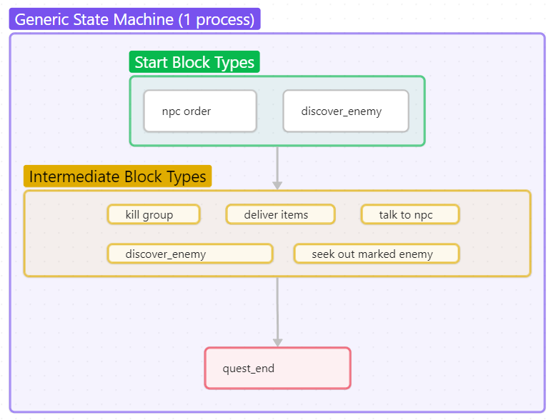
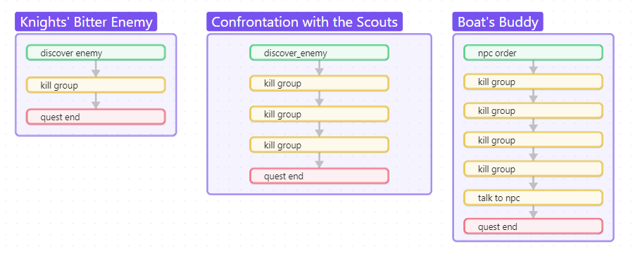
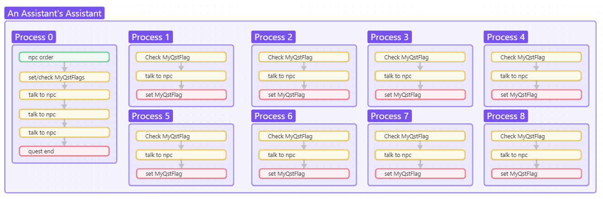
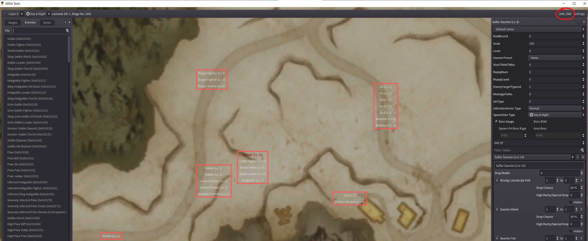
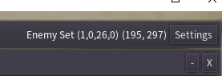
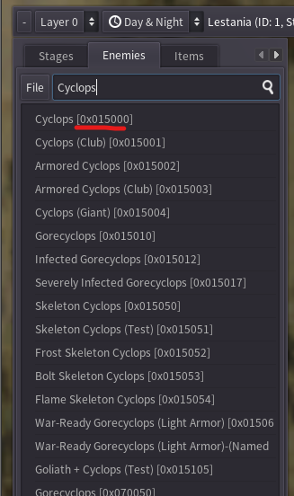
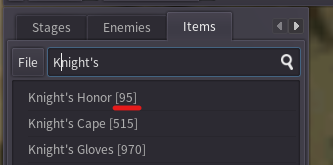

# Generic Quest State Machine

The generic quest state machine is a first attempt and providing a way for quests to be implemented without too much technical knowledge.

The generic implementation has currently proven to handle the following types of quests
- Find and kill a world boss
- Find and kill multiple groups of enemies
- Talk to an NPC to receive directions for some task. Complete this task and return.
  - Both key item deliveries and item deliveries are implemented.

## High Level overview of how a quest works

The quest system in DDon seems to be fairly complicated. A quest can define multiple processes and each process can have what is known as a sequence and block number. It is suspected that a process is akin to a thread in the quest state machine. Each process block has 2 lists of quest commands which are known as check commands and result commands.

The "result commands" are commands which actually do something (display the progress banner, teleport a player, start a custscene, etc.) The list of result commands are executed instantly when the block is fetched by the client.  The "check commands" are commands which wait for some condition to be satisfied. The quest process will only progress to the next block when all the check commands in the current block for the process are satisfied. The server can also send "work commands" which are async to the normal quest progress mechanism. The content of these commands looks similar to check commands.

Researching the packet capture for the main quest "Hope's Bitter End", the following patterns were observed.

- A quest can spawn multiple processes
- As each processes moves to the next state the block number is incrementd by 1
- When a process is completed, the block number is incremented by 1 and the sequence number is set to 1.
- A quest process state that only has result commands appears to be a terminal block (the client does not ask for another update)

## Details about the generic quest implementation

To simplify the enabling of simple quests, the generic quest state machine allows simple quests to be defined in a single process. For mre complex tasks it is possible to use multiple processes. It is up to the quest writer to decide.

The state machine assumes the following steps:



Each quest has some starting condition, either being ordered from an NPC or being discovered by chance out in the field. A number of intermediate steps are required by the quest. These steps can be, killing enemies, running to marked enemies, discovering enemies, delivering items to an NPC or talking to an NPC. Finally when all intermediate steps are completed, the quest is marked as complete and rewards are distributed.




New quests can be defined by updating or adding new files to [Arrowgene.Ddon.Shared/Files/Assets/quests](https://github.com/sebastian-heinz/Arrowgene.DragonsDogmaOnline/tree/develop/Arrowgene.Ddon.Shared/Files/Assets/quests)

## Overview of the generic quest JSON format

The JSON for the state machine is split into 4 major parts.
- Generic details about the quest.
- Rewards that can be earned by completing the quest.
- Enemies unique to the quest.
- Steps required for the quest to execute.
    - Either `blocks` or `processes`

```json
{
    "type": string,
    "comment": string,
    "quest_id": int,
    "base_level": int,
    "minimum_item_rank": int,
    "discoverable": bool,
    "area_id": string,
    "news_image": int,
    "rewards": [],
    "enemy_groups": [],
    "blocks": []
}
```

A proper definition of the format should be defined but for now we will use an example to show how one can create a new quest.

## How to add new quests

There currently does not exist any tools to aid in adding new world quests. I suggest to install the following tools.

- [ripgrep](https://github.com/BurntSushi/ripgrep)
- [git](https://git-scm.com/download/win)
- [arctool](http://redirect.viglink.com/?key=71fe2139a887ad501313cd8cce3053c5&subId=5490376&u=https%3A//www.fluffyquack.com/tools/ARCtool.rar)

After installing `git`, clone the following repositories locally
- [DDON-translation](https://github.com/Sapphiratelaemara/DDON-translation)
- [DDOn-Tools](https://github.com/alborrajo/DDOn-Tools)
- [ddon-data](https://github.com/ddon-research/ddon-data)

Build `DDon-tools` from source to get the latest build.

Use a wiki like [http://ddon.wikidot.com/](http://ddon.wikidot.com) to find the name of the quest in japanese.

### Example: Implementing "The Knights' Bitter Enemy"

Go to [http://ddon.wikidot.com/](http://ddon.wikidot.com/wq:theknightsbitterenemy) and copy the Japanese name of the quest `騎士団の仇敵`. Using `ripgrep`, search for this text in the DDON-translation repository you cloned and look for a match which looks like `DDON-Translation-TOML\ui\00_message\quest_info\q20005010_00.toml`

```plaintext
$ rg 騎士団の仇敵
// lot's of text prints out ...
DDON-Translation-CSV\ui\00_message\quest_info\q20005010_00.csv
2:q20005010_00_289,騎士団の仇敵,The Knights' Bitter Enemy
```

The first part of this file name `q20005010` (really `20005010`) this is the quest ID used by the client to display information about the quest. I would also suggest to lookup the quest in [youtube](https://www.youtube.com/watch?v=eXns7McFY1E) using the japanese name to see how the quest should work.

Using the wiki, we can learn the following details:

- The quest is located at (x 193, Y 294)
- The recommended level is 12
- The exp and currency rewards from the quest
    - 590 XP
    - 390 G
    - 70 R
    - 80 AP (not implemented)
- The selectable rewards of the quest (1 of the following three items)
  - 1x [Knight's Honour](http://ddon.wikidot.com/weapons:knightshonour)
  - 3x [Lumber Knife](http://ddon.wikidot.com/consumables:lumberknife)
  - 1x [Cathedral Fire](http://ddon.wikidot.com/weapons:cathedralfire)

Let's open up DDon-tools and find the information we require. After opening the tool, select the Lestania map and click on the enemies tab. Then start to move around the mouse until we are at the location (X:193, Y:294). We can tell the position in DDon-tools by looking in the upper right corner.



Once you have found the region, zoom in and we can see a bunch of nodes close to the area (red square boxes). This next part takes a bit of guess work. For this particular quest, the node with the cyclops in it is what we are interested in. Record the StageId values `(1, 0, 26, 0)` in the upper right corner after hovering over the node.



Next let's search for the Cyclops enemy ID. The enemies tab has a search input box you can use. Type in the name `cyclops` and record the hex number `0x015000` next to the name in the list.



Next select the item tab. Similar to enemies, we can search item ID's quickly.



After doing this for all three items, you should find

- Knight's Honor (95)
- Lumber Knife (58)
- Cathedral Fire (10047)

In this particular quest, this is all the information we need. Let's use it to construct the quest JSON object parsed by the server.

#### Populating the common information

First let's create a new file under `Arrowgene.DragonsDogmaOnline\Arrowgene.Ddon.Cli\bin\Debug\net9.0\Files\Assets\quests` called `q20005010.json`. The name of this file should reflect the quest id used by the client.

Each file should start with the following generic format.

```json
{
    "state_machine": "GenericStateMachine",
    "type": string,
    "comment": string,
    "quest_id": int,
    "base_level": int,
    "minimum_item_rank": int,
    "discoverable": bool,
    "area_id": string,
    "news_image": int,
    "rewards": [],
    "enemy_groups": [],
    "blocks": []
}
```

> [!NOTE]
> This quest is simple so we use the simplied syntax of `blocks` to define the steps in the quest. In more complicated quests, you may instead see `processes` instead. Quests which use `blocks` are shorthand to say this quest only has one process in the quest state machine.

First fill in the common items using the values we collected from the wiki. Quests starting with a prefix of `q2xxxxxx` are "World Quests", so we will fill in `"World"` as the quest type. The `discoverable` field controls if the quest shows up on the map before accepting it. In this quest we will set it to `false`.
```json
{
    "state_machine": "GenericStateMachine",
    "type": "World",
    "comment": "The Knights' Bitter Enemy",
    "quest_id": 20005010,
    "base_level": 12,
    "minimum_item_rank": 0,
    "discoverable": false,
    "area_id": "HidellPlains",
    "news_image": 5,
    "rewards": [],
    "enemy_groups": [],
    "blocks": []
}
```

The `area_id` field controls what category the quest appears under for Lestania News. In this case, the quest appears in Hidell Plains. You can also use "None" to hide the quest from the news. Similarly, if the quest does appear in Lestania News, you should provide a news image index. If none is provided, a default is used by the client, but the default only includes Hidell Plains images, so you should manually choose one.

| Min ID     | Max ID | Image Description                                                    |
|:---------:|:-----:|:-----------------------------------------------------------|
| 0     |       | Locked, used for quests with hidden info.
| 1     | 16    | Hidell Plains + White Dragon Temple
| 21    | 29    | Breya Coast
| 41    | 57    | Betland Plains + Temple of Purification
| 61    | 75    | Dowe Valley + Dreed Castle
| 81    | 96    | Volden Mines + Tunnels
| 101   | 114   | Mysree Forest + Glowworm Cave
| 121   | 128   | Mysree Grove
| 141   | 154   | Northern Betland Plains + Gardnox Fort
| 161   | 171   | Zandora Wasteland
| 181   | 193   | Eastern Zandora + Mergoda Security District
| 201   | 211   | Deenan Woods + Erte Deenan
| 221   | 235   | Mergoda Ruins
| 241   | 249   | Bloodbane Isle
| 261   | 266   | Elan Water Grove
| 281   | 285   | Farana Plains
| 301   | 305   | Kingall Canyon
| 321   | 326   | Morrow Forest
| 330   | 345   | Acre Selund
| 347   |       | Acre Selund
| 501   | 505   | Generic Wells
| 511   | 516   | Generic Cellars
| 521   | 527   | Generic Waterways
| 531   | 538   | Generic Caves
| 541   | 548   | Generic Catacombs
| 551   | 555   | Generic Arks
| 561   | 567   | Generic Terraces
| 571   | 573   | Generic Chapels
| 581   | 583   | Generic Caves (S2)
| 591   | 593   | Generic Waterways (S2)
| 603   |       | Tower of Ivanos
| 611   | 615   | Generic Ruins
| 621   | 623   | Generic Wells (S2)
| 641   | 643   | Generic Catacombs (S2)
| 650   |       | Hollow of Beginnings
| 660   | 662   | Generic Infected Forests
| 670   | 679   | Acre Selund Interiors
| 681   |       | Firefall Lava Caves
| 683   |       | Generic Cave (S3)
| 900   | 902   | Text Banners: Disaster/Rare Species/Bounty


#### Adding Rewards

Next we can define the rewards. The rewards have a variable format depending on the `type` field.

```json
{
    "type": string
}
```

- If the type is `wallet`, then it will contain the fields `wallet_type` and `amount`.
- If the type is `exp`, then it will contain the field `amount`.
- If the type is `select` it will describe a reward where 1 item can be selected.
- If the type is `random` it will describe a reward where 1 random item will be selected.
- If the type is `fixed` it will always reward the fixed item.

Putting this all together, we will get a reward list which looks like
```json
{
    "type": "wallet",
    "wallet_type": "Gold",
    "amount": 390
},
{
    "type": "wallet",
    "wallet_type": "RiftPoints",
    "amount": 70
},
{
    "type": "exp",
    "amount": 590
},
{
    "type": "select",
    "loot_pool": [
        {
            "item_id": 95,
            "num": 1
        },
        {
            "item_id": 58,
            "num": 3
        },
        {
            "item_id": 10047,
            "num": 1
        }
    ]
}
```

This should be added into the `rewards` array in the parent object.

#### Defining enemy groups

A group of enemies may be referenced in multiple rules. To reduce repetition, all enememy groups are defined one time in the `enemy_groups` category. They they are referenced by their 0 based index in this array. For each group, we need to provide location information about where to find these enemies. Recall the stage ID value `(1, 0, 26, 0)` we recorded from DDon-tools. The `stage_id` parser only provides the `id` and `group_id` by default. Other values can be optionally provided. There is an optional comment which can be provided to help remember what this group is for.

```json
"enemy_groups": [
    {
        "comment": "GroupId: 0",
        "stage_id": {
            "id": 1,
            "group_id": 26
        },
        "enemies": []
    }
]
```

Next we have an array of enemies in this group. Recall the values we recorded from DDOn-Tools the hexadecimal value of the enemy. We also need to provide a `level` and `exp` amount. There is a special flag `is_boss` which can be provided which assigns multiple flags used commonly with bosses. We set thgis to true.

```json
"enemy_groups": [
    {
        "comment": "GroupId: 0",
        "stage_id": {
            "id": 1,
            "group_id": 26
        },
        "enemies": [
            {
                "enemy_id": "0x015000",
                "level": 12,
                "exp": 1860,
                "is_boss": true
            }
        ]
    }
]
```

It is also possible to define the other attributes of the enemy seen in DDOn-Tools, but they are considered optional by the parser. If not provided, sane defaults will be selected.

> [!NOTE]
> The `enemy_id` is a hexstring that way we can see the information about the enemy easier (json doesn't allow hex literals). Presenting the number in hexadecimal allows easy visualization of certain attributes of the enemy encoded in it's ID.

> [!NOTE]
> More enemies can be defined in the `enemies` array. Also more groups can be defined in the `enemy_groups` array.


#### Defining the quest blocks

This quest is a simple quest so we will opt for a shorthand syntax where we just define a list of blocks. This list describes all the steps required to start and complete the quest. As mentioned earlier in the document, there are many types of `block` elements. There are blocks which are generally used to start a quest. Usually `DiscoverEnemy` or `NpcTalkAndOrder`. Then some variable amount of intermediate steps are provided. Finally there is the end block type which is implicitly added by the generic quest state machine and doesn't need to be provided in the quest json.

This quest is simple in that it only has 2 major steps.
- We discover the enemy
- We kill the enemy

We would create the first block as a `DiscoverEnemy` block. This block takes information about the location of the enemy and the node on the map they are associated with. The group id `0` is because this group of enemies is the `0` element in the `enemy_groups` array.

```json
{
    "type": "DiscoverEnemy",
    "groups": [0]
}
```

Next we define a rule that we want to wait for the enemy group to be dead. First thing we need to do is when we move from the first state `DiscoverEnemy` to the next state `KillGroup` is that we need to "announce" that we have accepted this quest. We do this by setting the `announce_type` key to `Accept`. Similar to the previous rule, we will then assign the group id value of `0` to associate this rule with the first element of the `enemy_groups` array. We also set this `reset_group` flag to `false`. We do this because the previous rule `DiscoverEnemy` already reset the group. If we do it in this rule as well, we will see the existing enemy dissapear and reappear (which we don't want to happen).

```json
{
    "type": "KillGroup",
    "announce_type": "Accept",
    "reset_group": false,
    "groups": [0]
}
```

Finally, your file should look like below. Save the file, reload the server and try out your quest.

```json
{
    "state_machine": "GenericStateMachine",
    "type": "World",
    "comment": "The Knights' Bitter Enemy",
    "quest_id": 20005010,
    "base_level": 12,
    "minimum_item_rank": 0,
    "discoverable": false,
    "area_id": "HidellPlains",
    "news_image": 5,
    "rewards": [
        {
            "type": "wallet",
            "wallet_type": "Gold",
            "amount": 390
        },
        {
            "type": "wallet",
            "wallet_type": "RiftPoints",
            "amount": 70
        },
        {
            "type": "exp",
            "amount": 590
        },
        {
            "type": "select",
            "loot_pool": [
                {
                    "item_id": 95,
                    "num": 1
                },
                {
                    "item_id": 58,
                    "num": 3
                },
                {
                    "item_id": 10047,
                    "num": 1
                }
            ]
        }
    ],
    "enemy_groups": [
        {
            "comment": "GroupId: 0",
            "stage_id": {
                "id": 1,
                "group_id": 26
            },
            "enemies": [
                {
                    "enemy_id": "0x015000",
                    "level": 12,
                    "exp": 1860,
                    "is_boss": true
                }
            ]
        }
    ],
    "blocks": [
        {
            "type": "DiscoverEnemy",
            "groups": [0]
        },
        {
            "type": "KillGroup",
            "announce_type": "Accept",
            "reset_group": false,
            "groups": [0]
        }
    ]
}
```

### Taking a look at: "The Woes of A Merchant" delivery quest

For this example, we will review a simple delivery quest which has NPC dialouge. This should teach you how to find the correct message id to use when chatting with an NPC.

First let's find the quest file [q20000001](https://github.com/sebastian-heinz/Arrowgene.DragonsDogmaOnline/blob/develop/Arrowgene.Ddon.Shared/Files/Assets/quests/q20000001.json) in the the sever respository. Next, head to the [DDON-translation](https://github.com/Sapphiratelaemara/DDON-translation) repository and locate the `@titles.txt` file under [DDON-Translation-TOML/ui/00_message/quest_info/](https://github.com/Sapphiratelaemara/DDON-translation/blob/main/DDON-Translation-TOML/ui/00_message/quest_info/%40titles.txt). Search for the Japanese name of the quest in the `@titles.txt` file, in our case it is "ある行商人の悩み". Use the Japanese quest name to search for gameplay videos of the quest. Use `DDON` before every search -- something like "DDON ある行商人の悩み". In the [ddon-data](https://github.com/ddon-research/ddon-data) respository, navigate to the quest directory `/client/03040008/quest/q20000001/ui/00_message/quest` and open the [gmd](https://github.com/ddon-research/ddon-data/blob/main/client/03040008/quest/q20000001/ui/00_message/quest/q20000001.gmd.json) and [mss](https://github.com/ddon-research/ddon-data/blob/main/client/03040008/quest/q20000001/ui/00_message/quest/q20000001.mss.json) files.

Let's go back to the gameplay video. Be careful when watching it, because there's a catch, there's basic npc dialog and quest npc dialog. The quest dialog only starts to happen after you accept the quest, so no need to pay attention to any dialog before the quest UI. After the quest is accepted the quest dialog will start to happen immediately. Pay attention to two things -- the number of dialogs displayed for each interaction and the kanji characters order. For this quest, after accepting it, four dialogs are displayed, so we know we will use a `GroupSerial` that contains four `MsgSerial` IDs in it.

Open the `q20000001.gmd` file and see if the kanji matches with the video. It is important to check because sometimes, there's multiple of the same messages with nuanced text. The `GroupSerial` for the first interaction with the NPCs will not always be at the top. For this message the correct messages are the first four in the gmd. Make notes of their GmdIndex value. They are `0`, `1`, `2` and `3` in this case.

Go to the file `q20000001.json` and search for the `Peddler` NPC. The quest rule should have a `message_id` associated with it. Open the [NpcId.cs](https://github.com/sebastian-heinz/Arrowgene.DragonsDogmaOnline/blob/develop/Arrowgene.Ddon.Shared/Model/NpcId.cs) in the server repository and check the NpcId for Peddler -- it is `509` in this case. Open the file `q20000001.mss.json` and search for the `GroupSerial` with `MsgSerial` containing GmdIndex `0`, `1`, `2` and `3`. In this case, it is the first one, `"GroupSerial" : 10734`. Make sure that `GroupSerial` belongs to Peddler which is NpcId `509`. Go back to the file `q20000001.json` and change the first `message_id` for Peddler to the `GroupSerial` corresponding to his four dialogs, which is `10734` in this case.

By analyzing the file `q20000001.json` we know that there's only one other `message_id` left. This is likely the dialog before completing the quest. Fast forward the video and repeat the previous steps for the new dialouge. As before, check for the number of dialogs and their corresponding kanji. Go to the file `q20000001.gmd` and compare the kanji with the ones in the video. You should find that the dialouge corresponds to `"MessageIndex" : 12`. Go back to the file `q20000001.mss.json` and remember to always check the NpcId. In this quest we only talk with one npc, but there's more complex quests than this one. Find the `GroupSerial` which has `"MessageIndex" : 12`. In this case it is `"GroupSerial" : 10737`. Go back to `q20000001.json` and change Peddler's last `message_id` to `10737`.

That is it, but remember, the correct messages for the first `message_id` isn't always the first one, so it is important to double check the kanji with the video. The quest dialog only starts after accepting the quest. Some quests start the dialog immediately, others require a conversation with the npc to advance to the next step. Sometimes the NPC will display a generic dialog and only displays his quest dialog after the player selects the quest in the npc dialog menu to advance the quest. Remember to always check the NpcId in quests with multiple npcs so you don't mix their dialogs.

## Block Types

The generic state machine offers a bunch of pseudo blocks which implement common behavior used in many simple quests. For quests which require more control, the `Raw` block can be used to directly provide commands to the client quest state machine.

### NpcTalkAndOrder

Used when starting a quest by talking to an NPC.

### DiscoverEnemy

Used when the quest starting point is when an enemy is encountered.

### SeekOutEnemiesAtMarkedLocation

Used when the quest requires you to find a group of enemies.

### End

This quest block is automatically inserted at the end of every list of blocks. This will generate the commands to complete/clear the quest. Do not add this block to the list of blocks in the JSON since it is implicitly added.

### KillGroup

Used to indicate enemies which need to be killed for a quest.

### CollectItem

Used to collect items from shiny points used in a quest.

### DeliverItems

Used to deliver items for a quest.

### TalkToNpc

Used to talk with NPCs.

### IsStageNo

Checks to see if the player is within a certain stage before progressing.

### MyQstFlags

Can set and/or check `MyQstFlag` values. Used to gate progress of processes in multi-process quests.

### Raw

The `Raw` block is a block type which accepts the raw commands understood by the game defined in the [Quest Commands](#quest-commands) section.

```json
{
    "type": "Raw",
    "check_commands": [],
    "result_commands": []
}
```

The check and result commands have a very similar format so they share the same JSON format. They all have a mandatory `type` argument and then accept up to 4 optional parameters. If a parameter is not provided it is assumed to be `0`.

```json
{
    "type": string,
    "Param1": int,
    "Param2": int,
    "Param3": int,
    "Param4": int
}
```

#### Example Raw Block

```json
{
    "type": "Raw",
    "check_commands": [
        {"type": "EventEnd", "Param1": 101, "Param2": 0}
    ],
    "result_commands": [
        {"type": "QstLayoutFlagOn", "Param1": 284},
        {"type": "QstLayoutFlagOn", "Param1": 937},
        {"type": "EventExec", "Param1": 101, "Param2": 0, "Param3": 101, "Param4": 0}
    ]
}
```

## Appendix

### Quest Commands

See the [quest command reference document](quest_command_reference.md) for more details.

### Quest Flags

#### Main Quests

##### Resolutions and Omens (q00000001)

| Type      | Stage | Value | Comment                                                    
|:---------:|:-----:|:-----:|:-----------------------------------------------------------
| QstLayout | 101   | 284   | Spawns Iris and Leo
| QstLayout | 423   | 1277  | Spawns Talcott, Cyrus, Iris and Leo
| MyQst     | 101   | 4     | Leo NPC State Machine (Waiting for action to begin)
| MyQst     | 101   | 13    | Leo NPC State Machine (Flag 13 check)
| MyQst     | 101   | 18    | Leo NPC State Machine (Flag 18 check)
| MyQst     | 101   | 934   | Leo NPC State Machine (Move Start_t0000)
| MyQst     | 101   | 935   | Leo NPC State Machine (Move in front of the enemy_t0000)
| MyQst     | 101   | 936   | Leo NPC State Machine (936 Check)
| MyQst     | 101   | 937   | Leo NPC State Machine (Flag 937 check)
| MyQst     | 101   | 942   | Leo NPC State Machine (942 check_t0000)
| MyQst     | 101   | 946   | Leo NPC State Machine (Battle_t0000)
| MyQst     | 101   | 599   | Leo NPC State Machine (Flag 18 check)
| MyQst     | 101   | 11    | Iris NPC State Machine (Leo's conversation waiting_t0000)
| MyQst     | 101   | 19    | Iris NPC State Machine (Flag 19 check)
| MyQst     | 101   | 935   | Iris NPC State Machine (Flag 935 check)
| MyQst     | 101   | 937   | Iris NPC State Machine (Flag 937 check)
| MyQst     | 101   | 936   | Iris NPC State Machine (Flag 936 check)
| MyQst     | 101   | 942   | Iris NPC State Machine (Flag 942 check)
| MyQst     | 101   | 598   | Iris NPC State Machine (Flag 598 check)
| MyQst     | 101   | 599   | Iris NPC State Machine (18Check_t0000)
| MyQst     | 101   | 1099  | Iris NPC State Machine (Waiting for conversation)

##### A Servant's Pledge (q00000026)

| Type      | Value | Comment                                                    |
|:---------:|:-----:|:-----------------------------------------------------------|
| QstLayout | 973   | Changes Pawn Dungeon Entrace to a Wall with no dungeon entrance.
| QstLayout | 974   | Changes Pawn Dungeon Entrace to teleport player to correct map for quest.
| QstLayout | 975   | Changes Pawn Dungeon Entrance to go to a different stage with shiny spots you can tocuh.
| QstLayout | 898   | Spawns glowing point for quest that player needs to touch.

> [!NOTE]
> Setting both flag 973 and 974 caused the game to query for lost pawns. When you don't set both, it doesn't do this.

##### The Dull Grey Arc (q00000005)

| Type      | Value | Comment                                                    |
|:---------:|:-----:|:-----------------------------------------------------------|
| QstLayout | 907   | Dead knights in st0576                                     |
| QstLayout | 911   | Blocks the boss area in st0576                             |
| QstLayout | 976   | Spawns Fabio, Iris and Klaus in an injured state in st0576 |
| QstLayout | 1226  | Spawns Fabio in the Audience Chamber close to Leo          |

##### The Girl in the Forest (q00000006)

| Type      | Value | Comment                                                    |
|:---------:|:-----:|:-----------------------------------------------------------|
| QstLayout | 912   | Spawns wall to block exits during boss fight
| QstLayout | 977   | Spawns Gerd and the White Knights outside Glowworm Cave
| QstLayout | 979   | Spawns Gerd and Mayleaf inside Glowworm Cave

##### The House of Steam (q00000007)

| Type      | Value | Comment                                                    |
|:---------:|:-----:|:-----------------------------------------------------------|
| QstLayout | 414   | Spawns Fabio in the hotsprings

##### The Assailed Fort (q00000009)

| Type      | Value | Comment                                                    |
|:---------:|:-----:|:-----------------------------------------------------------|
| QstLayout | 982   | Spawns Vanessa in the Audience Chamber
| QstLayout | 1236  | Spawns Gerd in the Audience Chamber
| QstLayout | 1305  | Spawns barricades outside gritten fort (prevents entrance)
| QstLayout | 1306  | Spawns barricades outside gritten fort (prevents entrance)

##### The Castle of Dusk (q00000010)

| Type      | Value | Comment                                                    |
|:---------:|:-----:|:-----------------------------------------------------------|
| QstLayout | 1237  | Spawns Gerd in the Audience Chamber
| QstLayout | 276   | Holy Grail (inside castle)
| QstLayout | 1108  | Solider Corpse (inside castle)
| QstLayout | 983   | Spawns WhiteKnights and Gerd (inside castle)
| QstLayout | 1291  | Boss barrier?
| QstLayout | 1308  | Spawns more WhiteKnights (hint NPC?) (inside castle)
| QstLayout | 1315  | Boss Room Locked Wooden Door (for boss fight)
| QstLayout | 913   | Boss Room Locked Gate (for boss fight)

#### The Stolen Heart (q00000013)

| Type      | Value |GroupNo| Comment                                                    |
|:---------:|:-----:|:-----:|:-----------------------------------------------------------|
| QstLayout | 902   | 1     | General purpose glitter for research (汎用キラキラポイント（調べる用)
| QstLayout | 914   | 2     | Template of purification gimmick gimmick (ミソギの滝ギミック)
| QstLayout | 1007  | 3     | Boss Door barrier??
| QstLayout | 1008  | 4     | Spawns Leo at the boss fight
| QstLayout | 2396  | 5     | Quest specified message OM (誘導１ -- (クエスト指定メッセージOM))
| QstLayout | 2397  | 6     | Quest specified message OM (誘導２-- (クエスト指定メッセージOM))
| QstLayout | 2398  | 7     | Quest specified message OM (誘導３-- (クエスト指定メッセージOM))
| QstLayout | 2399  | 8     | Quest specified message OM (誘導４-- (クエスト指定メッセージOM))
| QstLayout | 2400  | 9     | Quest specified message OM (誘導５-- (クエスト指定メッセージOM))
| MyQst     | 788   |       | Leo begins battle

#### The Roars of A Thousand (q00000014)

| Type      | Value | id/grp | Comment                                                    |
|:---------:|:-----:|:------:|:-----------------------------------------------------------|
| QstLayout | 1009  | st0201 | Spawns Gerd in the audience chamber
| QstLayout | 1239  | st0201 | Spawns Heinz in the Audience Chamber
| QstLayout | 1240  | st0201 | Spawns Vanessa in the Audience Chamber
| QstLayout | 1107  | st0100 | Knight Corpse lying face down (騎士死体うつ伏せ)
| QstLayout | 1010  | st0100 | Spawns White Knights, Heinz and Gerd
| QstLayout | 1100  | st0100 | Spawns Heinz
| QstLayout | 1257  | st0100 | Vessel of life (small) (命の器（小）)
| QstLayout | 1621  | st0100 | Allied NPC - For advance squad (共闘NPC−先発部隊用) (first battle in hidell)
| QstLayout | 1622  | st0100 | Gonghe NPC-For supporting troops (共闘NPC−支援部隊用) (second battle in hidell)
| MyQst     | 624   |        | Starts NPC FSM for advance squad (flag 1621)
| MyQst     | 600   |        | Stops NPC FSM for first battle and starts FSM for support groups (flag 1621 and 1622)
| MyQst     | 723   |        | Stops NPC FSM for 1 of the supporting group NPCs (flag 1622)
| MyQst     | 728   |        | Stops NPC FSM for 1 of the supporting group NPCs (flag 1622)
| MyQst     | 208   |        | Starts NPC FSM for Heinz, Gerd and White Knights (flag 1010)

#### Return to Yore (q00000015)
| Type      | Value | id/grp | Comment                                                    |
|:---------:|:-----:|:------:|:-----------------------------------------------------------|
| QstLayout | 1241  | st0201 | Spawns Mayleaf in the audience chamber.
| QstLayout | 903   | st0404 | General-purpose glitter points (for research purposes) (key?) (汎用キラキラポイント（調べる用）)
| QstLayout | 915   | st0404 | Large door in front of El Tedinanbos (エルテディナンボス前大型扉)
| QstLayout | 1011  | st0404 | Spawns Leo
| QstLayout | 1012  | st0404 | Spawns Kieshildt
| QstLayout | 1258  | st0404 | Vessel of Life (small) (命の器（小）)
| QstLayout | 2395  | st0404 | Spawns Kieshildt and Leo?

#### A Friendly Visit (q00000016)
| Type      | Value | id/grp          | Comment                                                    |
|:---------:|:-----:|:---------------:|:-----------------------------------------------------------|
| QstLayout | 1013  | st0201          | Spawns Vanessa
| QstLayout | 900   | st0100 (group1) | General-purpose glitter points (for research) (汎用キラキラポイント（調べる用）)
| QstLayout | 916   | st0402 (group1) | Gardnok Fort large door (ガルドノック砦大型ドア) (boss room lock)
| QstLayout | 1014  | st0402          | Spawns Arisen Corps Regimental Soldier, Stark, Talcott and Leo

#### A Brief Respite (q00000028)
| Type      | Value | id/grp          | Comment                                                    |
|:---------:|:-----:|:---------------:|:-----------------------------------------------------------|
| QstLayout | 1016  | st0200          | Spawns Mysial
| MyQst     | 170   |                 | NPC FSM: Mysial starts walking to Mel
| MainQst   | 171   |                 | NPC FSM: Set when Mysial is done talking to Mel
| MyQst     | 172   |                 | NPC FSM: Mysial starts walking to watch the sunset
| MainQst   | 173   |                 | NPC FSM: Set when Mysial reaches the destination to watch sunset
| MyQst     | 174   |                 | NPC FSM: Walk into Tavern
| MainQst   | 175   |                 | NPC FSM: Set when Mysial reaches stairs in tavern
| MyQst     | 176   |                 | NPC FSM: Mysial starts walking down the stairs into the tavern
| MainQst   | 586   |                 | NPC FSM: Mysial reaches pier?

#### The Ark, Once More (q00000018)
| Type      | Value | id/grp          | Comment                                                    |
|:---------:|:-----:|:---------------:|:-----------------------------------------------------------|
| QstLayout | 1242  | st0201          | Spawns Heinz in the audience chamber
| QstLayout | 917   | st0571          | Force player to Dungeon Exit (肉塊的に対応した封鎖扉)
| QstLayout | 924   | st0571          | Adult Atari OM 40m (大人アタリＯＭ 40m)
| QstLayout | 1015  | st0571          | Spawns Joseph inside the Ark

#### Thinking of A Friend (q00000019)
| Type      | Value | id/grp          | Comment                                                    |
|:---------:|:-----:|:---------------:|:-----------------------------------------------------------|
| QstLayout | 1243  | st0201          | Spawns Gerd
| QstLayout | 274   | st0100          | Quest specified message OM (クエスト指定メッセージOM)
| QstLayout | 971   | st0100          | Field closure (landslide) (フィールド封鎖（崖崩れ)
| QstLayout | 1017  | st0100          | Spawns Iris

#### The Beast's Final Moments (q00000029)
| Type      | Value | id/grp          | Comment                                                    |
|:---------:|:-----:|:---------------:|:-----------------------------------------------------------|
| QstLayout | 1246  | st0201          | Spawns Gerd
| QstLayout | 1247  | st0201          | Spawns Gerd, Heniz and Mayleaf
| QstLayout | 922   | st0571          | Boss Door (肉塊的に対応した封鎖扉)
| QstLayout | 1021  | st0571          | Spawns Leo
| MyQst     | 790   |                 | Starts Leos NPC FSM

### The future entrusted to us (q00000020)
| Type      | Value | id/grp          | Comment                                                    |
|:---------:|:-----:|:---------------:|:-----------------------------------------------------------|
| QstLayout | 1248  | st0201          | Spawns Gerd
| QstLayout | 1249  | st0201          | Spawns Gerd, Heinz
| QstLayout | 904   | st0411          | Alchemy Research Building -- General Purpose Glitter (錬金研究棟のカギ) -- (汎用キラキラポイント (調べる用))
| QstLayout | 905   | st0411          | Special Research Zone Key -- General Purpose Glitter (特別研究区のカギ) -- (汎用キラキラポイント (調べる用))
| QstLayout | 906   | st0411          | Military Instructor's Room Key -- General Purpose Glitter (軍事指導官部屋のカギ) -- (汎用キラキラポイント (調べる用))
| QstLayout | 1022  | st0411          | Spawns Leo
| QstLayout | 1023  | st0411          | Spawns Leo
| QstLayout | 1024  | st0411          | Spawns Iris
| MyQst     | 116   | st0411          | Starts Leo follow FSM for the stage
| MyQst     | 120   | st0411          | Starts Leos combat FSM for boss battle

### The Quandary of Soldiers (q00000021)
| Type      | stage  | Value | Comment                                                    |
|:---------:|:------:|:-----:|:-----------------------------------------------------------|
| QstLayout | st0201 | 1025  | Spawns Heinz
| QstLayout | st0201 | 1252  | Spawns Mayleaf
| QstLayout | st0203 | 277   | Transparent Warp and Glitter (フロア移動用透明ワープＯＭ) (汎用キラキラポイント（調べる用）)
| QstLayout | st0572 | 919   | Blocks boss room exits? (メルゴダ汎用スライトドア) (肉塊的に対応した封鎖扉) (メルゴダ汎用スライトドア)
| QstLayout | st0572 | 1026  | Spawns Karno, White Knights and Gerd
| QstLayout | st0572 | 1027  | Spawns Heinz
| QstLayout | st0572 | 1312  | bow? (船頭)

### The Dwellers of the Golden Land (q00000022)
| Type      | stage  | Value | Comment                                                    |
|:---------:|:------:|:-----:|:-----------------------------------------------------------|
| QstLayout | st0201 | 1028  | Spawn Heinz, Gerd and Vanessa.
| QstLayout | st0201 | 1253  | Spawn Mayleaf and Vanessa.
| QstLayout | st0410 | 920   | Slide Door (Melgoda General-purpose Slight Door) (スライドドア) (メルゴダ汎用スライトドア)
| QstLayout | st0410 | 1029  | Spawn Klaus
| QstLayout | st0410 | 2464  | Spawn blockaide and FLoating Stone (封鎖岩とアタリ) (大人アタリＯＭ 40m) (メルゴダ浮遊石(中))
| QstLayout | st0411 | 1102  | Spawn Klaus
| QstLayout | st0411 | 1307  | Blockaide and exit? (大人アタリＯＭ 60m)
| QstLayout | st0418 | 1098  | Diamantes Sealed Door (ディアマンテス封印扉)
| QstLayout | st0622 | 1030  | Spawn Klaus

### The Golden Key (q00000023)
| Type      | stage  | Value | Comment                                                    |
|:---------:|:------:|:-----:|:-----------------------------------------------------------|
| QstLayout | st0201 | 1254  | Spawns Gerd, Heinz and Mayleaf
| QstLayout | st0201 | 1255  | Spawns Heinz and Mayleaf
| QstLayout | st0622 | 1031  | Spawns Klaus
| QstLayout | st0418 | 901   | General Purpose Glitter (汎用キラキラポイント（調べる用）)
| QstLayout | st0418 | 923   | Mergoda Door Middle (メルゴダ扉・中両扉)
| QstLayout | st0418 | 1032  | Spawns Leo
| QstLayout | st0418 | 1324  | Mergoda Door Middle, Transparent warp OM for moving around the floor (メルゴダ扉・中両扉, フロア移動用透明ワープＯＭ)

### The Golden Key (q00000024)
| Type      | stage  | Value | Comment                                                    |
|:---------:|:------:|:-----:|:-----------------------------------------------------------|
| QstLayout | st0201 | 1033  | Spawns Heinz, Gerd, Vanessa and Mayleaf
| QstLayout | st0418 | 921   | Blocks something? (大人アタリＯＭ 40m, メルゴダ浮遊石(中), )
| QstLayout | st0418 | 1034  | Spawns Klaus
| QstLayout | st0418 | 1035  | Spawns Leo
| QstLayout | st0418 | 1099  | Diametes Sealed Door (ディアマンテス封印扉)
| QstLayout | st0418 | 1101  | Spawns Klaus
| MyQst     |        | 137   | Start Leo battl FSM

### Events

- [Lestania (stage0100)](events/st0100.md)
- [White Dragon Temple (stage0200)](events/st0200.md)
- [The Audience Chamber (stage0201)](events/st0201.md)
