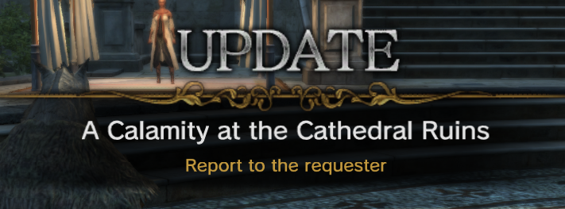
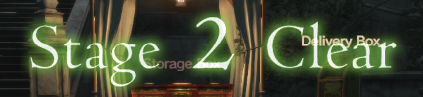

# Quest Command Reference

The quest commands are the commands used by the quest state machine in the client. As far as we can tell, the result commands are always executed first. Then the check commands are what control the progress of the state machine to request the next block for the process.


There are certain acronyms used in the command names

| Acronym | Meaning |
|:-------:|:-------:|
| Em      | Enemy   |
| Eq      | Equal   |
| OM      | Object Manager (doors, levers, glowing points) |
| Pl      | Player  |
| Prt     | Party   |
| Qst     | Quest   |
| Sce     | Scenario Bounding box? |

> [!NOTE]
> Some of the commands have misspellings in their names. I left them as originally sourced to help with searching/reverse engineering.

## Check Commands

Check commands are commands which gate the progress/advancement of the current quest block in a process to the next quest block in a process.

### TalkNpc
```
/**
 * @brief
 * @param stageNo
 * @param npcId
 */
TalkNpc(StageNo stageNo, NpcId npcId, int param03 = 0, int param04 = 0);
```

### DieEnemy
```
/**
 * @brief
 * @param stageNo
 * @param groupNo
 * @param setNo
 */
DieEnemy(StageNo stageNo, int groupNo, int setNo, int param04 = 0);
```

### SceHitIn

```
/**
 * @brief
 * @param stageNo
 * @param sceNo
 */
SceHitIn(StageNo stageNo, int sceNo, int param03 = 0, int param04 = 0);
```

### HaveItem

```
/**
 * @brief
 * @param itemId
 * @param itemNum
 */
HaveItem(int itemId, int itemNum, int param03 = 0, int param04 = 0);
```
### DeliverItem

```
/**
 * @brief
 * @param itemId
 * @param itemNum
 * @param npcId
 * @param msgNo
 */
DeliverItem(int itemId, int itemNum, NpcId npcId = NpcId.None, int msgNo = 0);
```

### EmDieLight

```
/**
 * @brief
 * @param enemyGroupId
 * @param enemyLv
 * @param enemyNum
 */
EmDieLight(int enemyGroupId, int enemyLv, int enemyNum, int param04 = 0);
```

### QstFlagOn

```
/**
 * @brief
 * @param questId
 * @param flagNo
 */
QstFlagOn(int questId, int flagNo, int param03 = 0, int param04 = 0);
```

### QstFlagOff

```
/**
 * @brief
 * @param questId
 * @param flagNo
 */
QstFlagOff(int questId, int flagNo, int param03 = 0, int param04 = 0);
```

### MyQstFlagOn

```
/**
 * @brief
 * @param flagNo
 */
MyQstFlagOn(int flagNo, int param02 = 0, int param03 = 0, int param04 = 0);
```

### MyQstFlagOff

```
/**
 * @brief
 * @param flagNo
 */
MyQstFlagOff(int flagNo, int param02 = 0, int param03 = 0, int param04 = 0);
```

### Padding00
```
/**
 * @brief
 */
Padding00(int param01 = 0, int param02 = 0, int param03 = 0, int param04 = 0);
```

### Padding01
```
/**
 * @brief
 */
Padding01(int param01 = 0, int param02 = 0, int param03 = 0, int param04 = 0);
```

### Padding02
```
/**
 * @brief
 */
Padding02(int param01 = 0, int param02 = 0, int param03 = 0, int param04 = 0);
```

### StageNo

```
/**
 * @brief
 * @param stageNo
 */
StageNo(StageNo stageNo, int param02 = 0, int param03 = 0, int param04 = 0);
```

### EventEnd

```
/**
 * @brief
 * @param stageNo
 * @param eventNo
 */
EventEnd(StageNo stageNo, int eventNo, int param03 = 0, int param04 = 0);
```

### Prt

```
/**
 * @brief Checks to see if all members of the party are ready before proceding.
 * There is an equivalent ResultCommand which spawns this point.
 * @param stageNo
 * @param x
 * @param y
 * @param z
 */
Prt(StageNo stageNo, int x, int y, int z);
```

### Clearcount

```
/**
 * @brief
 * @param minCount
 * @param maxCount
 */
Clearcount(int minCount, int maxCount, int param03 = 0, int param04 = 0);
```

### SceFlagOn

```
/**
 * @brief
 * @param flagNo
 */
SceFlagOn(int flagNo, int param02 = 0, int param03 = 0, int param04 = 0);
```

### SceFlagOff

```
/**
 * @brief
 * @param flagNo
 */
SceFlagOff(int flagNo, int param02 = 0, int param03 = 0, int param04 = 0);
```

### TouchActToNpc

```
/**
 * @brief
 * @param stageNo
 * @param npcId
 */
TouchActToNpc(StageNo stageNo, NpcId npcId, int param03 = 0, int param04 = 0);
```

### OrderDecide

```
/**
 * @brief
 * @param npcId
 */
OrderDecide(NpcId npcId, int param02 = 0, int param03 = 0, int param04 = 0);
```

### IsEndCycle

```
/**
 * @brief
 */
IsEndCycle(int param01 = 0, int param02 = 0, int param03 = 0, int param04 = 0);
```

### IsInterruptCycle

```
/**
 * @brief
 */
IsInterruptCycle(int param01 = 0, int param02 = 0, int param03 = 0, int param04 = 0);
```

### IsFailedCycle

```
/**
 * @brief
 */
IsFailedCycle(int param01 = 0, int param02 = 0, int param03 = 0, int param04 = 0);
```

### IsEndResult

```
/**
 * @brief
 */
IsEndResult(int param01 = 0, int param02 = 0, int param03 = 0, int param04 = 0);
```

### NpcTalkAndOrderUi

```
/**
 * @brief Used to order a quest from an NPC with multiple talking options.
 * @param stageNo
 * @param npcId
 * @param noOrderGroupSerial
 */
NpcTalkAndOrderUi(StageNo stageNo, NpcId npcId, int noOrderGroupSerial, int param04 = 0);
```

### NpcTouchAndOrderUi

```
/**
 * @brief Used to order a quest from an NPC with no additional talking options.
 * @param stageNo
 * @param npcId
 * @param noOrderGroupSerial
 */
NpcTouchAndOrderUi(StageNo stageNo, NpcId npcId, int noOrderGroupSerial, int param04 = 0);
```

### StageNoNotEq

```
/**
 * @brief
 * @param stageNo
 */
StageNoNotEq(StageNo stageNo, int param02 = 0, int param03 = 0, int param04 = 0);
```

### Warlevel

```
/**
 * @brief
 * @param warLevel
 */
Warlevel(int warLevel, int param02 = 0, int param03 = 0, int param04 = 0);
```

### TalkNpcWithoutMarker

```
/**
 * @brief
 * @param stageNo
 * @param npcId
 */
TalkNpcWithoutMarker(StageNo stageNo, NpcId npcId, int param03 = 0, int param04 = 0);
```

### HaveMoney

```
/**
 * @brief
 * @param gold
 * @param type
 */
HaveMoney(int gold, int type, int param03 = 0, int param04 = 0);
```

### SetQuestClearNum

```
/**
 * @brief
 * @note might be required when a quest asks you to go complete one world quest to progress?
 * @param clearNum
 * @param areaId
 */
SetQuestClearNum(int clearNum, int areaId, int param03 = 0, int param04 = 0);
```

### MakeCraft

```
/**
 * @brief
 */
MakeCraft(int param01 = 0, int param02 = 0, int param03 = 0, int param04 = 0);
```

### PlayEmotion

```
/**
 * @brief
 */
PlayEmotion(int param01 = 0, int param02 = 0, int param03 = 0, int param04 = 0);
```

### IsEndTimer

```
/**
 * @brief
 * @param timerNo
 */
IsEndTimer(int timerNo, int param02 = 0, int param03 = 0, int param04 = 0);
```

### IsEnemyFound

```
/**
 * @brief
 * @param stageNo
 * @param groupNo
 * @param setNo
 */
IsEnemyFound(StageNo stageNo, int groupNo, int setNo, int param04 = 0);
```

### RandomEq

```
/**
 * @brief
 * @param randomNo
 * @param value
 */
RandomEq(int randomNo, int value, int param03 = 0, int param04 = 0);
```

### RandomNotEq

```
/**
 * @brief
 * @param randomNo
 * @param value
 */
RandomNotEq(int randomNo, int value, int param03 = 0, int param04 = 0);
```

### RandomLess

```
/**
 * @brief
 * @param randomNo
 * @param value
 */
RandomLess(int randomNo, int value, int param03 = 0, int param04 = 0);
```

### RandomNotGreater

```
/**
 * @brief
 * @param randomNo
 * @param value
 */
RandomNotGreater(int randomNo, int value, int param03 = 0, int param04 = 0);
```

### RandomGreater

```
/**
 * @brief
 * @param randomNo
 * @param value
 */
RandomGreater(int randomNo, int value, int param03 = 0, int param04 = 0);
```

### RandomNotLess

```
/**
 * @brief
 * @param randomNo
 * @param value
 */
RandomNotLess(int randomNo, int value, int param03 = 0, int param04 = 0);
```

### Clearcount02

```
/**
 * @brief
 * @param div
 * @param value
 */
Clearcount02(int div, int value, int param03 = 0, int param04 = 0);
```

### IngameTimeRangeEq

```
/**
 * @brief
 * @param minTime
 * @param maxTime
 */
IngameTimeRangeEq(int minTime, int maxTime, int param03 = 0, int param04 = 0);
```

### IngameTimeRangeNotEq

```
/**
 * @brief
 * @param minTime
 * @param maxTime
 */
IngameTimeRangeNotEq(int minTime, int maxTime, int param03 = 0, int param04 = 0);
```

### PlHp

```
/**
 * @brief
 * @param hpRate
 * @param type
 */
PlHp(int hpRate, int type, int param03 = 0, int param04 = 0);
```

### EmHpNotLess

```
/**
 * @brief
 * @param stageNo
 * @param groupNo
 * @param setNo
 * @param hpRate
 */
EmHpNotLess(StageNo stageNo, int groupNo, int setNo, int hpRate);
```

### EmHpLess

```
/**
 * @brief
 * @param stageNo
 * @param groupNo
 * @param setNo
 * @param hpRate
 */
EmHpLess(StageNo stageNo, int groupNo, int setNo, int hpRate);
```

### WeatherEq

```
/**
 * @brief
 * @param weatherId
 */
WeatherEq(int weatherId, int param02 = 0, int param03 = 0, int param04 = 0);
```

### WeatherNotEq

```
/**
 * @brief
 * @param weatherId
 */
WeatherNotEq(int weatherId, int param02 = 0, int param03 = 0, int param04 = 0);
```

### PlJobEq

```
/**
 * @brief
 * @param jobId
 */
PlJobEq(int jobId, int param02 = 0, int param03 = 0, int param04 = 0);
```

### PlJobNotEq

```
/**
 * @brief
 * @param jobId
 */
PlJobNotEq(int jobId, int param02 = 0, int param03 = 0, int param04 = 0);
```

### PlSexEq

```
/**
 * @brief
 * @param sex
 */
PlSexEq(int sex, int param02 = 0, int param03 = 0, int param04 = 0);
```

### PlSexNotEq

```
/**
 * @brief
 * @param sex
 */
PlSexNotEq(int sex, int param02 = 0, int param03 = 0, int param04 = 0);
```

### SceHitOut

```
/**
 * @brief
 * @param stageNo
 * @param sceNo
 */
SceHitOut(StageNo stageNo, int sceNo, int param03 = 0, int param04 = 0);
```

### WaitOrder

```
/**
 * @brief
 */
WaitOrder(int param01 = 0, int param02 = 0, int param03 = 0, int param04 = 0);
```

### OmSetTouch

```
/**
 * @brief Used to touch objects spawned by World Manage Quests.
 * @param stageNo
 * @param groupNo
 * @param setNo
 */
OmSetTouch(StageNo stageNo, int groupNo, int setNo, int param04 = 0);
```

### OmReleaseTouch

```
/**
 * @brief Used to detect released objects spawned by World Manage Quests.
 * @param stageNo
 * @param groupNo
 * @param setNo
 */
OmReleaseTouch(StageNo stageNo, int groupNo, int setNo, int param04 = 0);
```

### JobLevelNotLess

```
/**
 * @brief
 * @param checkType
 * @param level
 */
JobLevelNotLess(int checkType, int level, int param03 = 0, int param04 = 0);
```

### JobLevelLess

```
/**
 * @brief
 * @param checkType
 * @param level
 */
JobLevelLess(int checkType, int level, int param03 = 0, int param04 = 0);
```

### MyQstFlagOnFromFsm

```
/**
 * @brief Checks for flags set by the NPC FSM. These flags would be the "FlagNo" values
 * under the "MainQstFlagOn" container name inside the npc fsm JSON files.
 * @param flagNo
 */
MyQstFlagOnFromFsm(int flagNo, int param02 = 0, int param03 = 0, int param04 = 0);
```

### SceHitInWithoutMarker

```
/**
 * @brief
 * @param stageNo
 * @param sceNo
 */
SceHitInWithoutMarker(StageNo stageNo, int sceNo, int param03 = 0, int param04 = 0);
```

### SceHitOutWithoutMarker

```
/**
 * @brief
 * @param stageNo
 * @param sceNo
 */
SceHitOutWithoutMarker(StageNo stageNo, int sceNo, int param03 = 0, int param04 = 0);
```

### KeyItemPoint

```
/**
 * @brief
 * @param idx
 * @param num
 */
KeyItemPoint(int idx, int num, int param03 = 0, int param04 = 0);
```

### IsNotEndTimer

```
/**
 * @brief
 * @param timerNo
 */
IsNotEndTimer(int timerNo, int param02 = 0, int param03 = 0, int param04 = 0);
```

### IsMainQuestClear

```
/**
 * @brief
 * @param questId
 */
IsMainQuestClear(int questId, int param02 = 0, int param03 = 0, int param04 = 0);
```

### DogmaOrb

```
/**
 * @brief Check is satisfied when player buys blood orb upgrade from the white dragon.
 */
DogmaOrb(int param01 = 0, int param02 = 0, int param03 = 0, int param04 = 0);
```

### IsEnemyFoundForOrder

```
/**
 * @brief
 * @param stageNo
 * @param groupNo
 * @param setNo
 */
IsEnemyFoundForOrder(StageNo stageNo, int groupNo, int setNo, int param04 = 0);
```

### IsTutorialFlagOn

```
/**
 * @brief
 * @param flagNo
 */
IsTutorialFlagOn(int flagNo, int param02 = 0, int param03 = 0, int param04 = 0);
```

### QuestOmSetTouch

```
/**
 * @brief
 * @param stageNo
 * @param groupNo
 * @param setNo
 */
QuestOmSetTouch(StageNo stageNo, int groupNo, int setNo, int param04 = 0);
```

### QuestOmReleaseTouch

```
/**
 * @brief
 * @param stageNo
 * @param groupNo
 * @param setNo
 */
QuestOmReleaseTouch(StageNo stageNo, int groupNo, int setNo, int param04 = 0);
```

### NewTalkNpc

```
/**
 * @brief
 * @param stageNo
 * @param groupNo
 * @param setNo
 * @param questId
 */
NewTalkNpc(StageNo stageNo, int groupNo, int setNo, int questId);
```

### NewTalkNpcWithoutMarker

```
/**
 * @brief
 * @param stageNo
 * @param groupNo
 * @param setNo
 * @param questId
 */
NewTalkNpcWithoutMarker(StageNo stageNo, int groupNo, int setNo, int questId);
```

### IsTutorialQuestClear

```
/**
 * @brief
 * @param questId
 */
IsTutorialQuestClear(int questId, int param02 = 0, int param03 = 0, int param04 = 0);
```

### IsMainQuestOrder

```
/**
 * @brief
 * @param questId
 */
IsMainQuestOrder(int questId, int param02 = 0, int param03 = 0, int param04 = 0);
```

### IsTutorialQuestOrder

```
/**
 * @brief
 * @param questId
 */
IsTutorialQuestOrder(int questId, int param02 = 0, int param03 = 0, int param04 = 0);
```

### IsTouchPawnDungeonOm

```
/**
 * @brief
 * @param stageNo
 * @param groupNo
 * @param setNo
 */
IsTouchPawnDungeonOm(StageNo stageNo, int groupNo, int setNo, int param04 = 0);
```

### IsOpenDoorOmQuestSet

```
/**
 * @brief
 * @param stageNo
 * @param groupNo
 * @param setNo
 * @param questId
 */
IsOpenDoorOmQuestSet(StageNo stageNo, int groupNo, int setNo, int questId);
```

### EmDieForRandomDungeon

```
/**
 * @brief
 * @param stageNo
 * @param enemyId
 * @param enemyNum
 */
EmDieForRandomDungeon(StageNo stageNo, int enemyId, int enemyNum, int param04 = 0);
```

### NpcHpNotLess

```
/**
 * @brief
 * @param stageNo
 * @param groupNo
 * @param setNo
 * @param hpRate
 */
NpcHpNotLess(StageNo stageNo, int groupNo, int setNo, int hpRate);
```

### NpcHpLess

```
/**
 * @brief
 * @param stageNo
 * @param groupNo
 * @param setNo
 * @param hpRate
 */
NpcHpLess(StageNo stageNo, int groupNo, int setNo, int hpRate);
```

### IsEnemyFoundWithoutMarker

```
/**
 * @brief
 * @param stageNo
 * @param groupNo
 * @param setNo
 */
IsEnemyFoundWithoutMarker(StageNo stageNo, int groupNo, int setNo, int param04 = 0);
```

### IsEventBoardAccepted

```
/**
 * @brief
 */
IsEventBoardAccepted(int param01 = 0, int param02 = 0, int param03 = 0, int param04 = 0);
```

### WorldManageQuestFlagOn

```
/**
 * @brief
 * @param flagNo
 * @param questId
 */
WorldManageQuestFlagOn(int flagNo, int questId, int param03 = 0, int param04 = 0);
```

### WorldManageQuestFlagOff

```
/**
 * @brief
 * @param flagNo
 * @param questId
 */
WorldManageQuestFlagOff(int flagNo, int questId, int param03 = 0, int param04 = 0);
```

### TouchEventBoard

```
/**
 * @brief
 */
TouchEventBoard(int param01 = 0, int param02 = 0, int param03 = 0, int param04 = 0);
```

### OpenEntryRaidBoss

```
/**
 * @brief
 */
OpenEntryRaidBoss(int param01 = 0, int param02 = 0, int param03 = 0, int param04 = 0);
```

### OepnEntryFortDefense

```
/**
 * @brief
 */
OepnEntryFortDefense(int param01 = 0, int param02 = 0, int param03 = 0, int param04 = 0);
```

### DiePlayer

```
/**
 * @brief
 */
DiePlayer(int param01 = 0, int param02 = 0, int param03 = 0, int param04 = 0);
```

### PartyNumNotLessWtihoutPawn

```
/**
 * @brief
 * @param partyMemberNum
 */
PartyNumNotLessWtihoutPawn(int partyMemberNum, int param02 = 0, int param03 = 0, int param04 = 0);
```

### PartyNumNotLessWithPawn

```
/**
 * @brief
 * @param partyMemberNum
 */
PartyNumNotLessWithPawn(int partyMemberNum, int param02 = 0, int param03 = 0, int param04 = 0);
```

### LostMainPawn

```
/**
 * @brief
 */
LostMainPawn(int param01 = 0, int param02 = 0, int param03 = 0, int param04 = 0);
```

### SpTalkNpc

```
/**
 * @brief
 */
SpTalkNpc(int param01 = 0, int param02 = 0, int param03 = 0, int param04 = 0);
```

### OepnJobMaster

```
/**
 * @brief
 */
OepnJobMaster(int param01 = 0, int param02 = 0, int param03 = 0, int param04 = 0);
```

### TouchRimStone

```
/**
 * @brief
 */
TouchRimStone(int param01 = 0, int param02 = 0, int param03 = 0, int param04 = 0);
```

### GetAchievement

```
/**
 * @brief
 */
GetAchievement(int param01 = 0, int param02 = 0, int param03 = 0, int param04 = 0);
```

### DummyNotProgress

```
/**
 * @brief
 */
DummyNotProgress(int param01 = 0, int param02 = 0, int param03 = 0, int param04 = 0);
```

### DieRaidBoss

```
/**
 * @brief
 */
DieRaidBoss(int param01 = 0, int param02 = 0, int param03 = 0, int param04 = 0);
```

### CycleTimerZero
```
/**
 * @brief
 */
CycleTimerZero(int param01 = 0, int param02 = 0, int param03 = 0, int param04 = 0);
```

### CycleTimer
```
/**
 * @brief
 * @param timeSec
 */
CycleTimer(int timeSec, int param02 = 0, int param03 = 0, int param04 = 0);
```

### QuestNpcTalkAndOrderUi
```
/**
 * @brief
 * @param stageNo
 * @param groupNo
 * @param setNo
 * @param questId
 */
QuestNpcTalkAndOrderUi(StageNo stageNo, int groupNo, int setNo, int questId);
```

### QuestNpcTouchAndOrderUi
```
/**
 * @brief
 * @param stageNo
 * @param groupNo
 * @param setNo
 * @param questId
 */
QuestNpcTouchAndOrderUi(StageNo stageNo, int groupNo, int setNo, int questId);
```

### IsFoundRaidBoss
```
/**
 * @brief
 * @param stageNo
 * @param groupNo
 * @param setNo
 * @param enemyId
 */
IsFoundRaidBoss(StageNo stageNo, int groupNo, int setNo, int enemyId);
```

### QuestOmSetTouchWithoutMarker
```
/**
 * @brief
 * @param stageNo
 * @param groupNo
 * @param setNo
 */
QuestOmSetTouchWithoutMarker(StageNo stageNo, int groupNo, int setNo, int param04 = 0);
```

### QuestOmReleaseTouchWithoutMarker
```
/**
 * @brief
 * @param stageNo
 * @param groupNo
 * @param setNo
 */
QuestOmReleaseTouchWithoutMarker(StageNo stageNo, int groupNo, int setNo, int param04 = 0);
```

### TutorialTalkNpc
```
/**
 * @brief
 * @param stageNo
 * @param npcId
 */
TutorialTalkNpc(StageNo stageNo, NpcId npcId, int param03 = 0, int param04 = 0);
```

### IsLogin
```
/**
 * @brief
 */
IsLogin(int param01 = 0, int param02 = 0, int param03 = 0, int param04 = 0);
```

### IsPlayEndFirstSeasonEndCredit
```
/**
 * @brief
 */
IsPlayEndFirstSeasonEndCredit(int param01 = 0, int param02 = 0, int param03 = 0, int param04 = 0);
```

### IsKilledTargetEnemySetGroup
```
/**
 * @brief
 * @param flagNo
 */
IsKilledTargetEnemySetGroup(int flagNo, int param02 = 0, int param03 = 0, int param04 = 0);
```

### IsKilledTargetEmSetGrpNoMarker

```
/**
 * @brief
 * @param flagNo
 */
IsKilledTargetEmSetGrpNoMarker(int flagNo, int param02 = 0, int param03 = 0, int param04 = 0);
```

### IsLeftCycleTimer
```
/**
 * @brief
 * @param timeSec
 */
IsLeftCycleTimer(int timeSec, int param02 = 0, int param03 = 0, int param04 = 0);
```

### OmEndText
```
/**
 * @brief
 * @param stageNo
 * @param groupNo
 * @param setNo
 */
OmEndText(StageNo stageNo, int groupNo, int setNo, int param04 = 0);
```

### QuestOmEndText
```
/**
 * @brief
 * @param stageNo
 * @param groupNo
 * @param setNo
 */
QuestOmEndText(StageNo stageNo, int groupNo, int setNo, int param04 = 0);
```

### OpenAreaMaster
```
/**
 * @brief
 * @param areaId
 */
OpenAreaMaster(int areaId, int param02 = 0, int param03 = 0, int param04 = 0);
```

### HaveItemAllBag
```
/**
 * @brief
 * @param itemId
 * @param itemNum
 */
HaveItemAllBag(int itemId, int itemNum, int param03 = 0, int param04 = 0);
```

### OpenNewspaper
```
/**
 * @brief
 */
OpenNewspaper(int param01 = 0, int param02 = 0, int param03 = 0, int param04 = 0);
```

### OpenQuestBoard
```
/**
 * @brief
 */
OpenQuestBoard(int param01 = 0, int param02 = 0, int param03 = 0, int param04 = 0);
```

### StageNoWithoutMarker
```
/**
 * @brief
 * @param stageNo
 */
StageNoWithoutMarker(StageNo stageNo, int param02 = 0, int param03 = 0, int param04 = 0);
```

### TalkQuestNpcUnitMarker
```
/**
 * @brief Used when a NPC walks between multiple points. The marker will continue to float over the NPCs head.
 * @param stageNo
 * @param groupNo
 * @param setNo
 * @param questId
 */
TalkQuestNpcUnitMarker(StageNo stageNo, int groupNo, int setNo, int questId);
```

### TouchQuestNpcUnitMarker
```
/**
 * @brief
 * @param stageNo
 * @param groupNo
 * @param setNo
 * @param questId
 */
TouchQuestNpcUnitMarker(StageNo stageNo, int groupNo, int setNo, int questId);
```

### IsExistSecondPawn
```
/**
 * @brief
 */
IsExistSecondPawn(int param01 = 0, int param02 = 0, int param03 = 0, int param04 = 0);
```

### IsOrderJobTutorialQuest
```
/**
 * @brief
 */
IsOrderJobTutorialQuest(int param01 = 0, int param02 = 0, int param03 = 0, int param04 = 0);
```

### IsOpenWarehouse
```
/**
 * @brief
 */
IsOpenWarehouse(int param01 = 0, int param02 = 0, int param03 = 0, int param04 = 0);
```

### IsMyquestLayoutFlagOn
```
/**
 * @brief
 * @param FlagNo
 */
IsMyquestLayoutFlagOn(int FlagNo, int param02 = 0, int param03 = 0, int param04 = 0);
```

### IsMyquestLayoutFlagOff
```
/**
 * @brief
 * @param FlagNo
 */
IsMyquestLayoutFlagOff(int FlagNo, int param02 = 0, int param03 = 0, int param04 = 0);
```

### IsOpenWarehouseReward
```
/**
 * @brief
 */
IsOpenWarehouseReward(int param01 = 0, int param02 = 0, int param03 = 0, int param04 = 0);
```

### IsOrderLightQuest
```
/**
 * @brief
 */
IsOrderLightQuest(int param01 = 0, int param02 = 0, int param03 = 0, int param04 = 0);
```

### IsOrderWorldQuest
```
/**
 * @brief
 */
IsOrderWorldQuest(int param01 = 0, int param02 = 0, int param03 = 0, int param04 = 0);
```

### IsLostMainPawn
```
/**
 * @brief
 */
IsLostMainPawn(int param01 = 0, int param02 = 0, int param03 = 0, int param04 = 0);
```

### IsFullOrderQuest
```
/**
 * @brief
 */
IsFullOrderQuest(int param01 = 0, int param02 = 0, int param03 = 0, int param04 = 0);
```

### IsBadStatus
```
/**
 * @brief
 */
IsBadStatus(int param01 = 0, int param02 = 0, int param03 = 0, int param04 = 0);
```

### CheckAreaRank
```
/**
 * @brief
 * @param AreaId
 * @param AreaRank
 */
CheckAreaRank(int AreaId, int AreaRank, int param03 = 0, int param04 = 0);
```

### Padding133
```
/**
 * @brief
 */
Padding133(int param01 = 0, int param02 = 0, int param03 = 0, int param04 = 0);
```

### EnablePartyWarp
```
/**
 * @brief
 */
EnablePartyWarp(int param01 = 0, int param02 = 0, int param03 = 0, int param04 = 0);
```

### IsHugeble
```
/**
 * @brief
 */
IsHugeble(int param01 = 0, int param02 = 0, int param03 = 0, int param04 = 0);
```

### IsDownEnemy
```
/**
 * @brief
 */
IsDownEnemy(int param01 = 0, int param02 = 0, int param03 = 0, int param04 = 0);
```

### OpenAreaMasterSupplies
```
/**
 * @brief
 */
OpenAreaMasterSupplies(int param01 = 0, int param02 = 0, int param03 = 0, int param04 = 0);
```

### OpenEntryBoard
```
/**
 * @brief
 */
OpenEntryBoard(int param01 = 0, int param02 = 0, int param03 = 0, int param04 = 0);
```

### NoticeInterruptContents
```
/**
 * @brief
 */
NoticeInterruptContents(int param01 = 0, int param02 = 0, int param03 = 0, int param04 = 0);
```

### OpenRetrySelect
```
/**
 * @brief
 */
OpenRetrySelect(int param01 = 0, int param02 = 0, int param03 = 0, int param04 = 0);
```

### IsPlWeakening
```
/**
 * @brief
 */
IsPlWeakening(int param01 = 0, int param02 = 0, int param03 = 0, int param04 = 0);
```

### NoticePartyInvite
```
/**
 * @brief
 */
NoticePartyInvite(int param01 = 0, int param02 = 0, int param03 = 0, int param04 = 0);
```

### IsKilledAreaBoss
```
/**
 * @brief
 */
IsKilledAreaBoss(int param01 = 0, int param02 = 0, int param03 = 0, int param04 = 0);
```

### IsPartyReward
```
/**
 * @brief
 */
IsPartyReward(int param01 = 0, int param02 = 0, int param03 = 0, int param04 = 0);
```

### IsFullBag
```
/**
 * @brief
 */
IsFullBag(int param01 = 0, int param02 = 0, int param03 = 0, int param04 = 0);
```

### OpenCraftExam
```
/**
 * @brief
 */
OpenCraftExam(int param01 = 0, int param02 = 0, int param03 = 0, int param04 = 0);
```

### LevelUpCraft
```
/**
 * @brief
 */
LevelUpCraft(int param01 = 0, int param02 = 0, int param03 = 0, int param04 = 0);
```

### IsClearLightQuest
```
/**
 * @brief
 */
IsClearLightQuest(int param01 = 0, int param02 = 0, int param03 = 0, int param04 = 0);
```

### OpenJobMasterReward
```
/**
 * @brief
 */
OpenJobMasterReward(int param01 = 0, int param02 = 0, int param03 = 0, int param04 = 0);
```

### TouchActQuestNpc
```
/**
 * @brief
 * @param stageNo
 * @param groupNo
 * @param setNo
 * @param questId
 */
TouchActQuestNpc(StageNo stageNo, int groupNo, int setNo, int questId);
```

### IsLeaderAndJoinPawn
```
/**
 * @brief
 * @param pawnNum
 */
IsLeaderAndJoinPawn(int pawnNum, int param02 = 0, int param03 = 0, int param04 = 0);
```

### IsAcceptLightQuest
```
/**
 * @brief
 */
IsAcceptLightQuest(int param01 = 0, int param02 = 0, int param03 = 0, int param04 = 0);
```

### IsReleaseWarpPoint
```
/**
 * @brief
 */
IsReleaseWarpPoint(int param01 = 0, int param02 = 0, int param03 = 0, int param04 = 0);
```

### IsSetPlayerSkill
```
/**
 * @brief
 */
IsSetPlayerSkill(int param01 = 0, int param02 = 0, int param03 = 0, int param04 = 0);
```

### IsOrderMyQuest
```
/**
 * @brief
 */
IsOrderMyQuest(int param01 = 0, int param02 = 0, int param03 = 0, int param04 = 0);
```

### IsNotOrderMyQuest
```
/**
 * @brief
 */
IsNotOrderMyQuest(int param01 = 0, int param02 = 0, int param03 = 0, int param04 = 0);
```

### HasMypawn
```
/**
 * @brief
 */
HasMypawn(int param01 = 0, int param02 = 0, int param03 = 0, int param04 = 0);
```

### IsFavoriteWarpPoint
```
/**
 * @brief
 * @param warpPointId
 */
IsFavoriteWarpPoint(int warpPointId, int param02 = 0, int param03 = 0, int param04 = 0);
```

### Craft
```
/**
 * @brief
 */
Craft(int param01 = 0, int param02 = 0, int param03 = 0, int param04 = 0);
```

### IsKilledTargetEnemySetGroupGmMain
```
/**
 * @brief
 * @param flagNo
 */
IsKilledTargetEnemySetGroupGmMain(int flagNo, int param02 = 0, int param03 = 0, int param04 = 0);
```

### IsKilledTargetEnemySetGroupGmSub
```
/**
 * @brief
 * @param flagNo
 */
IsKilledTargetEnemySetGroupGmSub(int flagNo, int param02 = 0, int param03 = 0, int param04 = 0);
```

### HasUsedKey
```
/**
 * @brief
 * @param stageNo
 * @param groupNo
 * @param setNo
 * @param questId
 */
HasUsedKey(StageNo stageNo, int groupNo, int setNo, int questId);
```

### IsCycleFlagOffPeriod
```
/**
 * @brief
 */
IsCycleFlagOffPeriod(int param01 = 0, int param02 = 0, int param03 = 0, int param04 = 0);
```

### IsEnemyFoundGmMain
```
/**
 * @brief
 * @param stageNo
 * @param groupNo
 * @param setNo
 */
IsEnemyFoundGmMain(StageNo stageNo, int groupNo, int setNo, int param04 = 0);
```

### IsEnemyFoundGmSub
```
/**
 * @brief
 * @param stageNo
 * @param groupNo
 * @param setNo
 */
IsEnemyFoundGmSub(StageNo stageNo, int groupNo, int setNo, int param04 = 0);
```

### IsLoginBugFixedOnly
```
/**
 * @brief
 */
IsLoginBugFixedOnly(int param01 = 0, int param02 = 0, int param03 = 0, int param04 = 0);
```

### IsSearchClan
```
/**
 * @brief
 */
IsSearchClan(int param01 = 0, int param02 = 0, int param03 = 0, int param04 = 0);
```

### IsOpenAreaListUi
```
/**
 * @brief
 */
IsOpenAreaListUi(int param01 = 0, int param02 = 0, int param03 = 0, int param04 = 0);
```

### IsReleaseWarpPointAnyone
```
/**
 * @brief
 * @param warpPointId
 */
IsReleaseWarpPointAnyone(int warpPointId, int param02 = 0, int param03 = 0, int param04 = 0);
```

### DevidePlayer
```
/**
 * @brief
 */
DevidePlayer(int param01 = 0, int param02 = 0, int param03 = 0, int param04 = 0);
```

### NowPhase
```
/**
 * @brief
 * @param phaseId
 */
NowPhase(int phaseId, int param02 = 0, int param03 = 0, int param04 = 0);
```

### IsReleasePortal
```
/**
 * @brief
 */
IsReleasePortal(int param01 = 0, int param02 = 0, int param03 = 0, int param04 = 0);
```

### IsGetAppraiseItem
```
/**
 * @brief
 */
IsGetAppraiseItem(int param01 = 0, int param02 = 0, int param03 = 0, int param04 = 0);
```

### IsSetPartnerPawn
```
/**
 * @brief
 */
IsSetPartnerPawn(int param01 = 0, int param02 = 0, int param03 = 0, int param04 = 0);
```

### IsPresentPartnerPawn
```
/**
 * @brief
 */
IsPresentPartnerPawn(int param01 = 0, int param02 = 0, int param03 = 0, int param04 = 0);
```

### IsReleaseMyRoom
```
/**
 * @brief
 */
IsReleaseMyRoom(int param01 = 0, int param02 = 0, int param03 = 0, int param04 = 0);
```

### IsExistDividePlayer
```
/**
 * @brief
 */
IsExistDividePlayer(int param01 = 0, int param02 = 0, int param03 = 0, int param04 = 0);
```

### NotDividePlayer
```
/**
 * @brief
 */
NotDividePlayer(int param01 = 0, int param02 = 0, int param03 = 0, int param04 = 0);
```

### IsGatherPartyInStage
```
/**
 * @brief
 * @param stageNo
 */
IsGatherPartyInStage(StageNo stageNo, int param02 = 0, int param03 = 0, int param04 = 0);
```

### IsFinishedEnemyDivideAction
```
/**
 * @brief
 */
IsFinishedEnemyDivideAction(int param01 = 0, int param02 = 0, int param03 = 0, int param04 = 0);
```

### IsOpenDoorOmQuestSetNoMarker
```
/**
 * @brief
 * @param stageNo
 * @param groupNo
 * @param setNo
 * @param questId
 */
IsOpenDoorOmQuestSetNoMarker(StageNo stageNo, int groupNo, int setNo, int questId);
```

### IsFinishedEventOrderNum
```
/**
 * @brief
 * @param stageNo
 * @param eventNo
 */
IsFinishedEventOrderNum(StageNo stageNo, int eventNo, int param03 = 0, int param04 = 0);
```

### IsPresentPartnerPawnNoMarker
```
/**
 * @brief
 */
IsPresentPartnerPawnNoMarker(int param01 = 0, int param02 = 0, int param03 = 0, int param04 = 0);
```

### IsOmBrokenLayout
```
/**
 * @brief
 * @param stageNo
 * @param groupNo
 * @param setNo
 */
IsOmBrokenLayout(StageNo stageNo, int groupNo, int setNo, int param04 = 0);
```

### IsOmBrokenQuest
```
/**
 * @brief
 * @param stageNo
 * @param groupNo
 * @param setNo
 */
IsOmBrokenQuest(StageNo stageNo, int groupNo, int setNo, int param04 = 0);
```

### IsHoldingPeriodCycleContents
```
/**
 * @brief
 */
IsHoldingPeriodCycleContents(int param01 = 0, int param02 = 0, int param03 = 0, int param04 = 0);
```

### IsNotHoldingPeriodCycleContents
```
/**
 * @brief
 */
IsNotHoldingPeriodCycleContents(int param01 = 0, int param02 = 0, int param03 = 0, int param04 = 0);
```

### IsResetInstanceArea
```
/**
 * @brief
 */
IsResetInstanceArea(int param01 = 0, int param02 = 0, int param03 = 0, int param04 = 0);
```

### CheckMoonAge
```
/**
 * @brief
 * @param moonAgeStart
 * @param moonAgeEnd
 */
CheckMoonAge(int moonAgeStart, int moonAgeEnd, int param03 = 0, int param04 = 0);
```

### IsOrderPawnQuest
```
/**
 * @brief
 * @param orderGroupSerial
 * @param noOrderGroupSerial
 */
IsOrderPawnQuest(int orderGroupSerial, int noOrderGroupSerial, int param03 = 0, int param04 = 0);
```

### IsTakePictures
```
/**
 * @brief
 */
IsTakePictures(int param01 = 0, int param02 = 0, int param03 = 0, int param04 = 0);
```

### IsStageForMainQuest
```
/**
 * @brief
 * @param stageNo
 */
IsStageForMainQuest(StageNo stageNo, int param02 = 0, int param03 = 0, int param04 = 0);
```

### IsReleasePawnExpedition
```
/**
 * @brief
 */
IsReleasePawnExpedition(int param01 = 0, int param02 = 0, int param03 = 0, int param04 = 0);
```

### OpenPpMode
```
/**
 * @brief
 */
OpenPpMode(int param01 = 0, int param02 = 0, int param03 = 0, int param04 = 0);
```

### PpNotLess
```
/**
 * @brief
 * @param point
 */
PpNotLess(int point, int param02 = 0, int param03 = 0, int param04 = 0);
```

### OpenPpShop
```
/**
 * @brief
 */
OpenPpShop(int param01 = 0, int param02 = 0, int param03 = 0, int param04 = 0);
```

### TouchClanBoard
```
/**
 * @brief
 */
TouchClanBoard(int param01 = 0, int param02 = 0, int param03 = 0, int param04 = 0);
```

### IsOneOffGather
```
/**
 * @brief
 */
IsOneOffGather(int param01 = 0, int param02 = 0, int param03 = 0, int param04 = 0);
```

### IsOmBrokenLayoutNoMarker
```
/**
 * @brief
 * @param stageNo
 * @param groupNo
 * @param setNo
 */
IsOmBrokenLayoutNoMarker(StageNo stageNo, int groupNo, int setNo, int param04 = 0);
```

### IsOmBrokenQuestNoMarker
```
/**
 * @brief
 * @param stageNo
 * @param groupNo
 * @param setNo
 */
IsOmBrokenQuestNoMarker(StageNo stageNo, int groupNo, int setNo, int param04 = 0);
```

### KeyItemPointEq
```
/**
 * @brief
 * @param idx
 * @param num
 */
KeyItemPointEq(int idx, int num, int param03 = 0, int param04 = 0);
```

### IsEmotion
```
/**
 * @brief
 * @param actNo
 */
IsEmotion(int actNo, int param02 = 0, int param03 = 0, int param04 = 0);
```

### IsEquipColor
```
/**
 * @brief
 * @param color
 */
IsEquipColor(int color, int param02 = 0, int param03 = 0, int param04 = 0);
```

### IsEquip
```
/**
 * @brief
 * @param itemId
 */
IsEquip(int itemId, int param02 = 0, int param03 = 0, int param04 = 0);
```

### IsTakePicturesNpc
```
/**
 * @brief
 * @param stageNo
 * @param npcId01
 * @param npcId02
 * @param npcId03
 */
IsTakePicturesNpc(StageNo stageNo, int npcId01, int npcId02, int npcId03);
```

### SayMessage
```
/**
 * @brief
 */
SayMessage(int param01 = 0, int param02 = 0, int param03 = 0, int param04 = 0);
```

### IsTakePicturesWithoutPawn
```
/**
 * @brief
 * @param stageNo
 * @param x
 * @param y
 * @param z
 */
IsTakePicturesWithoutPawn(StageNo stageNo, int x, int y, int z);
```

### IsLinkageEnemyFlag
```
/**
 * @brief
 * @param stageNo
 * @param groupNo
 * @param setNo
 * @param flagNo
 */
IsLinkageEnemyFlag(StageNo stageNo, int groupNo, int setNo, int flagNo);
```

### IsLinkageEnemyFlagOff
```
/**
 * @brief
 * @param stageNo
 * @param groupNo
 * @param setNo
 * @param flagNo
 */
IsLinkageEnemyFlagOff(StageNo stageNo, int groupNo, int setNo, int flagNo);
```

### IsReleaseSecretRoom
```
/**
 * @brief
 */
IsReleaseSecretRoom(int param01 = 0, int param02 = 0, int param03 = 0, int param04 = 0);
```

## Result Commands

### LotOn

```
/**
 * @brief
 * @param stageNo
 * @param lotNo
 */
LotOn(StageNo stageNo, int lotNo, int param03 = 0, int param04 = 0);
```

### LotOff

```
/**
 * @brief
 * @param stageNo
 * @param lotNo
 */
LotOff(StageNo stageNo, int lotNo, int param03 = 0, int param04 = 0);
```

### HandItem

```
/**
 * @brief
 * @param itemId
 * @param itemNum
 */
HandItem(int itemId, int itemNum, int param03 = 0, int param04 = 0);
```

### SetAnnounce

```
/**
 * @brief
 * @param announceType
 * @param announceSubtype Some announce commands like accept use this parameter to distinguish between distinguish between "discovered (0)" and "accept (1)" banner.
 */
SetAnnounce(QuestAnnounceType announceType, int announceSubtype = 0, int param03 = 0, int param04 = 0);
```

### UpdateAnnounce

```
/**
 * @brief
 * @param type
 */
UpdateAnnounce(QuestAnnounceType announceType = QuestAnnounceType.Accept, int param02 = 0, int param03 = 0, int param04 = 0);
```

### ChangeMessage

```
/**
 * @brief
 */
ChangeMessage(int param01 = 0, int param02 = 0, int param03 = 0, int param04 = 0);
```

### QstFlagOn

```
/**
 * @brief
 */
QstFlagOn(int param01 = 0, int param02 = 0, int param03 = 0, int param04 = 0);
```

### MyQstFlagOn

```
/**
 * @brief
 * @param flagNo
 */
MyQstFlagOn(int flagNo, int param02 = 0, int param03 = 0, int param04 = 0);
```

### GlobalFlagOn

```
/**
 * @brief
 */
GlobalFlagOn(int param01 = 0, int param02 = 0, int param03 = 0, int param04 = 0);
```

### QstTalkChg

```
/**
 * @brief
 * @param npcId
 * @param msgNo
 */
QstTalkChg(NpcId npcId, int msgNo, int param03 = 0, int param04 = 0);
```

### QstTalkDel

```
/**
 * @brief
 * @param npcId
 */
QstTalkDel(NpcId npcId, int param02 = 0, int param03 = 0, int param04 = 0);
```

### StageJump

```
/**
 * @brief
 * @param stageNo
 * @param startPos
 */
StageJump(StageNo stageNo, int startPos, int param03 = 0, int param04 = 0);
```

### EventExec

```
/**
 * @brief
 * @param stageNo
 * @param eventNo
 * @param jumpStageNo
 * @param jumpStartPosNo
 */
EventExec(StageNo stageNo, int eventNo, StageNo jumpStageNo, int jumpStartPosNo);
```

### CallMessage

```
/**
 * @brief
 */
CallMessage(int param01 = 0, int param02 = 0, int param03 = 0, int param04 = 0);
```

### Prt

```
/**
 * @brief Creates a glowing point where a party gathers to start some event.
 * Use the integer values of x, y, z from the /info commands to get the coordinates.
 * There is an equivalent CheckCommand which you can use to check if the party is here.
 * @param stageNo
 * @param x
 * @param y
 * @param z
 */
Prt(StageNo stageNo, int x, int y, int z);
```

### QstLayoutFlagOn

```
/**
 * @brief
 * @param flagNo
 */
QstLayoutFlagOn(int flagNo, int param02 = 0, int param03 = 0, int param04 = 0);
```

### QstLayoutFlagOff

```
/**
 * @brief
 * @param flagNo
 */
QstLayoutFlagOff(int flagNo, int param02 = 0, int param03 = 0, int param04 = 0);
```

### QstSceFlagOn

```
/**
 * @brief
 */
QstSceFlagOn(int param01 = 0, int param02 = 0, int param03 = 0, int param04 = 0);
```

### QstDogmaOrb

```
/**
 * @brief
 * @param orbNum
 */
QstDogmaOrb(int orbNum, int param02 = 0, int param03 = 0, int param04 = 0);
```

### GotoMainPwanEdit

```
/**
 * @brief
 */
GotoMainPwanEdit(int param01 = 0, int param02 = 0, int param03 = 0, int param04 = 0);
```

### AddFsmNpcList

```
/**
 * @brief
 * @param npcId
 */
AddFsmNpcList(NpcId npcId, int param02 = 0, int param03 = 0, int param04 = 0);
```

### EndCycle

```
/**
 * @brief
 */
EndCycle(int param01 = 0, int param02 = 0, int param03 = 0, int param04 = 0);
```

### AddCycleTimer
```
/**
 * @brief
 * @param sec
 */
AddCycleTimer(int sec, int param02 = 0, int param03 = 0, int param04 = 0);
```

### AddMarkerAtItem
```
/**
 * @brief
 * @param stageNo
 * @param x
 * @param y
 * @param z
 */
AddMarkerAtItem(StageNo stageNo, int x, int y, int z);
```

### AddMarkerAtDest
```
/**
 * @brief
 * @param stageNo
 * @param x
 * @param y
 * @param z
 */
AddMarkerAtDest(StageNo stageNo, int x, int y, int z);
```

### AddResultPoint
```
/**
 * @brief
 * @param tableIndex
 */
AddResultPoint(int tableIndex, int param02 = 0, int param03 = 0, int param04 = 0);
```

### PushImteToPlBag
```
/**
 * @brief
 * @param itemId
 * @param itemNum
 */
PushImteToPlBag(int itemId, int itemNum, int param03 = 0, int param04 = 0);
```

### StartTimer
```
/**
 * @brief
 * @param timerNo
 * @param sec
 */
StartTimer(int timerNo, int sec, int param03 = 0, int param04 = 0);
```

### SetRandom
```
/**
 * @brief
 * @param randomNo
 * @param minValue
 * @param maxValue
 * @param resultValue
 */
SetRandom(int randomNo, int minValue, int maxValue, int resultValue);
```

### ResetRandom
```
/**
 * @brief
 * @param randomNo
 */
ResetRandom(int randomNo, int param02 = 0, int param03 = 0, int param04 = 0);
```

### BgmRequest
```
/**
 * @brief
 * @param type
 * @param bgmId
 */
BgmRequest(int type, int bgmId, int param03 = 0, int param04 = 0);
```

### BgmStop
```
/**
 * @brief
 */
BgmStop(int param01 = 0, int param02 = 0, int param03 = 0, int param04 = 0);
```

### SetWaypoint
```
/**
 * @brief
 * @param npcId
 * @param waypointNo0
 * @param waypointNo1
 * @param waypointNo2
 */
SetWaypoint(NpcId npcId, int waypointNo0, int waypointNo1, int waypointNo2);
```

### ForceTalkQuest
```
/**
 * @brief
 * @param npcId
 * @param groupSerial
 */
ForceTalkQuest(NpcId npcId, int groupSerial, int param03 = 0, int param04 = 0);
```

### TutorialDialog
```
/**
 * @brief
 * @param guideNo
 */
TutorialDialog(int guideNo, int param02 = 0, int param03 = 0, int param04 = 0);
```

### AddKeyItemPoint
```
/**
 * @brief
 * @param keyItemIdx
 * @param pointNum
 */
AddKeyItemPoint(int keyItemIdx, int pointNum, int param03 = 0, int param04 = 0);
```

### DontSaveProcess
```
/**
 * @brief
 */
DontSaveProcess(int param01 = 0, int param02 = 0, int param03 = 0, int param04 = 0);
```

### InterruptCycleContents
```
/**
 * @brief
 */
InterruptCycleContents(int param01 = 0, int param02 = 0, int param03 = 0, int param04 = 0);
```

### QuestEvaluationPoint
```
/**
 * @brief
 * @param point
 */
QuestEvaluationPoint(int point, int param02 = 0, int param03 = 0, int param04 = 0);
```

### CheckOrderCondition
```
/**
 * @brief
 */
CheckOrderCondition(int param01 = 0, int param02 = 0, int param03 = 0, int param04 = 0);
```

### WorldManageLayoutFlagOn
```
/**
 * @brief
 * @param flagNo
 * @param questId
 */
WorldManageLayoutFlagOn(int flagNo, int questId, int param03 = 0, int param04 = 0);
```

### WorldManageLayoutFlagOff
```
/**
 * @brief
 * @param flagNo
 * @param questId
 */
WorldManageLayoutFlagOff(int flagNo, int questId, int param03 = 0, int param04 = 0);
```

### PlayEndingForFirstSeason
```
/**
 * @brief
 */
PlayEndingForFirstSeason(int param01 = 0, int param02 = 0, int param03 = 0, int param04 = 0);
```

### AddCyclePurpose
```
/**
 * @brief
 * @param announceNo
 * @param type
 */
AddCyclePurpose(int announceNo, int type, int param03 = 0, int param04 = 0);
```

### RemoveCyclePurpose
```
/**
 * @brief
 * @param announceNo
 */
RemoveCyclePurpose(int announceNo, int param02 = 0, int param03 = 0, int param04 = 0);
```

### UpdateAnnounceDirect
```
/**
 * @brief
 * @param announceNo
 * @param type
 */
UpdateAnnounceDirect(int announceNo, int type, int param03 = 0, int param04 = 0);
```

### SetCheckPoint
```
/**
 * @brief
 */
SetCheckPoint(int param01 = 0, int param02 = 0, int param03 = 0, int param04 = 0);
```

### ReturnCheckPoint
```
/**
 * @brief
 * @param processNo
 */
ReturnCheckPoint(int processNo, int param02 = 0, int param03 = 0, int param04 = 0);
```

### CallGeneralAnnounce


```
/**
 * @brief Pops up notification text.
 * @param type
 * @param msgNo
 */
CallGeneralAnnounce(int type, int msgNo, int param03 = 0, int param04 = 0);
```

### TutorialEnemyInvincibleOff
```
/**
 * @brief
 */
TutorialEnemyInvincibleOff(int param01 = 0, int param02 = 0, int param03 = 0, int param04 = 0);
```

### SetDiePlayerReturnPos
```
/**
 * @brief
 * @param stageNo
 * @param startPos
 * @param outSceNo
 */
SetDiePlayerReturnPos(StageNo stageNo, int startPos, int outSceNo, int param04 = 0);
```

### WorldManageQuestFlagOn
```
/**
 * @brief
 * @param flagNo
 * @param questId
 */
WorldManageQuestFlagOn(int flagNo, int questId, int param03 = 0, int param04 = 0);
```

### WorldManageQuestFlagOff
```
/**
 * @brief
 * @param flagNo
 * @param questId
 */
WorldManageQuestFlagOff(int flagNo, int questId, int param03 = 0, int param04 = 0);
```

### ReturnCheckPointEx
```
/**
 * @brief
 * @param processNo
 */
ReturnCheckPointEx(int processNo, int param02 = 0, int param03 = 0, int param04 = 0);
```

### ResetCheckPoint
```
/**
 * @brief
 */
ResetCheckPoint(int param01 = 0, int param02 = 0, int param03 = 0, int param04 = 0);
```

### ResetDiePlayerReturnPos
```
/**
 * @brief
 * @param stageNo
 * @param startPos
 */
ResetDiePlayerReturnPos(StageNo stageNo, int startPos, int param03 = 0, int param04 = 0);
```

### SetBarricade
```
/**
 * @brief
 */
SetBarricade(int param01 = 0, int param02 = 0, int param03 = 0, int param04 = 0);
```

### ResetBarricade
```
/**
 * @brief
 */
ResetBarricade(int param01 = 0, int param02 = 0, int param03 = 0, int param04 = 0);
```

### TutorialEnemyInvincibleOn
```
/**
 * @brief
 */
TutorialEnemyInvincibleOn(int param01 = 0, int param02 = 0, int param03 = 0, int param04 = 0);
```

### ResetTutorialFlag
```
/**
 * @brief
 */
ResetTutorialFlag(int param01 = 0, int param02 = 0, int param03 = 0, int param04 = 0);
```

### StartContentsTimer
```
/**
 * @brief
 */
StartContentsTimer(int param01 = 0, int param02 = 0, int param03 = 0, int param04 = 0);
```

### MyQstFlagOff
```
/**
 * @brief
 * @param flagNo
 */
MyQstFlagOff(int flagNo, int param02 = 0, int param03 = 0, int param04 = 0);
```

### PlayCameraEvent
```
/**
 * @brief Plays quicktime events defined in the `stage/<stid>/<stid>/scr/<stid>/fsm/<stid>ev<eventid>.fsm.json files.
 * @note These events will only play if they are triggered when you are in the same StageNo.
 * @param stageNo
 * @param eventNo
 */
PlayCameraEvent(StageNo stageNo, int eventNo, int param03 = 0, int param04 = 0);
```

### EndEndQuest
```
/**
 * @brief
 */
EndEndQuest(int param01 = 0, int param02 = 0, int param03 = 0, int param04 = 0);
```

### ReturnAnnounce
```
/**
 * @brief
 */
ReturnAnnounce(int param01 = 0, int param02 = 0, int param03 = 0, int param04 = 0);
```

### AddEndContentsPurpose



```
/**
 * @brief Prints an update message.
 * @param announceNo
 * @param type
 */
AddEndContentsPurpose(int announceNo, int type, int param03 = 0, int param04 = 0);
```

### RemoveEndContentsPurpose
```
/**
 * @brief
 * @param announceNo
 */
RemoveEndContentsPurpose(int announceNo, int param02 = 0, int param03 = 0, int param04 = 0);
```

### StopCycleTimer
```
/**
 * @brief
 */
StopCycleTimer(int param01 = 0, int param02 = 0, int param03 = 0, int param04 = 0);
```

### RestartCycleTimer
```
/**
 * @brief
 */
RestartCycleTimer(int param01 = 0, int param02 = 0, int param03 = 0, int param04 = 0);
```

### AddAreaPoint
```
/**
 * @brief
 * @param AreaId
 * @param AddPoint
 */
AddAreaPoint(int AreaId, int AddPoint, int param03 = 0, int param04 = 0);
```

### LayoutFlagRandomOn
```
/**
 * @brief
 * @param FlanNo1
 * @param FlanNo2
 * @param FlanNo3
 * @param ResultNo
 */
LayoutFlagRandomOn(int FlanNo1, int FlanNo2, int FlanNo3, int ResultNo);
```

### SetDeliverInfo
```
/**
 * @brief
 * @param stageNo
 * @param npcId
 * @param groupSerial
 */
SetDeliverInfo(StageNo stageNo, NpcId npcId, int groupSerial, int param04 = 0);
```

### SetDeliverInfoQuest
```
/**
 * @brief
 * @param stageNo
 * @param groupNo
 * @param setNo
 * @param groupSerial
 */
SetDeliverInfoQuest(StageNo stageNo, int groupNo, int setNo, int groupSerial);
```

### BgmRequestFix
```
/**
 * @brief
 * @param type
 * @param bgmId
 * @note some bgmIds can be found in the file sound/sound_game_common/sound/stream/bgm/bgm_battle/sound_boss_bgm.sbb.json BgmNo with type=1
 */
BgmRequestFix(int type, int bgmId, int param03 = 0, int param04 = 0);
```

### EventExecCont
```
/**
 * @brief
 * @param stageNo
 * @param eventNo
 * @param jumpStageNo
 * @param jumpStartPosNo
 */
EventExecCont(StageNo stageNo, int eventNo, int jumpStageNo, int jumpStartPosNo);
```

### PlPadOff
```
/**
 * @brief
 */
PlPadOff(int param01 = 0, int param02 = 0, int param03 = 0, int param04 = 0);
```

### PlPadOn
```
/**
 * @brief
 */
PlPadOn(int param01 = 0, int param02 = 0, int param03 = 0, int param04 = 0);
```

### EnableGetSetQuestList
```
/**
 * @brief
 */
EnableGetSetQuestList(int param01 = 0, int param02 = 0, int param03 = 0, int param04 = 0);
```

### StartMissionAnnounce
```
/**
 * @brief
 */
StartMissionAnnounce(int param01 = 0, int param02 = 0, int param03 = 0, int param04 = 0);
```

### StageAnnounce



```
/**
 * @brief Pops up stage x start/clear
 * @param type 0 = Start, 1 = Clear
 * @param num The stage number to print
 */
StageAnnounce(int type, int num, int param03 = 0, int param04 = 0);
```

### ReleaseAnnounce
```
/**
 * @brief
 * @param id
 */
ReleaseAnnounce(int id, int param02 = 0, int param03 = 0, int param04 = 0);
```

### ButtonGuideFlagOn
```
/**
 * @brief
 * @param buttonGuideNo
 */
ButtonGuideFlagOn(int buttonGuideNo, int param02 = 0, int param03 = 0, int param04 = 0);
```

### ButtonGuideFlagOff
```
/**
 * @brief
 * @param buttonGuideNo
 */
ButtonGuideFlagOff(int buttonGuideNo, int param02 = 0, int param03 = 0, int param04 = 0);
```

### AreaJumpFadeContinue
```
/**
 * @brief
 */
AreaJumpFadeContinue(int param01 = 0, int param02 = 0, int param03 = 0, int param04 = 0);
```

### ExeEventAfterStageJump
```
/**
 * @brief
 * @param stageNo
 * @param eventNo
 * @param startPos
 */
ExeEventAfterStageJump(StageNo stageNo, int eventNo, int startPos, int param04 = 0);
```

### ExeEventAfterStageJumpContinue
```
/**
 * @brief
 * @param stageNo
 * @param eventNo
 * @param startPos
 */
ExeEventAfterStageJumpContinue(StageNo stageNo, int eventNo, int startPos, int param04 = 0);
```

### PlayMessage
```
/**
 * @brief
 * @param groupNo
 * @param waitTime
 */
PlayMessage(int groupNo, int waitTime, int param03 = 0, int param04 = 0);
```

### StopMessage
```
/**
 * @brief
 */
StopMessage(int param01 = 0, int param02 = 0, int param03 = 0, int param04 = 0);
```

### DecideDivideArea
```
/**
 * @brief
 * @param stageNo
 * @param startPosNo
 */
DecideDivideArea(StageNo stageNo, int startPosNo, int param03 = 0, int param04 = 0);
```

### ShiftPhase
```
/**
 * @brief
 * @param phaseId
 */
ShiftPhase(int phaseId, int param02 = 0, int param03 = 0, int param04 = 0);
```

### ReleaseMyRoom
```
/**
 * @brief
 */
ReleaseMyRoom(int param01 = 0, int param02 = 0, int param03 = 0, int param04 = 0);
```

### DivideSuccess
```
/**
 * @brief
 */
DivideSuccess(int param01 = 0, int param02 = 0, int param03 = 0, int param04 = 0);
```

### DivideFailed
```
/**
 * @brief
 */
DivideFailed(int param01 = 0, int param02 = 0, int param03 = 0, int param04 = 0);
```

### SetProgressBonus
```
/**
 * @brief
 * @param rewardRank
 */
SetProgressBonus(int rewardRank, int param02 = 0, int param03 = 0, int param04 = 0);
```

### RefreshOmKeyDisp
```
/**
 * @brief
 */
RefreshOmKeyDisp(int param01 = 0, int param02 = 0, int param03 = 0, int param04 = 0);
```

### SwitchPawnQuestTalk
```
/**
 * @brief
 * @param type
 */
SwitchPawnQuestTalk(int type, int param02 = 0, int param03 = 0, int param04 = 0);
```

### LinkageEnemyFlagOn
```
/**
 * @brief
 * @param stageNo
 * @param groupNo
 * @param setNo
 * @param flagId
 */
LinkageEnemyFlagOn(StageNo stageNo, int groupNo, int setNo, int flagId);
```

### LinkageEnemyFlagOff
```
/**
 * @brief
 * @param stageNo
 * @param groupNo
 * @param setNo
 * @param flagId
 */
LinkageEnemyFlagOff(StageNo stageNo, int groupNo, int setNo, int flagId);
```

## Notify Commands

### KilledTargetEnemySetGroup

```
/**
 * @brief
 * @param flagNo
 * @param stageNo
 * @param groupNo
 */
KilledTargetEnemySetGroup(int flagNo, StageNo stageNo, int groupNo, int work04 = 0);
```

### KilledTargetEmSetGrpNoMarker

```
/**
 * @brief
 * @param flagNo
 * @param stageNo
 * @param groupNo
 */
KilledTargetEmSetGrpNoMarker(int flagNo, StageNo stageNo, int groupNo, int work04 = 0);
```

### KilledTargetEnemySetGroup1

```
/**
 * @brief
 * @param npcId
 */
KilledTargetEnemySetGroup1(NpcId npcId, int work02 = 0, int work03 = 0, int work04 = 0);
```