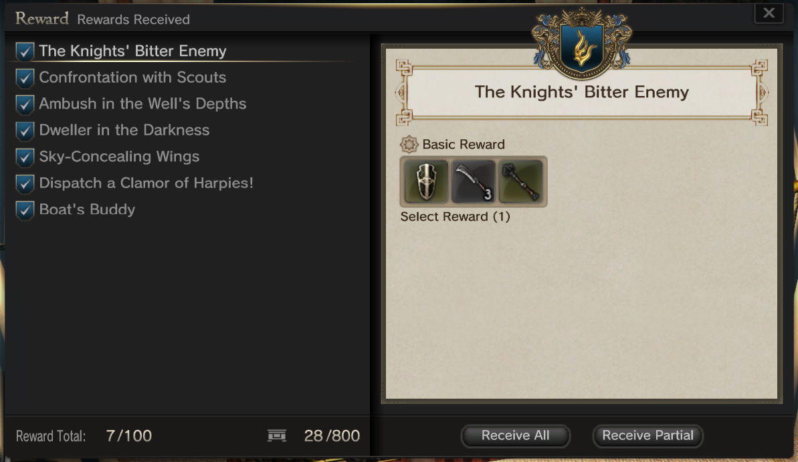

# Quest Support

This document describes currently implemented quest information and known issues associated with quests.

If you are interested in modifying or creating new quests, see the [generic quest state machine document](generic_quest_state_machine.md) for the details.

## What works in the current implementation

- Currently only [Season 1.0 MSQ](#season-10) and a limited number of [World Quests](#world-quests) are activated.
- Quest rewards can be claimed from the reward box after completing a quest.
  - 

> [!WARNING]
> The quest system generally doesn't work well in parties with multiple players. The world quests will reward all players in the party, but only the party leader will get quest banners as the quest progresses and completes.

> [!WARNING]
> Quest progress is only saved when a quest is completed. If you do some intermediate steps, then disconnect or log out, you will need to repeat all steps from the start.

> [!WARNING]
> Adjusted quest homepoint during battle events is not implemented yet. If you homepoint, you may need to log out and restart the quest.

> [!NOTE]
> If a quest completes in a safe area, the party leader needs to exit the area and reenter to restart the quest.

> [!NOTE]
> The server currently treats every completion of the quest as the first time.

> [!NOTE]
> The dialouge from NPCs for the quest is probably incorrect but I can't read the messages they say to correct them :)

## Main Story Quests

There exists an implementation of the following main story quests.

### Season 1.0

| Quest Name | Comment |
|:----------:|:-------:|
| [Resolutions and Omens](http://ddon.wikidot.com/mq:resolutionsandomens) | Some issues related to NPC FSM when transitioning between groups in the first area. Gear flickers for a moment after completing the quest.
| [The Slumbering God](http://ddon.wikidot.com/mq:theslumberinggod) | Working Well.
| [Envoy of Reconciliation](http://ddon.wikidot.com/mq:envoyofreconciliation) | Working Well.
| [Soldiers of the Rift](https://ddonline.tumblr.com/post/126992462344/mq-soldier-of-the-rift) | Working Well.
| [A Servants Pledge](https://ddonline.tumblr.com/post/127075717759/mq-a-servants-pledge) | Mostly working well. Quest at end a little weird because we have pawns already. Pawn Dungeon needs more mob placement.
| [The Crimson Crystal](https://ddonline.tumblr.com/post/127290993039/mq-the-crimson-crystal) | Working Well.
| [The Dull Grey Ark](https://ddonline.tumblr.com/post/128250949024/wq-the-dull-grey-ark) | Working Well
| [The Girl in the Forest](https://ddonline.tumblr.com/post/128253902059/mq-the-girl-in-the-forest) | Working mostly well. Boss fight all monsters need to die, not just troll.
| [The Goblin King](https://ddonline.tumblr.com/post/128255137129/mq-the-goblin-king) | Working Well.
| [The House of Steam](https://ddonline.tumblr.com/post/128376072499/mq-the-house-of-steam) | Working Well.
| [The Assailed Fort](https://ddonline.tumblr.com/post/128754598369/mq-the-assailed-fort) | Playable. Some orcs missing at start. Front gate of gritten has two entrances. Needs NPC state machines added.
| [The Castle of Dusk](https://ddonline.tumblr.com/post/128917708449/mq-the-castle-of-dusk) | Mostly works. Unable to trigger cutscene on door enter for the boss. When boss lockout occurs, there are 2 doors in the location.
| [The Gods Awakening](https://ddonline.tumblr.com/post/128920334189/mq-the-gods-awakening) | Working well.

### Season 3.3

| Quest Name | Comment |
|:----------:|:-------:|
| Hopes' Bitter End | Disabled

## World Quests

### Hidell Plains

| Quest Name | Comment
| :--------: | :------
| [Request For Medicine](https://ddonline.tumblr.com/post/127760023659/wq-request-for-medicine)
| [The Woes of A Merchant](https://ddonline.tumblr.com/post/127863272219/wq-the-woes-of-merchants)
| [An Assistant's Assistant](https://ddonline.tumblr.com/post/127758502739/world-quest-an-assistants-assistant-%E5%8A%A9%E6%89%8B%E3%81%AE%E5%8A%A9%E6%89%8B)
| [Crackdown on Store Vandals](https://ddonline.tumblr.com/post/127823776339/wq-crackdown-on-store-vandals)
| [A Heart Throbs Once More ](https://ddonline.tumblr.com/post/127820551989/wq-a-heart-throbs-once-more)
| [Fabio's Collectibles](https://ddonline.tumblr.com/post/127817453164/wq-fabios-collectibles)
| [Confrontation With Scouts](http://ddon.wikidot.com/wq:confrontationwithscouts)
| [Fabio and Monster-Slaying](https://ddonline.tumblr.com/post/127864008709/wq-fabio-and-monster-slaying)
| [A Transporter's Tragedy](https://ddonline.tumblr.com/post/127865270764/wq-a-transporters-tragedy)
| [Knight and Arisen](https://ddonline.tumblr.com/post/127861487629/wq-knight-and-arisen)
| [Ambush in the Well's Depths](http://ddon.wikidot.com/wq:ambushinthewellsdepths)
| [The Knights' Bitter Enemy](http://ddon.wikidot.com/wq:theknightsbitterenemy)
| [Sky-Concealing Wings](http://ddon.wikidot.com/wq:skyconcealingwings)
| [Dweller In The Darkness](http://ddon.wikidot.com/wq:dwellerinthedarkness)

### Breya Coast

| Quest Name | Comment
| :--------: | :------
| [Dispatch A Clamor of Harpies](http://ddon.wikidot.com/wq:dispatchaclamorofharpies)
| [Boats Buddy](http://ddon.wikidot.com/wq:boatsbuddy) | Nodes used to spawn monsters appear to not always work as expected.
| [Beach Bandits](http://ddon.wikidot.com/wq:beachbandits) | Nodes used to spawn monsters appear to not always work as expected.

## Appendix

### Quests Required before party play is allowed

- 覚悟と兆し Resolutions and Omens
- 横たわる神 The Slumbering God
- 覚者の甲斐性 The Arisen's Abilities (q60000012)
- 和解の使者 Envoy of Reconcilliation
- 異界の戦士 Soliders of the Rift
- しもべの契り A Servants Pledge
- 確かな情報源 Reliable Source of Information (q60000014)