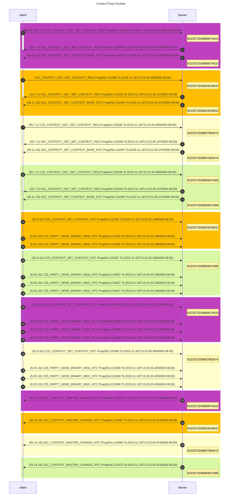

```mermaid
---
title: Context Party Packets
---

sequenceDiagram

autonumber

participant CLI as client
participant SRV as Server

rect rgb(191, 64, 191)
    CLI ->> SRV : 084220 (35.7.1) C2S_CONTEXT_GET_SET_CONTEXT_REQ Pcap(No:131936 Ts:2019-11-18T13:23:44.9950000-08:00)
    activate CLI
    note right of SRV : 9223372036889974610
    SRV ->> CLI : (35.7.2) S2C_CONTEXT_GET_SET_CONTEXT_RES Pcap(No:131940 Ts:2019-11-18T13:23:45.1060000-08:00)
    deactivate CLI

    SRV -->> CLI : (35.11.16) S2C_CONTEXT_SET_CONTEXT_BASE_NTC Pcap(No:131941 Ts:2019-11-18T13:23:45.1060000-08:00)
    note right of SRV : 9223372036889974610
end

rect rgb(255, 191, 0)
    CLI ->> SRV : C2S_CONTEXT_GET_SET_CONTEXT_REQ Pcap(No:131936 Ts:2019-11-18T13:23:44.9950000-08:00)
    activate CLI
    note right of SRV : 9223372036923529042
    SRV ->> CLI : (35.7.2) S2C_CONTEXT_GET_SET_CONTEXT_RES Pcap(No:131943 Ts:2019-11-18T13:23:45.1070000-08:00)
    deactivate CLI

    SRV -->> CLI : (35.11.16) S2C_CONTEXT_SET_CONTEXT_BASE_NTC Pcap(No:131944 Ts:2019-11-18T13:23:45.1070000-08:00)
    note right of SRV : 9223372036923529042
end

rect rgb(255,255,204) 
    CLI ->> SRV : (35.7.1) C2S_CONTEXT_GET_SET_CONTEXT_REQ Pcap(No:131936 Ts:2019-11-18T13:23:44.9950000-08:00)
    activate CLI
    note right of SRV : 9223372036957083474
    SRV ->> CLI : (35.7.2) S2C_CONTEXT_GET_SET_CONTEXT_RES Pcap(No:131946 Ts:2019-11-18T13:23:45.1070000-08:00)
    deactivate CLI

    SRV -->> CLI : (35.11.16) S2C_CONTEXT_SET_CONTEXT_BASE_NTC Pcap(No:131947 Ts:2019-11-18T13:23:45.1070000-08:00)
    note right of SRV : 9223372036957083474
end

rect rgb(218, 247, 166)
    CLI ->> SRV : (35.7.1) C2S_CONTEXT_GET_SET_CONTEXT_REQ Pcap(No:131936 Ts:2019-11-18T13:23:44.9950000-08:00)
    activate CLI
    note right of SRV : 9223372036990637906
    SRV ->> CLI : (35.7.2) S2C_CONTEXT_GET_SET_CONTEXT_RES Pcap(No:131949 Ts:2019-11-18T13:23:45.1070000-08:00)
    deactivate CLI

    SRV -->> CLI : (35.11.16) S2C_CONTEXT_SET_CONTEXT_BASE_NTC Pcap(No:131950 Ts:2019-11-18T13:23:45.1070000-08:00)
    note right of SRV : 9223372036990637906
end

rect rgb(255, 191, 0)
    CLI -->> SRV : (35.9.16) C2S_CONTEXT_SET_CONTEXT_NTC Pcap(No:131952 Ts:2019-11-18T13:23:45.1690000-08:00)
    note right of SRV : 9223372036923529042

    CLI -->> SRV : (6.25.16) C2S_PARTY_SEND_BINARY_MSG_NTC Pcap(No:131952 Ts:2019-11-18T13:23:45.1690000-08:00)
    CLI -->> SRV : (6.25.16) C2S_PARTY_SEND_BINARY_MSG_NTC Pcap(No:131952 Ts:2019-11-18T13:23:45.1690000-08:00)
end

rect rgb(218, 247, 166)
    CLI -->> SRV : (35.9.16) C2S_CONTEXT_SET_CONTEXT_NTC Pcap(No:131957 Ts:2019-11-18T13:23:45.3360000-08:00)
    note right of SRV : 9223372036990637906

    CLI -->> SRV : (6.25.16) C2S_PARTY_SEND_BINARY_MSG_NTC Pcap(No:131957 Ts:2019-11-18T13:23:45.3360000-08:00)

    CLI -->> SRV : (6.25.16) C2S_PARTY_SEND_BINARY_MSG_NTC Pcap(No:131957 Ts:2019-11-18T13:23:45.3360000-08:00)

    CLI -->> SRV : (6.25.16) C2S_PARTY_SEND_BINARY_MSG_NTC Pcap(No:131957 Ts:2019-11-18T13:23:45.3360000-08:00)
end

rect rgb(191, 64, 191)
    CLI -->> SRV : (35.9.16) C2S_CONTEXT_SET_CONTEXT_NTC Pcap(No:131958 Ts:2019-11-18T13:23:45.3710000-08:00)
    note right of SRV : 9223372036889974610

    CLI -->> SRV : (6.25.16) C2S_PARTY_SEND_BINARY_MSG_NTC Pcap(No:131958 Ts:2019-11-18T13:23:45.3710000-08:00)
    CLI -->> SRV : (6.25.16) C2S_PARTY_SEND_BINARY_MSG_NTC Pcap(No:131958 Ts:2019-11-18T13:23:45.3710000-08:00)
    CLI -->> SRV : (6.25.16) C2S_PARTY_SEND_BINARY_MSG_NTC Pcap(No:131958 Ts:2019-11-18T13:23:45.3710000-08:00)
end

rect rgb(255,255,204) 
    CLI -->> SRV : (35.9.16) C2S_CONTEXT_SET_CONTEXT_NTC Pcap(No:131960 Ts:2019-11-18T13:23:45.4050000-08:00)
    note right of SRV : 9223372036957083474

    CLI -->> SRV : (6.25.16) C2S_PARTY_SEND_BINARY_MSG_NTC Pcap(No:131960 Ts:2019-11-18T13:23:45.4050000-08:00)
    CLI -->> SRV : (6.25.16) C2S_PARTY_SEND_BINARY_MSG_NTC Pcap(No:131960 Ts:2019-11-18T13:23:45.4050000-08:00)
    CLI -->> SRV : (6.25.16) C2S_PARTY_SEND_BINARY_MSG_NTC Pcap(No:131960 Ts:2019-11-18T13:23:45.4050000-08:00)
end

rect rgb(191, 64, 191)
    SRV -->> CLI : (35.14.16) S2C_CONTEXT_MASTER_CHANGE_NTC Pcap(No:131966 Ts:2019-11-18T13:23:45.6750000-08:00)
    note right of SRV : 9223372036889974610
end

rect rgb(255, 191, 0)
    SRV -->> CLI : (35.14.16) S2C_CONTEXT_MASTER_CHANGE_NTC Pcap(No:131967 Ts:2019-11-18T13:23:45.6750000-08:00)
    note right of SRV : 9223372036923529042
end

rect rgb(255,255,204) 
    SRV -->> CLI : (35.14.16) S2C_CONTEXT_MASTER_CHANGE_NTC Pcap(No:131969 Ts:2019-11-18T13:23:45.6760000-08:00)
    note right of SRV : 9223372036957083474
end

rect rgb(218, 247, 166)
    SRV -->> CLI : (35.14.16) S2C_CONTEXT_MASTER_CHANGE_NTC Pcap(No:131970 Ts:2019-11-18T13:23:45.6760000-08:00)
    note right of SRV : 9223372036990637906
end

```