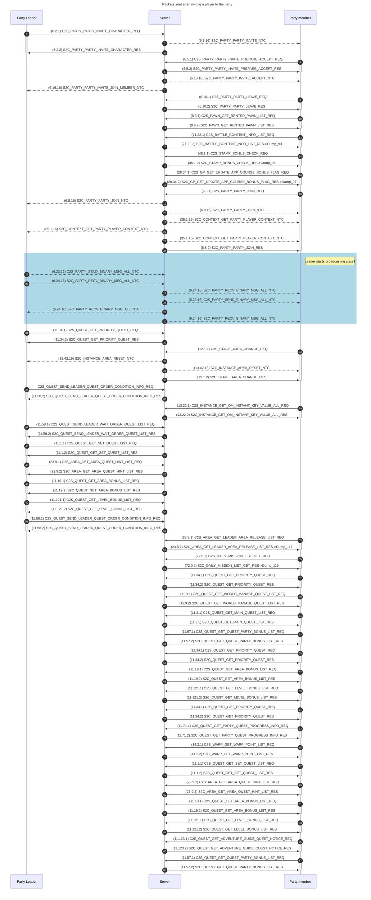

# Party Invite Packet Analysis (from emulated server)

```mermaid
---
title: Packets sent after inviting a player to the party
---

sequenceDiagram

autonumber

participant LDR as Party Leader
participant SRV as Server
participant M01 as Party member 

LDR ->> SRV : (6.2.1) C2S_PARTY_PARTY_INVITE_CHARACTER_REQ
activate LDR
SRV -->> M01 : (6.1.16) S2C_PARTY_PARTY_INVITE_NTC
SRV ->> LDR : (6.2.2) S2C_PARTY_PARTY_INVITE_CHARACTER_RES
deactivate LDR

M01 ->> SRV : (6.5.1) C2S_PARTY_PARTY_INVITE_PREPARE_ACCEPT_REQ
activate M01
SRV ->> M01 : (6.5.2) S2C_PARTY_PARTY_INVITE_PREPARE_ACCEPT_RES
deactivate M01

SRV -->> M01 : (6.18.16) S2C_PARTY_PARTY_INVITE_ACCEPT_NTC 
SRV -->> LDR : (6.19.16) S2C_PARTY_PARTY_INVITE_JOIN_MEMBER_NTC

M01 ->> SRV : (6.10.1) C2S_PARTY_PARTY_LEAVE_REQ
activate M01
SRV ->> M01 : (6.10.2) S2C_PARTY_PARTY_LEAVE_RES
deactivate M01

M01 ->> SRV : (8.8.1) C2S_PAWN_GET_RENTED_PAWN_LIST_REQ
activate M01
SRV ->> M01 : (8.8.2) S2C_PAWN_GET_RENTED_PAWN_LIST_RES
deactivate M01

M01 ->> SRV : (71.22.1) C2S_BATTLE_CONTENT_INFO_LIST_REQ
activate M01
SRV ->> M01 : (71.22.2) S2C_BATTLE_CONTENT_INFO_LIST_RES->Dump_93
deactivate M01

M01 ->> SRV : (45.1.1) C2S_STAMP_BONUS_CHECK_REQ
activate M01
SRV ->> M01 : (45.1.2) S2C_STAMP_BONUS_CHECK_RES->Dump_95
deactivate M01

M01 ->> SRV : (28.34.1) C2S_GP_GET_UPDATE_APP_COURSE_BONUS_FLAG_REQ
activate M01
SRV ->> M01 : (28.34.2) S2C_GP_GET_UPDATE_APP_COURSE_BONUS_FLAG_RES->Dump_97
deactivate M01

M01 ->> SRV : (6.8.1) C2S_PARTY_PARTY_JOIN_REQ
activate M01
SRV -->> LDR : (6.8.16) S2C_PARTY_PARTY_JOIN_NTC
SRV -->> M01 : (6.8.16) S2C_PARTY_PARTY_JOIN_NTC
SRV -->> M01 : (35.1.16) S2C_CONTEXT_GET_PARTY_PLAYER_CONTEXT_NTC
SRV -->> LDR : (35.1.16) S2C_CONTEXT_GET_PARTY_PLAYER_CONTEXT_NTC
SRV -->> M01 : (35.1.16) S2C_CONTEXT_GET_PARTY_PLAYER_CONTEXT_NTC
SRV ->> M01 : (6.8.2) S2C_PARTY_PARTY_JOIN_RES
deactivate M01

rect rgb(173, 216, 230)
note right of M01 : Leader starts broadcasting state?
LDR -->> SRV : (6.23.16) C2S_PARTY_SEND_BINARY_MSG_ALL_NTC
LDR -->> SRV : (6.24.16) S2C_PARTY_RECV_BINARY_MSG_ALL_NTC
SRV -->> M01 : (6.24.16) S2C_PARTY_RECV_BINARY_MSG_ALL_NTC
SRV -->> M01 : (6.23.16) C2S_PARTY_SEND_BINARY_MSG_ALL_NTC
SRV -->> LDR : (6.24.16) S2C_PARTY_RECV_BINARY_MSG_ALL_NTC
SRV -->> M01 : (6.24.16) S2C_PARTY_RECV_BINARY_MSG_ALL_NTC
end

LDR ->> SRV : (11.34.1) C2S_QUEST_GET_PRIORITY_QUEST_REQ
activate LDR
SRV ->> LDR : (11.34.2) S2C_QUEST_GET_PRIORITY_QUEST_RES
deactivate LDR

M01 ->> SRV : (12.1.1) C2S_STAGE_AREA_CHANGE_REQ
activate M01
SRV -->> LDR : (13.42.16) S2C_INSTANCE_AREA_RESET_NTC
SRV -->> M01 : (13.42.16) S2C_INSTANCE_AREA_RESET_NTC
SRV ->> M01 : (12.1.2) S2C_STAGE_AREA_CHANGE_RES
deactivate M01

LDR ->> SRV : C2S_QUEST_SEND_LEADER_QUEST_ORDER_CONDITION_INFO_REQ
activate LDR
SRV ->> LDR : (11.58.2) S2C_QUEST_SEND_LEADER_QUEST_ORDER_CONDITION_INFO_RES
deactivate LDR

M01 ->> SRV : (13.22.1) C2S_INSTANCE_GET_OM_INSTANT_KEY_VALUE_ALL_REQ
activate M01
SRV ->> M01 : (13.22.2) S2C_INSTANCE_GET_OM_INSTANT_KEY_VALUE_ALL_RES
deactivate M01

LDR ->> SRV : (11.59.1) C2S_QUEST_SEND_LEADER_WAIT_ORDER_QUEST_LIST_REQ
activate LDR
SRV ->> LDR : (11.59.2) S2C_QUEST_SEND_LEADER_WAIT_ORDER_QUEST_LIST_RES
deactivate LDR

LDR ->> SRV : (11.1.1) C2S_QUEST_GET_SET_QUEST_LIST_REQ
activate LDR
SRV ->> LDR : (11.1.2) S2C_QUEST_GET_SET_QUEST_LIST_RES
deactivate LDR

LDR ->> SRV : (23.9.1) C2S_AREA_GET_AREA_QUEST_HINT_LIST_REQ
activate LDR
SRV ->> LDR : (23.9.2) S2C_AREA_GET_AREA_QUEST_HINT_LIST_RES
deactivate LDR

LDR ->> SRV : (11.19.1) C2S_QUEST_GET_AREA_BONUS_LIST_REQ
activate LDR
SRV ->> LDR : (11.19.2) S2C_QUEST_GET_AREA_BONUS_LIST_RES
deactivate LDR

LDR ->> SRV : (11.121.1) C2S_QUEST_GET_LEVEL_BONUS_LIST_REQ
activate LDR
SRV ->> LDR : (11.121.2) S2C_QUEST_GET_LEVEL_BONUS_LIST_RES
deactivate LDR

LDR ->> SRV : (11.58.1) C2S_QUEST_SEND_LEADER_QUEST_ORDER_CONDITION_INFO_REQ
activate LDR
SRV ->> LDR : (11.58.2) S2C_QUEST_SEND_LEADER_QUEST_ORDER_CONDITION_INFO_RES
deactivate LDR

M01 ->> SRV : (23.8.1) C2S_AREA_GET_LEADER_AREA_RELEASE_LIST_REQ
activate M01
SRV ->> M01 : (23.8.2) S2C_AREA_GET_LEADER_AREA_RELEASE_LIST_RES->Dump_117
deactivate M01

M01 ->> SRV : (72.0.1) C2S_DAILY_MISSION_LIST_GET_REQ
activate M01
SRV ->> M01 : (72.0.2) S2C_DAILY_MISSION_LIST_GET_RES->Dump_119
deactivate M01

M01 ->> SRV : (11.34.1) C2S_QUEST_GET_PRIORITY_QUEST_REQ
activate M01
SRV ->> M01 : (11.34.2) S2C_QUEST_GET_PRIORITY_QUEST_RES
deactivate M01

M01 ->> SRV : (11.9.1) C2S_QUEST_GET_WORLD_MANAGE_QUEST_LIST_REQ
activate M01
SRV ->> M01 : (11.9.2) S2C_QUEST_GET_WORLD_MANAGE_QUEST_LIST_RES
deactivate M01

M01 ->> SRV : (11.2.1) C2S_QUEST_GET_MAIN_QUEST_LIST_REQ
activate M01
SRV ->> M01 : (11.2.2) S2C_QUEST_GET_MAIN_QUEST_LIST_RES
deactivate M01

M01 ->> SRV : (11.57.1) C2S_QUEST_GET_QUEST_PARTY_BONUS_LIST_REQ
activate M01
SRV ->> M01 : (11.57.2) S2C_QUEST_GET_QUEST_PARTY_BONUS_LIST_RES
deactivate M01

M01 ->> SRV : (11.34.1) C2S_QUEST_GET_PRIORITY_QUEST_REQ
activate M01
SRV ->> M01 : (11.34.2) S2C_QUEST_GET_PRIORITY_QUEST_RES
deactivate M01

M01 ->> SRV : (11.19.1) C2S_QUEST_GET_AREA_BONUS_LIST_REQ
activate M01
SRV ->> M01 : (11.19.2) S2C_QUEST_GET_AREA_BONUS_LIST_RES
deactivate M01

M01 ->> SRV : (11.121.1) C2S_QUEST_GET_LEVEL_BONUS_LIST_REQ
activate M01
SRV ->> M01 : (11.121.2) S2C_QUEST_GET_LEVEL_BONUS_LIST_RES
deactivate M01

M01 ->> SRV : (11.34.1) C2S_QUEST_GET_PRIORITY_QUEST_REQ
activate M01
SRV ->> M01 : (11.34.2) S2C_QUEST_GET_PRIORITY_QUEST_RES
deactivate M01

M01 ->> SRV : (11.71.1) C2S_QUEST_GET_PARTY_QUEST_PROGRESS_INFO_REQ
activate M01
SRV ->> M01 : (11.71.2) S2C_QUEST_GET_PARTY_QUEST_PROGRESS_INFO_RES
deactivate M01

M01 ->> SRV : (14.2.1) C2S_WARP_GET_WARP_POINT_LIST_REQ
activate M01
SRV ->> M01 : (14.2.2) S2C_WARP_GET_WARP_POINT_LIST_RES
deactivate M01

M01 ->> SRV : (11.1.1) C2S_QUEST_GET_SET_QUEST_LIST_REQ
activate M01
SRV ->> M01 : (11.1.2) S2C_QUEST_GET_SET_QUEST_LIST_RES
deactivate M01

M01 ->> SRV : (23.9.1) C2S_AREA_GET_AREA_QUEST_HINT_LIST_REQ
activate M01
SRV ->> M01 : (23.9.2) S2C_AREA_GET_AREA_QUEST_HINT_LIST_RES
deactivate M01

M01 ->> SRV : (11.19.1) C2S_QUEST_GET_AREA_BONUS_LIST_REQ
activate M01
SRV ->> M01 : (11.19.2) S2C_QUEST_GET_AREA_BONUS_LIST_RES
deactivate M01

M01 ->> SRV : (11.121.1) C2S_QUEST_GET_LEVEL_BONUS_LIST_REQ
activate M01
SRV ->> M01 : (11.121.2) S2C_QUEST_GET_LEVEL_BONUS_LIST_RES
deactivate M01

M01 ->> SRV : (11.123.1) C2S_QUEST_GET_ADVENTURE_GUIDE_QUEST_NOTICE_REQ
activate M01
SRV ->> M01 : (11.123.2) S2C_QUEST_GET_ADVENTURE_GUIDE_QUEST_NOTICE_RES
deactivate M01

M01 ->> SRV : (11.57.1) C2S_QUEST_GET_QUEST_PARTY_BONUS_LIST_REQ
activate M01
SRV ->> M01 : (11.57.2) S2C_QUEST_GET_QUEST_PARTY_BONUS_LIST_RES
deactivate M01
```
